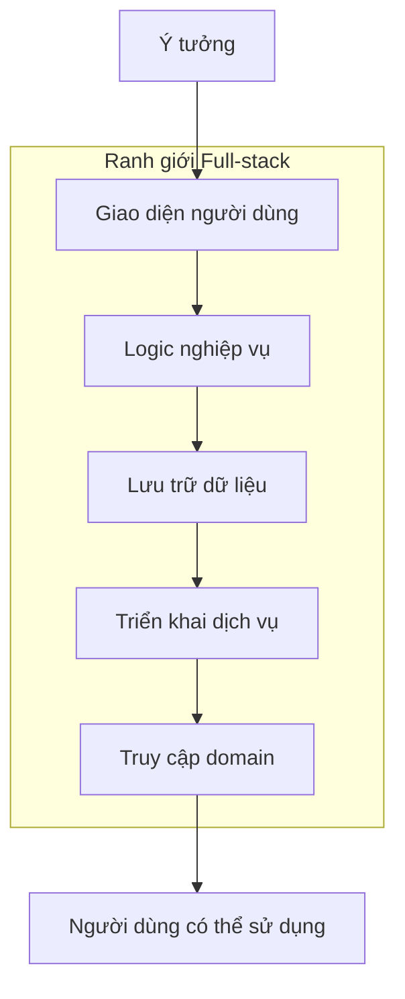
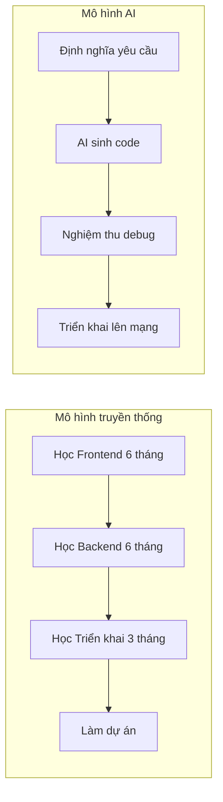
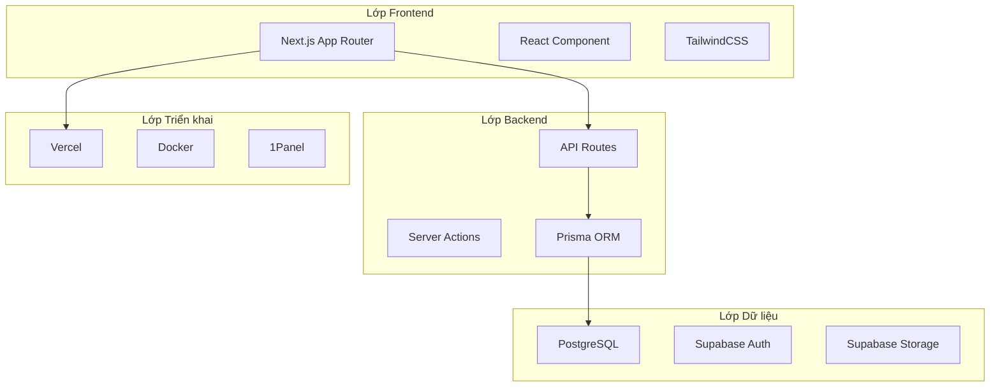

# 0.0.1 Thế nào mới gọi là Full-stack

> **Tóm tắt một câu**: Full-stack = Một người có thể biến ý tưởng thành sản phẩm trực tuyến có thể truy cập được, từ giao diện đến cơ sở dữ liệu đến triển khai, một vòng khép kín từ đầu đến cuối.

## Bản chất của Full-stack

Full-stack không phải là "thành thạo tất cả công nghệ", mà là **có khả năng tự mình hoàn thành sản phẩm đầy đủ**.

Định nghĩa truyền thống hiểu Full-stack là "Frontend + Backend", đây là **góc độ kỹ thuật**.

Full-stack trong thời đại Vibe Coding là **góc độ sản phẩm**: Liệu bạn có thể cho phép người dùng sử dụng sản phẩm của bạn thông qua một URL hay không?

## Ba cấp độ của Full-stack

| Cấp độ | Yêu cầu năng lực | Sản phẩm điển hình |
|-----|---------|---------|
| **L1: Cấp độ nguyên mẫu** | Có thể chạy được quy trình demo | Demo cục bộ, trưng bày bằng ảnh chụp màn hình |
| **L2: Cấp độ sản phẩm** | Có thể triển khai lên mạng, xử lý người dùng thực | URL có thể chia sẻ, hệ thống người dùng cơ bản |
| **L3: Cấp độ thương mại** | Có thể hỗ trợ thanh toán, xử lý quy mô lớn | Tích hợp thanh toán, tối ưu hiệu suất, giám sát cảnh báo |

Mục tiêu khóa học này: Đưa bạn từ L1 đến L2, và đặt nền tảng cho L3.

## Khả năng Full-stack trong thời đại AI

| Tiêu chí so sánh | Con đường truyền thống | Con đường có AI hỗ trợ |
|---------|---------|------------|
| Chu kỳ học tập | 1-2 năm học hệ thống | Vài tuần thực chiến |
| Kỹ năng cốt lõi | Cú pháp, thuật toán, framework | Diễn đạt yêu cầu, nghiệm thu kết quả |
| Tốc độ đầu ra | Tính theo tháng | Tính theo ngày/tuần |
| Điểm nghẽn | Khả năng lập trình | Độ rõ ràng yêu cầu |

## Tech stack Full-stack của khóa học này

Logic lựa chọn tech stack này:

1. **Next.js**: Frontend và Backend tích hợp, giảm chi phí chuyển đổi công nghệ
2. **Supabase**: Dịch vụ backend sẵn sàng sử dụng, tiết kiệm việc xây dựng cơ sở hạ tầng
3. **Vercel**: Triển khai không cần cấu hình, tập trung vào sản phẩm thay vì vận hành
4. **TypeScript**: Type safety giúp code do AI sinh ra đáng tin cậy hơn

## Nhận thức

> **Full-stack không bằng với toàn năng**
> - Bạn không cần viết tay cấu hình Webpack - Next.js đã đóng gói sẵn
> - Bạn không cần xây dựng hệ thống người dùng từ đầu - Supabase Auth sẵn sàng sử dụng
> - Bạn không cần quản lý server - Vercel xử lý triển khai và mở rộng quy mô
>
> Bản chất của Full-stack là **biết mỗi lớp đang làm gì**, chứ không phải **tự tay triển khai từng lớp**.

## Tóm tắt phần này

- Full-stack = Khả năng giao hàng từ đầu đến cuối, từ ý tưởng đến sản phẩm trực tuyến có thể truy cập
- Ngưỡng Full-stack trong thời đại AI giảm đáng kể, kỹ năng cốt lõi chuyển từ "viết code" sang "định nghĩa yêu cầu"
- Tech stack khóa học này: Next.js + Supabase + Vercel, một bộ xuyên suốt toàn bộ quy trình
