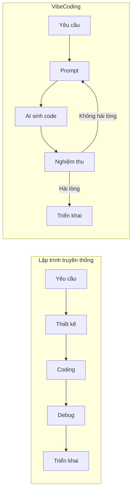
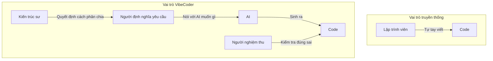
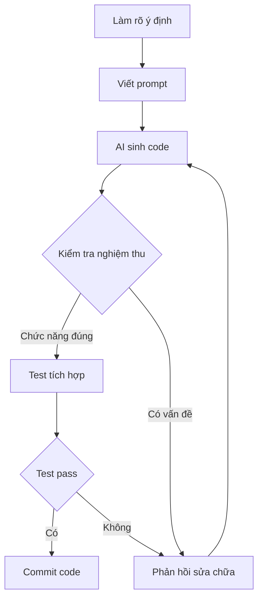

# 0.0.2 Tại sao Vibe một cái là có thể lập trình

> **Tóm tắt một câu**: Bản chất của Vibe Coding là dùng ngôn ngữ tự nhiên để diễn đạt ý định, để AI xử lý chi tiết triển khai - Bạn chịu trách nhiệm "làm cái gì", AI chịu trách nhiệm "làm như thế nào".

## Vibe Coding là gì

Vibe Coding là khái niệm do Andrej Karpathy đề xuất vào tháng 2 năm 2025:

> "Bạn hoàn toàn đắm chìm trong bầu không khí, đón nhận sự tăng trưởng theo cấp số nhân, quên đi sự tồn tại của code."

Điều này không đơn giản như "để AI giúp bạn viết code". Đó là một **mô hình hợp tác người-máy hoàn toàn mới**:

## So sánh sự khác biệt cốt lõi

| Tiêu chí | Lập trình truyền thống | Vibe Coding |
|-----|---------|-------------|
| **Input** | Cú pháp code chính xác | Mô tả bằng ngôn ngữ tự nhiên |
| **Output** | Code do developer viết | Code do AI sinh ra |
| **Kỹ năng cốt lõi** | Cú pháp, thuật toán, debug | Diễn đạt yêu cầu, nghiệm thu kết quả |
| **Cách lặp lại** | Sửa code → Chạy → Debug | Sửa prompt → Sinh code → Nghiệm thu |
| **Đường cong học tập** | Dốc, cần học hệ thống | Thoải, học theo thực hành |
| **Điểm nghẽn lớn nhất** | Tốc độ coding và độ sâu kỹ thuật | Độ rõ ràng yêu cầu và khả năng nghiệm thu |

## Chuyển đổi vai trò

| Vai trò truyền thống | Vai trò Vibe Coding |
|---------|-----------------|
| Người viết code | Người định nghĩa yêu cầu |
| Người debug cú pháp | Người nghiệm thu kết quả |
| Người triển khai | Người quyết định kiến trúc |

Bạn không còn là "người viết code", mà là "người chỉ huy AI viết code".

## Quy trình làm việc của Vibe Coding

**Giải thích các bước quan trọng**:

1. **Làm rõ ý định**: Dùng một câu nói rõ muốn thực hiện cái gì
2. **Viết prompt**: Chuyển ý định thành mô tả mà AI có thể hiểu
3. **AI sinh code**: Để AI xử lý việc triển khai cụ thể
4. **Kiểm tra nghiệm thu**: Xác nhận code có phù hợp với kỳ vọng không
5. **Phản hồi sửa chữa**: Nếu không đúng, cho AI biết chỗ nào cần điều chỉnh

## Khi nào dùng Vibe Coding

| Tình huống | Độ phù hợp | Lý do |
|-----|-------|-----|
| Nguyên mẫu nhanh | ⭐⭐⭐⭐⭐ | Chi phí tối thiểu để xác minh ý tưởng |
| Nghiệp vụ CRUD | ⭐⭐⭐⭐⭐ | Mô hình cố định, AI sinh chất lượng cao |
| Component UI | ⭐⭐⭐⭐ | Code style có độ lặp lại cao |
| File cấu hình | ⭐⭐⭐⭐ | Format chuẩn, dễ sinh |
| Thuật toán phức tạp | ⭐⭐ | Cần hiểu sâu mới nghiệm thu được |
| Tối ưu hiệu suất | ⭐⭐ | Cần điều chỉnh tinh tế và benchmark |
| Bảo mật quan trọng | ⭐ | Phải xem xét thủ công từng dòng |

## Nhận thức

> **Vibe Coding không phải là "không xem code"**
>
> Hiểu lầm phổ biến: Vibe Coding = Hoàn toàn không hiểu code vẫn có thể lập trình
>
> Sự thật: Bạn cần có khả năng **đọc hiểu** code do AI sinh ra, để có thể:
> - Đánh giá logic có đúng không
> - Phát hiện vấn đề bảo mật tiềm ẩn
> - Nhận ra AI "nói nghiêm túc nhưng sai sự thật"
>
> Vibe Coding hạ thấp ngưỡng **viết code**, chứ không phải ngưỡng **hiểu code**.

## Tóm tắt phần này

- Vibe Coding là mô hình phát triển dùng ngôn ngữ tự nhiên để điều khiển AI sinh code
- Kỹ năng cốt lõi chuyển từ "coding" sang "diễn đạt yêu cầu" và "nghiệm thu kết quả"
- Phù hợp với nguyên mẫu nhanh, nghiệp vụ CRUD, component UI, v.v.
- Bạn vẫn cần có khả năng đọc code để nghiệm thu output của AI
