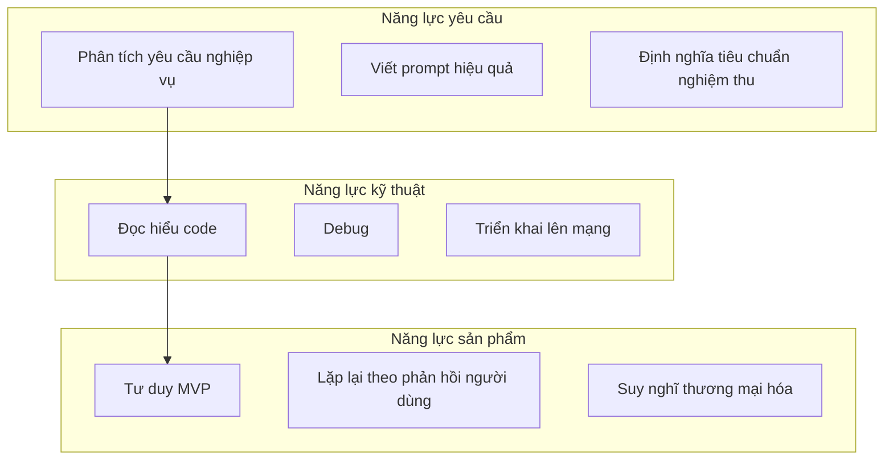
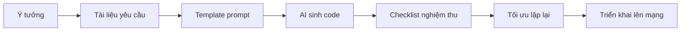
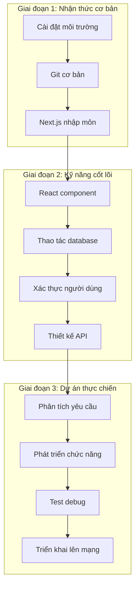

# 0.0.3 Học xong khóa này tôi có thể làm gì

> **Tóm tắt một câu**: Mục tiêu của khóa học này là giúp bạn có thể tự mình hoàn thành một ứng dụng Web có thể lên mạng, chia sẻ được, có tiềm năng thương mại hóa.


## Mục tiêu năng lực

Sau khi học xong khóa này, bạn sẽ có những năng lực sau:



| Chiều năng lực | Kỹ năng cụ thể | Cách xác minh |
|---------|---------|---------|
| **Định nghĩa yêu cầu** | Chuyển ý tưởng mơ hồ thành mô tả chức năng rõ ràng | Có thể viết prompt mà AI thực thi được |
| **Nghiệm thu code** | Đánh giá code do AI sinh ra có đúng không | Có thể phát hiện lỗi logic và lỗ hổng bảo mật |
| **Debug hệ thống** | Xác định vấn đề và hướng dẫn AI sửa | Có thể chạy thông toàn bộ quy trình ứng dụng |
| **Triển khai sản phẩm** | Triển khai dự án local lên mạng công cộng | Có được URL có thể chia sẻ |


## Sản phẩm cụ thể

Khi kết thúc khóa học, bạn sẽ có:

### 1. Một dự án full-stack hoàn chỉnh

```
Dự án của bạn/
├── Hệ thống xác thực người dùng (đăng ký/đăng nhập/phân quyền)
├── Chức năng nghiệp vụ cốt lõi (tùy theo đề tài bạn chọn)
├── Lưu trữ dữ liệu bền vững (PostgreSQL)
├── Giao diện responsive (tương thích mobile)
└── Triển khai môi trường production (URL có thể truy cập)
```

### 2. Quy trình phát triển có thể tái sử dụng



### 3. Một bộ khung tư duy

| Mô hình tư duy | Kịch bản áp dụng |
|---------|---------|
| **Tư duy MVP** | Làm phiên bản khả dụng tối thiểu trước, sau đó mở rộng dần |
| **Tư duy nghiệm thu** | Định nghĩa trước "thế nào là làm xong", sau đó mới bắt tay vào làm |
| **Tư duy lặp lại** | Từng bước nhỏ chạy nhanh, giao hàng liên tục |
| **Tư duy sản phẩm** | Xuất phát từ nhu cầu người dùng, chứ không phải khoe kỹ thuật |


## Lộ trình khóa học



| Giai đoạn | Nội dung cốt lõi | Thời lượng dự kiến |
|-----|---------|---------|
| Nhận thức cơ bản | Môi trường, công cụ, khái niệm framework | 1 tuần |
| Kỹ năng cốt lõi | Frontend, backend, database, authentication | 3-4 tuần |
| Dự án thực chiến | Dự án hoàn chỉnh từ 0 đến lên mạng | 2-3 tuần |


## Tiềm năng thương mại hóa

Sau khi hoàn thành khóa học, dự án của bạn có thể:

| Hướng đi | Hình thức cụ thể | Cách kiếm tiền |
|-----|---------|---------|
| **Sản phẩm SaaS** | Công cụ hướng đến nhóm người dùng cụ thể | Thu phí theo đăng ký |
| **Dự án độc lập** | Portfolio cá nhân, blog, trang công cụ | Quảng cáo, tài trợ |
| **Nhận dự án outsource** | Giúp khách hàng xây dựng MVP nhanh | Thu phí theo dự án |
| **Dịch vụ kỹ thuật** | Giúp doanh nghiệp đào tạo lập trình với AI | Thu phí tư vấn |


## Nhận thức

> **Khóa học này sẽ không biến bạn thành "lập trình viên kỳ cựu"**
>
> Nhận thức tỉnh táo:
> - Bạn sẽ không thành thạo thuật toán và cấu trúc dữ liệu
> - Bạn sẽ không trở thành chuyên gia source code framework
> - Bạn sẽ không có được năng lực vượt qua phỏng vấn big tech
>
> Nhưng bạn sẽ có được:
> - Khả năng tự mình giao hàng sản phẩm
> - Phương pháp hợp tác hiệu quả với AI
> - Sức thực thi biến ý tưởng thành hiện thực
>
> Đây là hai con đường khác nhau, mỗi cái đều có giá trị riêng.


## Tóm tắt phần này

- Mục tiêu khóa học: Tự mình hoàn thành ứng dụng Web full-stack có thể lên mạng
- Năng lực cốt lõi: Định nghĩa yêu cầu, nghiệm thu code, debug hệ thống, triển khai sản phẩm
- Sản phẩm cụ thể: Một dự án hoàn chỉnh + quy trình có thể tái sử dụng + khung tư duy
- Hướng thương mại hóa: SaaS, dự án độc lập, nhận outsource, dịch vụ kỹ thuật
