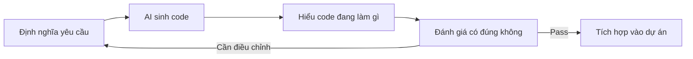

# 0.0 Phiên bản nâng cao học gì

Trong phiên bản cơ bản, bạn đã học được tâm pháp cốt lõi của Vibe Coding: dùng ngôn ngữ tự nhiên diễn đạt yêu cầu, để AI giúp bạn sinh code.

**Mục tiêu phiên bản nâng cao là: Giúp bạn có thể tự mình hoàn thành một dự án full-stack hoàn chỉnh.**

> **Định vị một câu**: Từ "có thể làm ra thứ gì đó" đến "có thể làm ra sản phẩm chuyên nghiệp" - Một người lo xong toàn bộ quy trình từ giao diện đến database đến triển khai.

## Phiên bản cơ bản vs Phiên bản nâng cao

| Tiêu chí | Phiên bản cơ bản (đã hoàn thành) | Phiên bản nâng cao (sắp bắt đầu) |
|-----|----------------|------------------|
| **Năng lực cốt lõi** | Dùng AI làm ra dự án đơn giản | Dùng AI xây dựng sản phẩm hoàn chỉnh |
| **Độ sâu kỹ thuật** | Điểm qua, AI xử lý chi tiết | Hiểu nguyên lý, có thể kiểm tra output AI |
| **Độ phức tạp dự án** | Ứng dụng đơn trang, website tĩnh | Ứng dụng full-stack, database, authentication |
| **Cách triển khai** | Triển khai một cú | Container hóa, CI/CD |

## Nâng cấp vai trò của bạn

Trong phiên bản cơ bản, bạn là "người định nghĩa yêu cầu".

Trong phiên bản nâng cao, bạn còn cần trở thành "người quyết định kiến trúc" và "người kiểm soát chất lượng":

## Hướng dẫn đọc chương này

| Tiểu mục | Câu hỏi cốt lõi | Bạn sẽ có được |
|-----|---------|---------|
| [0.0.1 Định nghĩa phát triển Full-stack](./0.0.1-fullstack-definition.md) | Full-stack là gì? Một người có làm được không? | Nhận thức rõ ràng về ranh giới full-stack |
| [0.0.2 Vibe Coding vs Lập trình truyền thống](./0.0.2-vibe-coding-vs-traditional.md) | Tại sao ngôn ngữ tự nhiên lại có thể lập trình? | Sự khác biệt bản chất giữa hai mô hình |
| [0.0.3 Mục tiêu khóa học](./0.0.3-goals.md) | Học xong có thể làm gì? | Danh sách năng lực và sản phẩm cụ thể |

## Xem trước Tech stack

Khóa học này chốt tech stack sau đây, tất cả các dự án thực chiến sẽ dựa trên cơ sở này:

| Tầng | Lựa chọn công nghệ | Lý do lựa chọn |
|-----|---------|---------|
| Frontend framework | Next.js (App Router) | Hệ sinh thái React + Năng lực full-stack + Hỗ trợ nguyên bản Vercel |
| Hệ thống kiểu | TypeScript | Đảm bảo type safety cho code do AI sinh ra |
| Backend service | Supabase | PostgreSQL + Auth + Storage sẵn sàng sử dụng |
| ORM | Prisma | Thao tác database với type safety |
| Tích hợp AI | Vercel AI SDK | Streaming response + Hỗ trợ đa model |
| Triển khai | Vercel | Triển khai không cần cấu hình + Mạng edge |
| Container hóa | Docker + 1Panel | Phương án chuẩn cho tình huống self-hosted |

## Nhận thức

> **Khóa học này không phù hợp với ai?**
> - Người muốn học hệ thống nền tảng khoa học máy tính (đây không phải CS101)
> - Người theo đuổi "hoàn toàn không xem code" (bạn cần có thể đọc hiểu code do AI sinh ra)
> - Người không muốn thực hành (cốt lõi của Vibe Coding là lặp lại xác minh)

## Tóm tắt phần này

- Đây là khóa học **ưu tiên thực chiến**, dùng AI tăng tốc toàn bộ quá trình từ ý tưởng đến sản phẩm
- Vai trò của bạn là **người định nghĩa yêu cầu và người nghiệm thu kết quả**, chứ không phải người viết code
- Tech stack đã được chốt, tập trung vào hệ sinh thái Next.js + Supabase + Vercel
