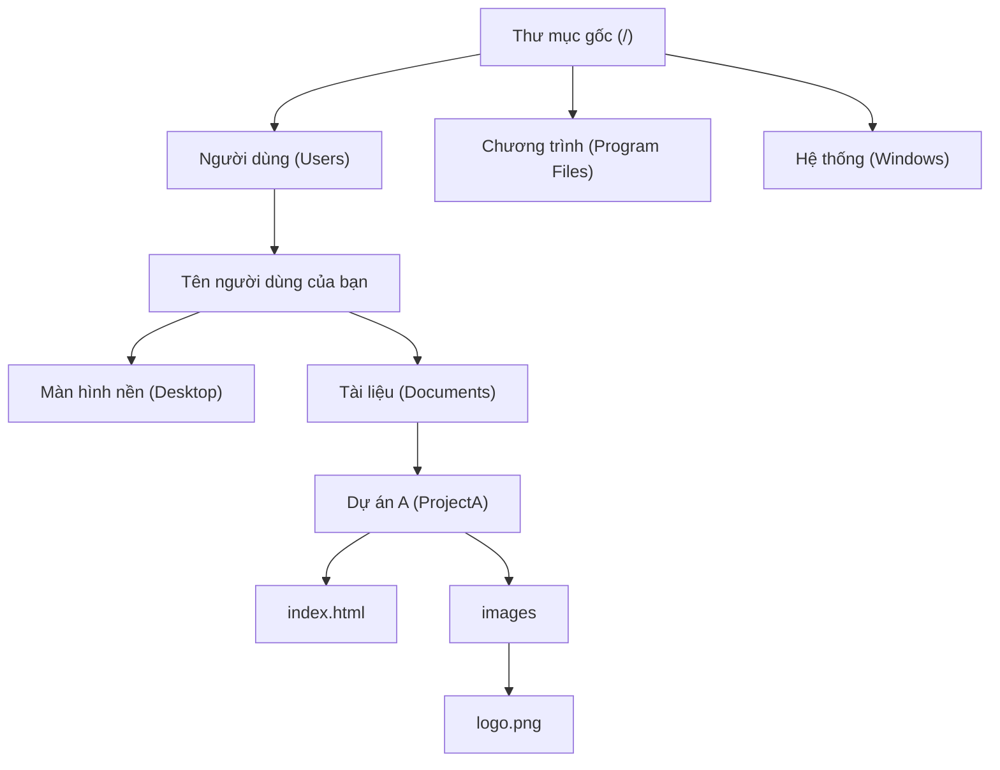

# 0.1.1 Hệ thống tệp tin: Thư viện số của máy tính

### Tóm tắt một câu

Hệ thống tệp tin là một bộ quy tắc và cấu trúc mà hệ điều hành dùng để quản lý và tổ chức tất cả dữ liệu (file) trên máy tính. Bạn có thể hình dung nó như một thư viện số khổng lồ, chịu trách nhiệm phân loại từng tài liệu (file), dán nhãn, và đặt chúng vào đúng kệ sách (thư mục), để bạn có thể tìm thấy chúng bất cứ lúc nào.

### Giá trị cốt lõi

Với tư cách là developer, việc hiểu hệ thống tệp tin là vô cùng quan trọng, vì:

1.  **Tổ chức code**: Tất cả code dự án, hình ảnh, file cấu hình của bạn đều cần được bố trí trong một cấu trúc thư mục hợp lý.
2.  **Định vị tài nguyên**: Khi chương trình chạy, nó cần đọc hoặc ghi dữ liệu từ hệ thống tệp tin một cách chính xác. Nếu đường dẫn sai, chương trình sẽ "lạc đường".
3.  **Cách ly môi trường**: Các dự án khác nhau phụ thuộc vào các công cụ và thư viện khác nhau, hệ thống tệp tin giúp chúng ta cách ly chúng, tránh xung đột.

### Giải thích các khái niệm cốt lõi

Hệ thống tệp tin bao gồm một số khái niệm đơn giản:

*   **File (Tệp tin)**: Đơn vị cơ bản để lưu trữ thông tin, giống như một cuốn sách hoặc tài liệu trong thư viện. Mỗi file đều có tên file và phần mở rộng (như `index.html`, `style.css`), phần mở rộng cho chúng ta biết loại file.
*   **Directory/Folder (Thư mục)**: "Container" chứa các file và các thư mục khác, giống như kệ sách hoặc khu vực phân loại trong thư viện.
*   **Path (Đường dẫn)**: "Địa chỉ" của một file hoặc thư mục trong hệ thống tệp tin.
    *   **Absolute Path (Đường dẫn tuyệt đối)**: Địa chỉ đầy đủ bắt đầu từ "cổng thư viện" (thư mục gốc), là duy nhất. Ví dụ: `C:\\Users\\YourName\\Documents\\project\\index.html`.
    *   **Relative Path (Đường dẫn tương đối)**: Địa chỉ bắt đầu từ "vị trí hiện tại của bạn". Ví dụ, nếu bạn đang ở trong thư mục `project`, muốn tìm `index.html`, đường dẫn tương đối là `./index.html`. `.` đại diện cho thư mục hiện tại, `..` đại diện cho thư mục cha.

#### Trực quan hóa cấu trúc

Cấu trúc hệ thống tệp tin giống như một cái cây úp ngược.

### Hướng dẫn hợp tác với AI

Khi bạn cần AI giúp xử lý file, việc diễn đạt rõ ràng đường dẫn là chìa khóa.

*   **Ý định cốt lõi**: Nói cho AI biết bạn muốn thực hiện **thao tác gì** với **file nào** ở **vị trí nào**.
*   **Công thức định nghĩa yêu cầu**: `"Hãy giúp tôi [thao tác] file [tên file] ở vị trí [đường dẫn tuyệt đối hoặc tương đối], nội dung là......"`
*   **Thuật ngữ quan trọng**: `đọc file (read file)`, `ghi file (write file)`, `tạo thư mục (create directory)`, `đường dẫn file (file path)`, `đường dẫn tuyệt đối (absolute path)`.

**Ví dụ**:

> **Bad ❌**: "Giúp tôi thay logo trong dự án."
> *AI sẽ bối rối: Dự án nào? Logo ở đâu?*
>
> **Good ✅**: "Hãy giúp tôi cập nhật logo của dự án `ProjectA`. File logo mới có đường dẫn là `D:\\Downloads\\new_logo.png`, hãy copy nó vào thư mục `C:\\Users\\YourName\\Documents\\ProjectA\\images\\` và ghi đè file `logo.png` hiện có."

### Hướng dẫn tránh lỗi

*   **Dấu phân cách đường dẫn**: Windows dùng dấu gạch chéo ngược `\`, còn macOS/Linux và URL web dùng dấu gạch chéo `/`. Trong lập trình, để tương thích đa nền tảng, thường khuyến nghị dùng `/`, hầu hết các công cụ hiện đại đều hiểu được.
*   **"Lạc đường" với đường dẫn tương đối**: Khi dùng đường dẫn tương đối, bạn phải rõ ràng chương trình hiện tại đang chạy ở thư mục nào, nếu không rất dễ không tìm thấy file.

Hiểu được hệ thống tệp tin, bạn đã nắm được một trong những ngôn ngữ cơ bản để giao tiếp với máy tính.
