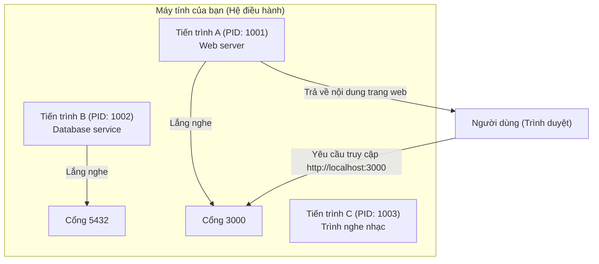

# 0.1.2 Tiến trình và cổng: Nhân viên phục vụ và số máy nhánh trong nhà hàng

### Tóm tắt một câu

**Process (Tiến trình)** là một instance của chương trình đang chạy trên máy tính, giống như một nhân viên phục vụ đang bận rộn trong nhà hàng. Còn **Port (Cổng)** là "số máy nhánh điện thoại" cụ thể mà nhân viên phục vụ đó dùng để giao tiếp với bên ngoài (các chương trình khác hoặc mạng).

### Giá trị cốt lõi

Hiểu về tiến trình và cổng là kiến thức hàng ngày đối với Web developer:

1.  **Chạy dịch vụ**: Khi bạn khởi động một dự án website, nó sẽ chạy trên máy tính dưới dạng một "tiến trình".
2.  **Truy cập dịch vụ**: Bạn cần truy cập website của mình qua trình duyệt bằng địa chỉ như `http://localhost:3000`, trong đó `3000` chính là số cổng (port number).
3.  **Khắc phục sự cố**: Một trong những lỗi phổ biến nhất là "cổng đã được sử dụng" (Port already in use), có nghĩa là số máy nhánh bạn muốn dùng đã bị nhân viên khác chiếm.

### Giải thích các khái niệm cốt lõi

*   **Process (Tiến trình)**:
    *   Mỗi khi bạn mở một ứng dụng (như trình duyệt, VS Code, trình nghe nhạc), hệ điều hành sẽ tạo một hoặc nhiều tiến trình cho nó.
    *   Mỗi tiến trình có một định danh duy nhất gọi là **PID (Process ID)**.
    *   Bạn có thể xem tất cả các tiến trình đang chạy qua Task Manager (Windows) hoặc Activity Monitor (macOS).

*   **Port (Cổng)**:
    *   Port là một số 16 bit, có giá trị từ 0 đến 65535.
    *   Khi một tiến trình cần cung cấp dịch vụ mạng (ví dụ Web server), nó sẽ "lắng nghe" một cổng cụ thể, chờ các yêu cầu kết nối từ bên ngoài.
    *   Trên một máy tính, **một cổng tại một thời điểm chỉ có thể được một tiến trình lắng nghe**. Đó là lý do bạn không thể chạy hai dự án website khác nhau trên cùng cổng `3000`.

#### Trực quan hóa cấu trúc

Hãy tưởng tượng máy tính của bạn là một nhà hàng lớn, với nhiều nhân viên (tiến trình) đang làm việc cùng lúc.

Trong mô hình này:
*   Web server và database service đều là các tiến trình độc lập, chúng cần qua cổng để giao tiếp với bên ngoài.
*   Trình nghe nhạc cũng là một tiến trình, nhưng có thể nó không cần lắng nghe cổng để cung cấp dịch vụ mạng.
*   Trình duyệt truy cập `localhost:3000`, sẽ tìm chính xác đến tiến trình Web server đang lắng nghe cổng 3000.

### Hướng dẫn hợp tác với AI

Khi bạn cần AI giúp quản lý dịch vụ, việc chỉ rõ tiến trình và cổng là vô cùng quan trọng.

*   **Ý định cốt lõi**: Nói cho AI biết bạn muốn làm gì với **dịch vụ nào** đang chạy trên **cổng nào**.
*   **Công thức định nghĩa yêu cầu**: `"Hãy giúp tôi [khởi động/dừng/kiểm tra] dịch vụ đang chạy trên cổng [số cổng]."`
*   **Thuật ngữ quan trọng**: `chạy (run)`, `khởi động (start)`, `dừng (stop)`, `tiến trình (process)`, `cổng (port)`, `cổng đã được sử dụng (port in use)`.

**Ví dụ**:

> **Bad ❌**: "Website của tôi không chạy được."
> *AI không biết website nào, gặp vấn đề gì.*
>
> **Good ✅**: "Khi tôi chạy dự án Next.js, terminal báo lỗi `Error: listen EADDRINUSE: address already in use :::3000`. Hãy giúp tôi kiểm tra tiến trình nào đang chiếm cổng 3000, và cho tôi biết cách dừng nó."

### Hướng dẫn tránh lỗi

*   **Các cổng thường dùng**: Trong Web development, `3000`, `8000`, `8080` là các cổng phát triển rất phổ biến. `80` là cổng mặc định của dịch vụ HTTP, `443` là của HTTPS.
*   **Cách tìm và dừng tiến trình đang chiếm cổng**: Đây là một thao tác rất thường xuyên. Bạn có thể yêu cầu AI cung cấp lệnh cụ thể.
    *   **Windows**: `netstat -ano | findstr :<số_cổng>` để tìm PID, sau đó `taskkill /PID <PID> /F`.
    *   **macOS/Linux**: `lsof -i :<số_cổng>` để tìm PID, sau đó `kill -9 <PID>`.

Nắm vững tiến trình và cổng, bạn đã có chìa khóa để bước vào thế giới ứng dụng mạng.
