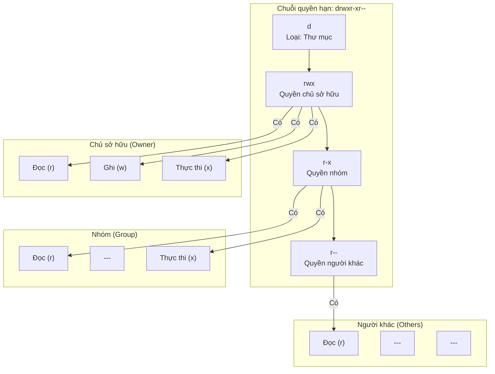

# 0.1.3 Quyền hạn: Ai có thể động vào tài sản số của tôi

### Tóm tắt một câu

**Permissions (Quyền hạn)** của file và thư mục xác định **ai** có thể thực hiện **hành động gì** với chúng. Điều này giống như hệ thống kiểm soát cửa ra vào của một tòa nhà chung cư, quy định ai (người dùng) có chìa khóa nào (quyền hạn), có thể vào phòng nào (file/thư mục), và làm gì khi vào (đọc/ghi/thực thi).

### Giá trị cốt lõi

Mặc dù cảm nhận không rõ trên máy tính cá nhân, nhưng trên server và trong môi trường làm việc nhóm, quyền hạn là nền tảng của bảo mật và ổn định:

1.  **Bảo vệ hệ thống**: Ngăn người dùng thông thường hoặc chương trình độc hại sửa đổi file hệ thống cốt lõi, dẫn đến sập hệ thống.
2.  **Bảo vệ dữ liệu**: Đảm bảo chỉ người dùng được ủy quyền mới có thể đọc hoặc sửa đổi dữ liệu nhạy cảm (như file database, file cấu hình).
3.  **Hợp tác nhóm**: Trong dự án nhiều người, làm rõ ai có quyền sửa code, ai chỉ được xem, tránh hỗn loạn.

### Giải thích các khái niệm cốt lõi (Ví dụ Linux/macOS)

Hệ thống quyền hạn chủ yếu xoay quanh ba chiều kích:

*   **Ba loại thao tác**:
    *   **Read (Đọc, r)**: Xem nội dung file hoặc liệt kê các file trong thư mục.
    *   **Write (Ghi, w)**: Sửa đổi nội dung file, hoặc tạo/xóa file trong thư mục.
    *   **Execute (Thực thi, x)**: Chạy một file (nếu là chương trình hoặc script), hoặc vào một thư mục.

*   **Ba loại người dùng**:
    *   **Owner (Chủ sở hữu)**: Người dùng tạo ra file hoặc thư mục.
    *   **Group (Nhóm người dùng)**: Một tập hợp người dùng, file có thể thuộc về một nhóm nào đó.
    *   **Others (Người khác)**: Tất cả mọi người ngoài chủ sở hữu và thành viên nhóm.

Khi bạn dùng lệnh `ls -l` trong terminal, bạn sẽ thấy chuỗi ký tự như `drwxr-xr--`, đây chính là biểu diễn quyền hạn.

*   Ký tự đầu tiên `d` biểu thị đây là thư mục, `-` biểu thị là file.
*   9 ký tự sau, cứ 3 ký tự một nhóm, lần lượt đại diện cho quyền hạn của **chủ sở hữu**, **nhóm người dùng**, **người khác**.
    *   `rwx` biểu thị có thể đọc, ghi, thực thi.
    *   `r-x` biểu thị có thể đọc, không thể ghi, có thể thực thi.
    *   `r--` biểu thị chỉ có thể đọc.

#### Trực quan hóa cấu trúc

Lấy ví dụ `drwxr-xr--`, chúng ta có thể hiểu như sau:

**Giải thích**: Đây là một thư mục, chủ sở hữu có toàn bộ quyền; thành viên nhóm có thể đọc và vào thư mục, nhưng không thể tạo hoặc xóa file bên trong; người khác chỉ có thể đọc nội dung thư mục.

### Hướng dẫn hợp tác với AI

Khi triển khai ứng dụng trên server, thường xuyên cần AI giúp thiết lập quyền hạn.

*   **Ý định cốt lõi**: Nói cho AI biết bạn muốn sửa quyền của **file/thư mục nào** thành **như thế nào**.
*   **Công thức định nghĩa yêu cầu**: `"Hãy giúp tôi sửa quyền của [đường dẫn file/thư mục], cho phép [loại người dùng] có quyền [đọc/ghi/thực thi]."`
*   **Thuật ngữ quan trọng**: `quyền hạn (permission)`, `sửa quyền (change permission)`, `chmod`, `chủ sở hữu (owner)`, `nhóm (group)`.

**Ví dụ**:

> **Bad ❌**: "Script của tôi không chạy được."
> *Có thể có nhiều nguyên nhân, chưa chắc là do quyền hạn.*
>
> **Good ✅**: "Tôi đã upload script triển khai `deploy.sh` lên server vào thư mục `/opt/scripts/`, nhưng khi tôi cố chạy nó, hệ thống báo `Permission denied`. Hãy cho tôi lệnh `chmod` để chủ sở hữu hiện tại có thể thực thi script này."

### Hướng dẫn tránh lỗi

*   **Lạm dụng `sudo`**: `sudo` (Super User Do) là lệnh thực thi với quyền quản trị viên. Khi gặp `Permission denied`, **đừng** vội vàng thêm `sudo` vào trước lệnh. Điều này giống như dùng chìa khóa vạn năng mở tất cả các cửa, tuy tiện nhưng cực kỳ nguy hiểm. Bạn nên tìm hiểu tại sao cần quyền cao hơn, và chỉ dùng khi thực sự cần thiết.
*   **`777` nguy hiểm**: `chmod 777 <file>` là "vũ khí tối hậu", nó mở hoàn toàn quyền đọc, ghi, thực thi cho tất cả mọi người trên hệ thống. Đây là hành vi **cực kỳ nguy hiểm** trên server, tương đương mở toang cửa nhà, ai muốn làm gì cũng được. Trừ khi bạn rất rõ mình đang làm gì, đừng bao giờ dùng `777`.

Hiểu về quyền hạn là bước quan trọng để bạn từ "người chơi code" trở thành "kỹ sư hệ thống".
