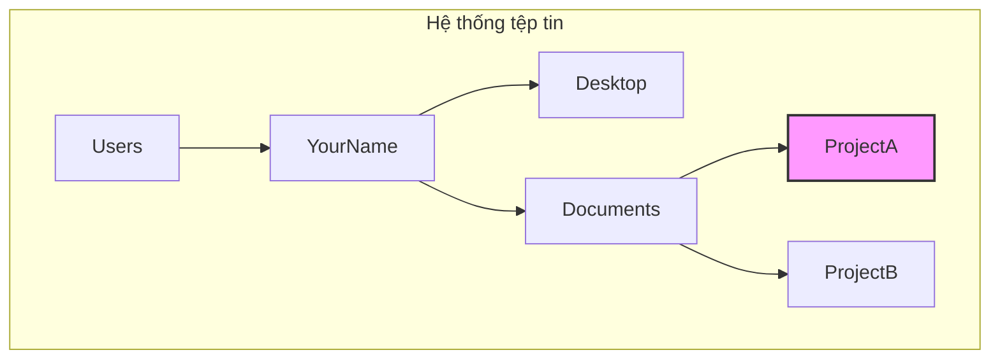

# 0.2.1 Điều hướng: Tự do dạo chơi trong thế giới số

### Tóm tắt một câu

Điều hướng dòng lệnh là việc sử dụng một vài lệnh cốt lõi để cho phép bạn định vị và di chuyển nhanh chóng trong "cây thư mục" của hệ thống tệp tin, giống như sử dụng điểm dịch chuyển trong bản đồ game vậy.

### Giá trị cốt lõi

1.  **Hiệu quả**: Khi bạn đã quen với đường dẫn và lệnh, việc nhập lệnh để nhảy đến vị trí nhanh hơn nhiều so với việc click từng thư mục trong giao diện đồ họa.
2.  **Chính xác**: Bạn có thể đi thẳng đến bất kỳ thư mục nào ở độ sâu bất kỳ mà không cần nhớ từng chi tiết của đường dẫn trung gian.
3.  **Tự động hóa**: Điều hướng là nền tảng của mọi script tự động hóa. Bạn cần "đi đến" đúng chỗ trước khi thực hiện các thao tác tiếp theo.

### Giải thích các khái niệm cốt lõi

Điều hướng dòng lệnh chủ yếu dựa vào hai lệnh cốt lõi: `pwd` và `cd`, cùng với việc hiểu về đường dẫn.

*   **`pwd` (Print Working Directory)**: In ra thư mục làm việc hiện tại. Lệnh này cho bạn biết "bạn đang ở đâu".
    *   Trong Windows PowerShell, lệnh tương ứng là `Get-Location`, nhưng alias `pwd` thường cũng dùng được.

*   **`cd` (Change Directory)**: Chuyển thư mục. Đây là lệnh điều hướng cốt lõi, sau nó cần có một đường dẫn làm tham số.

*   **Path (Đường dẫn)**:
    *   **Đường dẫn tuyệt đối**: Đường dẫn đầy đủ bắt đầu từ thư mục gốc, ví dụ `C:\Users\YourName\Desktop` (Windows) hoặc `/Users/YourName/Desktop` (macOS/Linux). Nó cung cấp vị trí duy nhất, rõ ràng.
    *   **Đường dẫn tương đối**: Đường dẫn tương đối với vị trí hiện tại của bạn.
        *   `.` (một chấm): Đại diện cho **thư mục hiện tại**.
        *   `..` (hai chấm): Đại diện cho **thư mục cha**.

#### Trực quan hóa cấu trúc

Giả sử cấu trúc file của chúng ta như sau, và hiện tại chúng ta đang ở trong thư mục `ProjectA`.

| Mục tiêu của bạn | Lệnh sử dụng (đường dẫn tương đối) | Giải thích |
| --- | --- | --- |
| Xem vị trí hiện tại | `pwd` | Output `/Users/YourName/Documents/ProjectA` |
| Vào thư mục `Documents` | `cd ..` | `..` đại diện cho thư mục cha, từ `ProjectA` quay lại `Documents` |
| Từ `Documents` vào `ProjectB` | `cd ProjectB` | Vào thẳng thư mục con `ProjectB` trong thư mục hiện tại |
| Từ `ProjectB` quay trực tiếp về `Desktop` | `cd ../../Desktop` | Dùng liên tiếp `..`, quay lên hai cấp, rồi vào `Desktop` |
| Từ bất kỳ đâu đến `ProjectA` | `cd /Users/YourName/Documents/ProjectA` | Dùng đường dẫn tuyệt đối, một bước đến nơi |

### Hướng dẫn hợp tác với AI

Khi bạn cần AI giúp viết script, việc mô tả rõ đường dẫn và ý định điều hướng rất quan trọng.

*   **Ý định cốt lõi**: Nói cho AI biết **vị trí hiện tại** và **vị trí đích** của bạn.
*   **Công thức định nghĩa yêu cầu**: `"Tôi hiện đang ở thư mục [đường dẫn bắt đầu], hãy viết lệnh để tôi có thể vào thư mục [đường dẫn đích]."`
*   **Thuật ngữ quan trọng**: `thư mục hiện tại (current directory)`, `thư mục cha (parent directory)`, `thư mục gốc (root directory)`, `cd`, `pwd`.

**Ví dụ**:

> **Bad ❌**: "Làm sao vào thư mục dự án của tôi?"
> *AI không biết thư mục dự án của bạn ở đâu.*
>
> **Good ✅**: "Đường dẫn dự án của tôi là `D:\workspace\my-awesome-project`. Hiện tại terminal đang ở `D:\workspace`. Hãy cho tôi lệnh `cd` để vào thư mục dự án."

### Hướng dẫn tránh lỗi

*   **Khoảng trắng trong đường dẫn**: Nếu tên thư mục có khoảng trắng (ví dụ `My Documents`), bạn cần đặt toàn bộ đường dẫn trong dấu ngoặc kép, như thế này: `cd "My Documents"`.
*   **Dấu gạch chéo Windows vs macOS/Linux**: Windows dùng dấu gạch chéo ngược `\` làm dấu phân cách đường dẫn, còn macOS/Linux dùng dấu gạch chéo `/`. Tuy nhiên, trong các công cụ dòng lệnh hiện đại (như PowerShell), thường cả hai đều được nhận diện đúng, nhưng tuân theo thói quen gốc là thực hành tốt nhất.
*   **Tab tự động hoàn thành**: Đây là "siêu kỹ năng" của điều hướng dòng lệnh! Nhập vài ký tự đầu của đường dẫn, sau đó nhấn phím `Tab`, hệ thống sẽ tự động hoàn thiện phần còn lại. Nếu có nhiều kết quả trùng, nhấn `Tab` nhiều lần sẽ liệt kê tất cả các lựa chọn. **Nhất định phải tập thói quen dùng `Tab`, điều này cực kỳ nâng cao hiệu quả và giảm lỗi đánh máy.**
