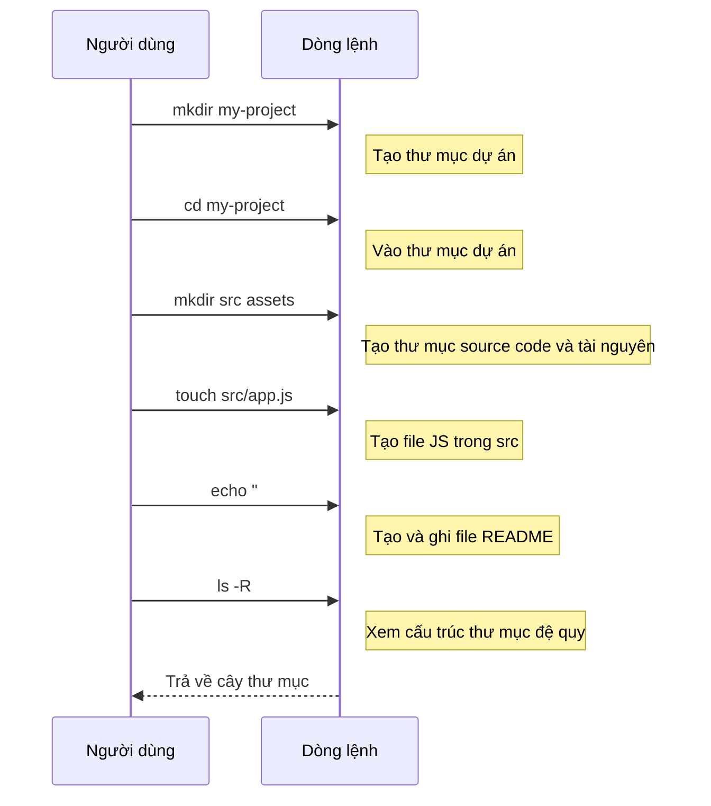

# 0.2.2 Thao tác file: Kiến trúc sư của thế giới số

### Tóm tắt một câu

Thao tác file bằng dòng lệnh là việc dùng các lệnh để đóng vai trò "kiến trúc sư", trong không gian số của bạn có thể tạo (xây nhà), xem (xem bản thiết kế), di chuyển (chuyển nhà), sao chép (nhân bản) và xóa (phá dỡ) file và thư mục.

### Giá trị cốt lõi

1.  **Xử lý hàng loạt**: Có thể tạo, di chuyển hoặc xóa số lượng lớn file một lúc, điều mà giao diện đồ họa khó có thể làm được.
2.  **Kiểm soát chính xác**: Thông qua tham số và tùy chọn, có thể thực hiện các thao tác rất tinh vi, ví dụ chỉ sao chép các file loại cụ thể.
3.  **Lõi của script**: Hầu hết mọi script tự động hóa đều chứa thao tác file. Ví dụ, một script build điển hình sẽ xóa thư mục output cũ trước, rồi tạo file mới.

### Giải thích các khái niệm cốt lõi

Nắm vững các lệnh cốt lõi sau đây, bạn có thể hoàn thành phần lớn nhiệm vụ quản lý file hàng ngày. Lưu ý sự khác biệt về tên lệnh giữa Windows (PowerShell) và macOS/Linux (Bash/Zsh).

| Nhiệm vụ | PowerShell (Windows) | Bash/Zsh (macOS/Linux) | Giải thích |
| :--- | :--- | :--- | :--- |
| **Liệt kê file** | `Get-ChildItem` (alias: `ls`, `gci`) | `ls` | Hiển thị file và thư mục trong thư mục hiện tại. |
| **Tạo thư mục** | `New-Item -ItemType Directory <tên_thư_mục>` (alias: `mkdir`) | `mkdir <tên_thư_mục>` | Tạo một thư mục mới. |
| **Tạo file** | `New-Item <tên_file>` (alias: `ni`) hoặc `echo "nội dung" > <tên_file>` | `touch <tên_file>` hoặc `echo "nội dung" > <tên_file>` | Tạo file trống hoặc file có nội dung. |
| **Xem nội dung** | `Get-Content <tên_file>` (alias: `cat`, `gc`) | `cat <tên_file>` | Hiển thị toàn bộ nội dung file trực tiếp trong dòng lệnh. |
| **Sao chép** | `Copy-Item <nguồn> <đích>` (alias: `cp`, `copy`) | `cp <nguồn> <đích>` | Sao chép file hoặc thư mục. |
| **Di chuyển/Đổi tên** | `Move-Item <nguồn> <đích>` (alias: `mv`, `move`) | `mv <nguồn> <đích>` | Di chuyển file hoặc thư mục, hoặc di chuyển trong cùng thư mục để đổi tên. |
| **Xóa** | `Remove-Item <đường_dẫn>` (alias: `rm`, `del`) | `rm <file>` / `rm -r <thư_mục>` | Xóa file hoặc thư mục. Tùy chọn `-r` (recursive) dùng để xóa đệ quy toàn bộ thư mục. |

#### Trực quan hóa quy trình làm việc

Hãy mô phỏng quy trình tạo dự án và sắp xếp file:

Quy trình này thể hiện rõ ràng cách xây dựng khung sườn cơ bản của một dự án từ không có gì.

### Hướng dẫn hợp tác với AI

Thao tác file là một trong những loại code mà AI sinh ra tốt nhất, nhưng bạn cần cung cấp ngữ cảnh rõ ràng.

*   **Ý định cốt lõi**: Nói cho AI biết bạn muốn thực hiện **thao tác gì** với **file/thư mục nào**, cùng với **nguồn và đích** của thao tác.
*   **Công thức định nghĩa yêu cầu**: `"Hãy cho tôi lệnh để [sao chép/di chuyển/xóa] [file/thư mục] từ [đường dẫn nguồn] đến [đường dẫn đích]."`
*   **Thuật ngữ quan trọng**: `tạo (create/make)`, `sao chép (copy)`, `di chuyển (move)`, `đổi tên (rename)`, `xóa (delete/remove)`, `thư mục (directory/folder)`, `file (file)`.

**Ví dụ**:

> **Bad ❌**: "Giúp tôi chuyển file sang đó."
> *File nào? Chuyển đến đâu?*
>
> **Good ✅**: "Tôi có file `logo.png` trong thư mục `~/Downloads`, hãy viết lệnh để sao chép nó vào thư mục `public/images` trong dự án hiện tại của tôi."

### Hướng dẫn tránh lỗi

*   **Nguy hiểm của `rm`**: Lệnh `rm` (hoặc `Remove-Item`) là **không thể hoàn tác**! File bị xóa sẽ không vào thùng rác. Khi sử dụng, đặc biệt là kết hợp với tùy chọn `-r` (đệ quy) và `-f` (force), nhất định phải kiểm tra lại thư mục bạn đang ở và đối tượng cần xóa. **Xóa nhầm file hệ thống là một trong những lỗi thảm họa dễ mắc nhất của newbie.**
*   **Ghi đè file**: Khi thực thi `cp` hoặc `mv`, nếu vị trí đích đã tồn tại file cùng tên, hệ thống thường sẽ hỏi bạn có muốn ghi đè không. Nhưng trong script, có thể trực tiếp ghi đè. Hãy tập thói quen kiểm tra vị trí đích trước.
*   **Ký tự đại diện `*`**: `*` là ký tự đại diện mạnh mẽ, đại diện cho "bất kỳ ký tự nào". Ví dụ, `rm *.log` sẽ xóa tất cả file có đuôi `.log`. Nó rất hiệu quả nhưng cũng nguy hiểm, trước khi dùng hãy xem trước danh sách file sẽ bị thao tác bằng lệnh như `ls *.log`.
