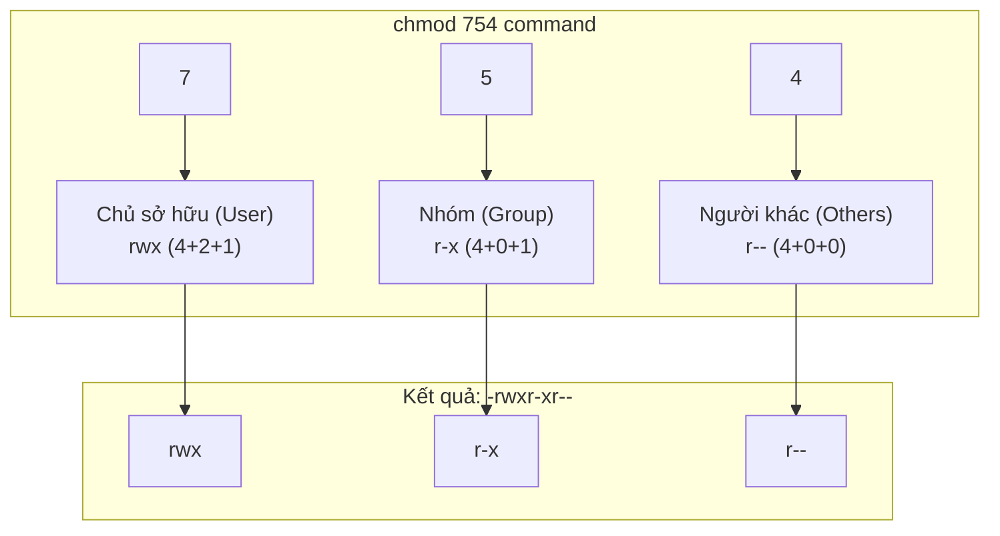

# 0.2.3 Quản lý quyền hạn: Vị thần bảo vệ tài sản số

### Tóm tắt một câu

Quản lý quyền hạn trong dòng lệnh chủ yếu thông qua lệnh `chmod`, giống như "cắt chìa khóa", chính xác cấp hoặc thu hồi khả năng truy cập file và thư mục của các người dùng khác nhau.

### Giá trị cốt lõi

1.  **Triển khai an toàn**: Khi triển khai ứng dụng trên server, thiết lập quyền file đúng là tuyến phòng thủ đầu tiên. Ví dụ, file private key được upload phải được thiết lập chỉ chủ sở hữu mới đọc được.
2.  **Thực thi script**: File script bạn tự viết (như file `.sh`), mặc định có thể không có quyền thực thi. Bạn cần tự "kích hoạt" khả năng thực thi cho nó.
3.  **Quy chuẩn hợp tác**: Trong hệ thống quản lý phiên bản như Git, quyền thực thi của file sẽ được ghi lại. Thiết lập quyền đúng có thể tránh thành viên nhóm gặp hành vi không nhất quán trên các hệ điều hành khác nhau.

### Giải thích các khái niệm cốt lõi (Ví dụ Linux/macOS)

Chúng ta đã hiểu khái niệm `rwx` về quyền hạn trong phần `0.1.3`. Trong dòng lệnh, chúng ta dùng lệnh `chmod` (Change Mode) để sửa các bit quyền hạn này. `chmod` có hai cách sử dụng chính: chế độ ký hiệu và chế độ số.

*   **Symbolic Mode (Chế độ ký hiệu)**: Trực quan hơn, dễ hiểu hơn.
    *   **Người dùng**: `u` (user/owner), `g` (group), `o` (others), `a` (all)
    *   **Thao tác**: `+` (thêm quyền), `-` (xóa quyền), `=` (thiết lập chính xác quyền)
    *   **Quyền**: `r` (read), `w` (write), `x` (execute)

    **Ví dụ**:
    *   `chmod u+x script.sh`: Thêm (+) quyền thực thi (x) cho chủ sở hữu (user).
    *   `chmod go-w config.yml`: Xóa (-) quyền ghi (w) cho nhóm (group) và người khác (others).
    *   `chmod a=r private.key`: Thiết lập chính xác (=) quyền chỉ đọc (r) cho tất cả mọi người (all).

*   **Octal Mode (Chế độ số bát phân)**: Ngắn gọn hơn, là phương pháp thường dùng của chuyên gia và trong script.
    Nó dùng một số bát phân ba chữ số để biểu diễn quyền `rwx`:
    *   `r` = 4
    *   `w` = 2
    *   `x` = 1

    Một tổ hợp quyền là tổng của ba số này. Ví dụ:
    *   `rwx` = 4 + 2 + 1 = `7`
    *   `r-x` = 4 + 0 + 1 = `5`
    *   `rw-` = 4 + 2 + 0 = `6`
    *   `r--` = 4 + 0 + 0 = `4`

    Ba chữ số sau `chmod` lần lượt tương ứng với quyền của **chủ sở hữu**, **nhóm**, **người khác**.

#### Trực quan hóa cấu trúc

Lệnh `chmod 754 <tên_file>` này làm gì?

**Giải thích**: Lệnh này thiết lập quyền file thành: chủ sở hữu có thể đọc ghi thực thi, thành viên nhóm có thể đọc và thực thi, người khác chỉ có thể đọc.

### Hướng dẫn hợp tác với AI

Khi bạn không chắc nên dùng quyền nào, có thể hỏi AI để có gợi ý thực hành tốt nhất.

*   **Ý định cốt lõi**: Mô tả **loại file** và **kịch bản sử dụng** của bạn, để AI đưa ra gợi ý quyền an toàn nhất.
*   **Công thức định nghĩa yêu cầu**: `"Tôi có một [loại file], nó sẽ được dùng cho [kịch bản sử dụng]. Hãy cho tôi biết nên thiết lập quyền bao nhiêu? Hãy cho tôi lệnh chmod cụ thể."`
*   **Thuật ngữ quan trọng**: `chmod`, `quyền (permission)`, `chế độ số (octal)`, `chế độ ký hiệu (symbolic)`, `script (script)`, `file cấu hình (config file)`, `private key (private key)`.

**Ví dụ**:

> **Bad ❌**: "Quyền file của tôi có vấn đề."
> *Quá mơ hồ, không thể đưa ra hỗ trợ hữu ích.*
>
> **Good ✅**: "Tôi đang triển khai ứng dụng Node.js lên server Ubuntu. Tôi có file `.env` chứa mật khẩu database. Để bảo mật, tôi nên thiết lập quyền gì cho file này? Hãy dùng chế độ số cho tôi lệnh `chmod`."
> *AI sẽ cho bạn biết, file nhạy cảm như vậy thường nên thiết lập `600` hoặc `400`, tức chỉ chủ sở hữu có thể đọc ghi hoặc chỉ đọc.*

### Hướng dẫn tránh lỗi

*   **Quyền thực thi của thư mục**: Đối với thư mục, quyền `x` (execute) có nghĩa là "**có thể vào thư mục**". Nếu bạn xóa quyền `x` của một thư mục, thì ngay cả khi bạn có quyền đọc ghi tất cả file bên trong, bạn vẫn không thể `cd` vào, cũng không thể truy cập bất kỳ file nào trong đó.
*   **Sức mạnh của `chmod -R`**: Tham số `-R` (Recursive) sẽ khiến lệnh `chmod` áp dụng đệ quy cho tất cả file và thư mục con. Đây là công cụ rất mạnh, nhưng cũng nguy hiểm. Ví dụ, `chmod -R 777 /my-app` sẽ thiết lập toàn bộ thư mục ứng dụng hoàn toàn mở, có thể dẫn đến lỗ hổng bảo mật nghiêm trọng.
*   **Mô hình quyền của Windows**: Windows có lệnh `icacls` và `Set-Acl` cung cấp mô hình quyền ACL (Access Control List) phức tạp hơn, khác với mô hình `rwx` của Linux/macOS. Mặc dù PowerShell cung cấp một số alias tương thích, nhưng khi thực hiện quản lý quyền tinh vi, bạn cần dùng công cụ và khái niệm gốc của Windows.
