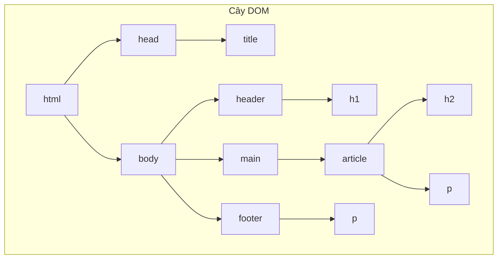

# 0.3.1 Xây Dựng Bộ Khung Trang Web—HTML: Cấu Trúc và Thẻ Ngữ Nghĩa

### Tóm Tắt Một Câu

HTML (HyperText Markup Language) là một **ngôn ngữ đánh dấu**, sử dụng các **thẻ (Tag)** khác nhau để định nghĩa **cấu trúc** và **nội dung** của trang web, giống như khung thép khi xây nhà, quyết định đâu là phòng khách, đâu là phòng ngủ.

### Tái Cấu Trúc Nhận Thức: HTML Không Phải Là Ngôn Ngữ Lập Trình

Quan niệm truyền thống cho rằng frontend là viết code, nhưng bản chất của HTML là **mô tả**, chứ không phải **logic**. Nó không chứa biến, vòng lặp hay câu điều kiện. Nhiệm vụ của nó là nói với trình duyệt: "Đây là một tiêu đề", "Đây là một đoạn văn", "Đây là một hình ảnh".

Trong thế giới của Vibe Coding, AI cực kỳ giỏi trong việc tạo cấu trúc HTML. Nhiệm vụ cốt lõi của bạn chuyển từ "gõ thủ công từng thẻ" sang "**định nghĩa cấu trúc trang và các khối nội dung một cách rõ ràng, và lựa chọn các thẻ ngữ nghĩa phù hợp nhất để mô tả chúng**". Bạn chịu trách nhiệm thiết kế bản vẽ, AI chịu trách nhiệm xây tường.

### Khôi Phục Bản Chất: HTML Là Một Cấu Trúc Cây (DOM)

Sau khi đọc tài liệu HTML, trình duyệt sẽ xây dựng một "Mô hình Đối tượng Tài liệu" (Document Object Model, DOM) dạng cây trong bộ nhớ. Mô hình này là nền tảng cho việc áp dụng CSS và tương tác JavaScript sau này.

Một cấu trúc HTML điển hình như sau:

```html
<!DOCTYPE html>
<html>
<head>
    <title>Trang Web Của Tôi</title>
</head>
<body>
    <header>
        <h1>Tiêu Đề Trang Web</h1>
    </header>
    <main>
        <article>
            <h2>Tiêu Đề Bài Viết</h2>
            <p>Đây là một đoạn văn.</p>
        </article>
    </main>
    <footer>
        <p>Thông Tin Bản Quyền</p>
    </footer>
</body>
</html>
```

#### Trực Quan Hóa Cấu Trúc (Cây DOM)

Đoạn code HTML trên có thể được phân tích thành cây DOM như sau:



**Nhận thức**: Khi bạn hiểu về cây DOM, bạn sẽ hiểu tại sao bộ chọn CSS có thể "đi sâu từng lớp", tại sao JavaScript có thể "tìm kiếm theo sơ đồ" để tìm bất kỳ phần tử nào. **Khi kiểm tra HTML do AI tạo ra, cốt lõi là kiểm tra xem cấu trúc logic của cây này có rõ ràng và hợp lý không.**

### Giá Trị Cốt Lõi: Thẻ Ngữ Nghĩa (Semantic Tags)

Cùng là hiển thị một tiêu đề, bạn có thể dùng `<h1>`, hoặc cũng có thể dùng `<div>` rồi dùng CSS để phóng to và làm đậm. Nhưng cái trước là "ngữ nghĩa", cái sau thì không.

**Thẻ ngữ nghĩa**, là sử dụng thẻ mô tả tốt nhất chức năng nội dung của nó. Điều này không chỉ để cho đẹp.

*   **Thân thiện với máy móc (SEO)**: Các bot thu thập dữ liệu của công cụ tìm kiếm (như Google) có thể hiểu rõ hơn cấu trúc trang của bạn, biết đâu là tiêu đề chính, đâu là điều hướng, từ đó xếp hạng tìm kiếm cao hơn.
*   **Thân thiện với người khuyết tật (Accessibility)**: Các công cụ hỗ trợ như trình đọc màn hình có thể dựa vào ngữ nghĩa của thẻ để cung cấp điều hướng và đọc nội dung rõ ràng cho người dùng khiếm thị.
*   **Thân thiện với AI**: Khi hướng dẫn cho AI bao gồm thẻ ngữ nghĩa, AI có thể hiểu chính xác hơn ý định của bạn. Ví dụ, nói với AI "thêm một `<section>` mới trong thẻ `<main>`" rõ ràng hơn nhiều so với "thêm một `div` nữa trong cái `div` kia".
*   **Thân thiện với bản thân bạn trong tương lai**: Vài tháng sau khi quay lại xem code, cấu trúc ngữ nghĩa rõ ràng giúp bạn ngay lập tức nhớ lại chức năng của từng phần.

**Các thẻ ngữ nghĩa thường dùng**:

*   `<header>`: Phần đầu trang hoặc khối.
*   `<nav>`: Khu vực liên kết điều hướng.
*   `<main>`: Nội dung cốt lõi của trang, mỗi trang chỉ nên có một.
*   `<article>`: Khối nội dung độc lập, hoàn chỉnh, như một bài blog, một tin tức.
*   `<section>`: Khối nội dung theo chủ đề.
*   `<aside>`: Thanh bên, nội dung có mối liên hệ thấp với nội dung chính.
*   `<footer>`: Phần cuối trang hoặc khối.

### Hướng Dẫn Cộng Tác Với AI

*   **Ý định cốt lõi**: Mô tả rõ ràng với AI **bố cục trang** và **các khối nội dung** bạn muốn, và chỉ định sử dụng **thẻ ngữ nghĩa**.
*   **Công thức định nghĩa yêu cầu**: `"Hãy giúp tôi tạo một bố cục trang web chuẩn, bao gồm <header>, <main> và <footer>. Trong khu vực <main>, tôi cần hai <article>, mỗi <article> chứa một tiêu đề <h2> và ba đoạn văn <p>."`
*   **Thuật ngữ quan trọng**: `bố cục (layout)`, `ngữ nghĩa (semantic)`, `<header>`, `<main>`, `<footer>`, `<article>`, `<section>`.

**Chiến lược tương tác**:

1.  **Yêu cầu cấu trúc trước, nội dung sau**: Trước tiên để AI tạo bộ khung HTML tổng thể của trang.
2.  **Xác nhận bộ khung**: Kiểm tra xem bộ khung mà AI đưa ra có đúng với mong đợi của bạn không, các thẻ ngữ nghĩa có được sử dụng phù hợp không.
3.  **Điền chi tiết**: Sau đó hướng dẫn AI: "Bây giờ, hãy giúp tôi điền nội dung giới thiệu về 'Vibe Coding' vào `<article>` đầu tiên."

Thông qua cách này, bạn luôn nắm quyền kiểm soát cấu trúc vĩ mô của trang, trong khi giao việc điền nội dung tẻ nhạt và tạo thẻ chi tiết cho AI.
