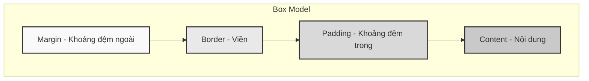
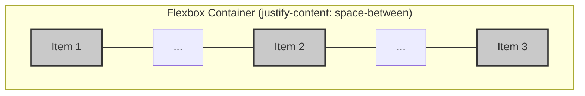

# 0.3.2 Mặc Quần Áo Cho Trang Web—CSS: Cơ Bản Về Kiểu Dáng và Bố Cục

## Tái Cấu Trúc Nhận Thức: Từ "Cọ Vẽ" Đến "Bộ Quy Tắc"

Trong quan niệm truyền thống, CSS giống như một cây cọ vẽ, chỗ nào không đẹp thì sơn lại. Cách suy nghĩ này sẽ nhanh chóng sụp đổ khi đối mặt với các trang phức tạp, dẫn đến kiểu dáng hỗn loạn, khó bảo trì, cuối cùng trở thành "núi code rác về kiểu dáng".

**Nhận thức trong phát triển frontend hiện đại: CSS không phải là cọ vẽ, mà là một "Bộ quy tắc" (Rule Set).** Bạn không còn là người công nhân nội thất đầy mồ hôi, mà là một kiến trúc sư thanh lịch, bạn chịu trách nhiệm định nghĩa các quy tắc, trình duyệt sẽ tự động và chính xác hoàn thành việc render theo quy tắc của bạn.

Bạn chỉ cần nói với trình duyệt: "Tất cả các phần tử `div` có class là `card`, đều phải có viền màu xám và padding 16px." Dù trên trang có 1 hay 100 thẻ card như vậy, trình duyệt đều sẽ trung thành thực thi quy tắc này.

Sự chuyển đổi tư duy này là bước nhảy vọt từ "mệnh lệnh" sang "khai báo", cũng là nền tảng của hệ thống kiểu dáng hiệu quả và dễ bảo trì.

## Khôi Phục Bản Chất: Hai Trụ Cột Của CSS—"Box Model" Và "Layout"

Tất cả các hiệu ứng CSS phức tạp đều có thể được phân tách thành hai khái niệm cơ bản nhất:

1.  **Box Model (Mô hình hộp)**: Vạn vật đều là hộp. Mỗi phần tử trên trang web, dù là một đoạn văn, một hình ảnh hay một nút bấm, đều được trình duyệt xem là một "hộp" hình chữ nhật. Tất cả các kiểu dáng bạn áp dụng cho phần tử, bản chất đều là điều chỉnh các thuộc tính của hộp này.
2.  **Layout (Bố cục)**: Mối quan hệ giữa các hộp với nhau. Là sắp xếp theo chiều dọc, phân bố theo chiều ngang, hay cấu trúc lưới phức tạp? Bố cục là định nghĩa các quy tắc về cách các hộp này cùng tồn tại hài hòa trong không gian một chiều hoặc hai chiều.

### Trực Quan Hóa Cấu Trúc 1: Box Model

Mỗi phần tử HTML là một hộp hình chữ nhật từ trong ra ngoài, bao gồm bốn phần:

*   **Content (Nội dung)**: Lõi của hộp, hiển thị văn bản, hình ảnh, v.v.
*   **Padding (Khoảng đệm trong)**: Vùng trong suốt bao quanh bên ngoài vùng nội dung.
*   **Border (Viền)**: Đường viền bao quanh padding.
*   **Margin (Khoảng đệm ngoài)**: Vùng trong suốt bao quanh viền, dùng để kiểm soát khoảng cách giữa hộp này với các hộp khác.



**Nhận thức**: Khi gặp vấn đề về kích thước hoặc khoảng cách trong kiểu dáng do AI tạo ra, phản ứng đầu tiên của bạn nên là mở công cụ phát triển của trình duyệt, kiểm tra box model của phần tử tương ứng. Là `padding` quá lớn, hay `margin` tính toán sai? Bằng cách kiểm tra box model, 90% vấn đề về kiểu dáng có thể được định vị nhanh chóng.

### Trực Quan Hóa Cấu Trúc 2: Nền Tảng Của Bố Cục Hiện Đại—Flexbox

Hãy quên đi những `float` và `position` cũ kỹ. Đối với phát triển Web hiện đại, **Flexbox** là best practice để giải quyết vấn đề bố cục một chiều. Nó như một băng chuyền, bạn có thể dễ dàng kiểm soát các vật phẩm (hộp) trên băng chuyền căn trái, căn phải, căn giữa, hay phân bổ đều không gian.

Giả sử chúng ta có một container (phần tử cha), bên trong có ba item (phần tử con).

```html
<div class="container">
  <div class="item">1</div>
  <div class="item">2</div>
  <div class="item">3</div>
</div>
```

```css
.container {
  display: flex; /* Bật Flexbox layout */
  justify-content: space-between; /* Phân bổ đều không gian giữa các phần tử con */
}
```

**Hiệu ứng**:



**Nhận thức**: Khi bạn cần một nhóm phần tử căn chỉnh theo chiều ngang hoặc chiều dọc, hãy nói trực tiếp với AI: "Sử dụng bố cục Flexbox, để các phần tử con căn giữa theo chiều dọc và căn đều hai đầu theo chiều ngang". AI nên ngay lập tức tạo ra code như `display: flex; align-items: center; justify-content: space-between;`. Nếu nó vẫn dùng "phương pháp cổ" căn giữa bằng `position: absolute` kết hợp với `top: 50%` và `transform: translateY(-50%)`, bạn phải ngay lập tức nhận ra rằng đây có thể không phải là giải pháp tối ưu cho tình huống hiện tại.

## Hướng Dẫn Cộng Tác Với AI: Từ "Cho Tôi Một Nút" Đến "Định Nghĩa Một Quy Chuẩn Nút"

Khi cộng tác với AI viết CSS, điều cấm kỵ nhất là giao tiếp theo mệnh lệnh và phân mảnh.

*   **Giao tiếp kém hiệu quả**: "Làm nút này to hơn một chút, đổi màu thành xanh dương."
*   **Giao tiếp hiệu quả**: "Định nghĩa một bộ quy chuẩn nút cho ứng dụng của chúng ta. Nút chính (primary) có màu nền là xanh thương hiệu, nút phụ (secondary) có viền màu xám. Tất cả các nút đều phải có bo góc 4px và padding 8px 16px."

### Công Thức Định Nghĩa Yêu Cầu

**Mô tả component + Trạng thái hình ảnh + Hành vi bố cục**

*   **Ví dụ**: "Tạo một component card (`.card`). Trạng thái mặc định có bóng đổ mềm và bo góc. Khi di chuột (`:hover`), bóng đổ đậm hơn. Trong chế độ xem di động, card chiếm đầy màn hình; trên desktop, tối đa hiển thị ba card trên một hàng."

### Thuật Ngữ Quan Trọng

*   **Selector (Bộ chọn)**: `h1`, `.class`, `#id`, `[attribute]`
*   **Property (Thuộc tính)**: `color`, `font-size`, `margin`
*   **Value (Giá trị)**: `red`, `16px`, `auto`
*   **Pseudo-class (Lớp giả)**: `:hover`, `:focus`, `:nth-child`
*   **Responsive Design (Thiết kế responsive)**: `@media (max-width: 768px)`

### Chiến Lược Tương Tác

1.  **Cấu trúc trước, kiểu dáng sau**: Trước tiên để AI tạo cấu trúc HTML, xác nhận không có lỗi, sau đó mới cho nó viết CSS.
2.  **Định nghĩa theo component**: Giao tiếp xoay quanh "component", không phải "trang". Nói với AI bạn muốn viết một "thanh điều hướng", chứ không phải "thanh xanh ở đầu trang".
3.  **Cung cấp design system/quy chuẩn**: Nếu bạn có quy chuẩn về màu sắc, font chữ, khoảng cách, v.v., hãy cung cấp trực tiếp cho AI. Nó có thể tạo ra code phù hợp với phong cách thương hiệu của bạn nhanh hơn.
4.  **Dùng nhiều `class`, ít dùng `id`**: `class` là quy tắc có thể tái sử dụng, `id` là trường hợp đặc biệt duy nhất. Ưu tiên sử dụng `class` để làm CSS của bạn module hóa và dễ bảo trì hơn.

Thông qua cách này, bạn sẽ hướng dẫn AI tạo ra code CSS có cấu trúc rõ ràng, dễ mở rộng, chứ không phải một đống "bản vá" khó bảo trì.
