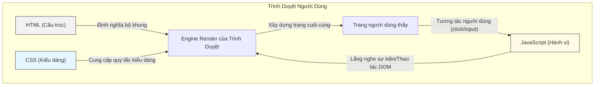

# 0.3.4 Tại Sao Phải Tách Riêng Bộ Khung, Quần Áo và Hành Động—Cộng Tác Ba Phần: Tư Tưởng Thiết Kế Tách Biệt Mối Quan Tâm

## Tái Cấu Trúc Nhận Thức: Từ "Trộn Lẫn" Đến "Từng Phần Làm Việc Riêng"

Lỗi dễ mắc nhất của người mới học là trộn lẫn HTML, CSS và JavaScript lại với nhau, viết code kiểu "lẫn lộn". Ví dụ, viết thuộc tính `style` trực tiếp trong thẻ HTML, hoặc dùng thuộc tính `onclick` để thực thi code JavaScript.

Cách làm này có vẻ tiện trong các bài tập nhỏ, nhưng trong dự án thực tế, nó là khởi đầu của thảm họa. Code sẽ trở nên cực kỳ khó đọc, bảo trì và mở rộng. Hãy tưởng tượng, để sửa màu của một nút, bạn có thể phải tìm kiếm và thay thế thủ công trong hàng chục file HTML, thay vì chỉ sửa một dòng code trong file CSS.

**Nhận thức đúng đắn: HTML, CSS và JavaScript là một đội nhóm, nhưng các thành viên trong đội nên làm việc riêng của mình, chứ không nên can thiệp lẫn nhau.** Tư tưởng này chính là **Separation of Concerns (Tách biệt mối quan tâm, SoC)** cực kỳ quan trọng trong kỹ nghệ phần mềm.

*   **HTML (Lớp cấu trúc)**: Chỉ chịu trách nhiệm định nghĩa nội dung và cấu trúc của trang. Nó như khung thép của tòa nhà, quyết định đâu là phòng khách, đâu là phòng ngủ.
*   **CSS (Lớp trình bày)**: Chỉ chịu trách nhiệm định nghĩa kiểu dáng và bố cục của trang. Nó như thiết kế nội thất của tòa nhà, quyết định sơn tường màu gì, đặt đồ đạc như thế nào.
*   **JavaScript (Lớp hành vi)**: Chỉ chịu trách nhiệm định nghĩa tương tác và logic của trang. Nó như hệ thống điện nước của tòa nhà, làm cho đèn sáng, nước chảy.

## Khôi Phục Bản Chất: Một Hợp Đồng Có Thể Bảo Trì Bền Vững

Bản chất của tách biệt mối quan tâm là thiết lập một "hợp đồng" rõ ràng, có thể bảo trì bền vững giữa ba lớp này.

*   **CSS ký hợp đồng với HTML thông qua "selector"**. CSS nói: "Tôi không quan tâm cấu trúc HTML của bạn thay đổi thế nào, chỉ cần bạn có một phần tử có class là `primary-button`, tôi sẽ render nó màu xanh."
*   **JavaScript ký hợp đồng với HTML thông qua "selector" và "event"**. JavaScript nói: "Tôi không quan tâm bạn trông như thế nào, chỉ cần trong trang có một form có ID là `login-form`, và nó được submit, tôi sẽ xử lý logic đăng nhập."

Mô hình cộng tác dựa trên "hợp đồng" này cho phép ba lớp có thể được chỉnh sửa và mở rộng độc lập, mà không dễ dàng phá vỡ chức năng của nhau.

## Trực Quan Hóa Cấu Trúc: Mô Hình Cộng Tác Ba Lớp

Sơ đồ này thể hiện rõ ràng:
1.  HTML, CSS, JS được tải như các module độc lập bởi trình duyệt.
2.  Engine render của trình duyệt "kết hợp" chúng lại, tạo ra trang cuối cùng mà người dùng thấy.
3.  Hành vi tương tác của người dùng (như click) sẽ kích hoạt JavaScript, JavaScript lại thao tác DOM (tức thay đổi cấu trúc HTML hoặc gián tiếp thay đổi CSS thông qua việc sửa class), từ đó cập nhật view, tạo thành vòng lặp tương tác hoàn chỉnh.

## Nhận Thức: Cách Nhận Diện "Code Xấu"

Khi Review code do AI tạo ra, bạn phải như một kiến trúc sư giàu kinh nghiệm, cảnh giác với những "mùi xấu" vi phạm nguyên tắc "tách biệt mối quan tâm":

*   **Thuộc tính `style` trong HTML**: `
...
`
    *   **Tại sao là mùi xấu?** Điều này hàn chặt kiểu dáng vào cấu trúc. Nếu tương lai cần sửa đồng loạt font size của tất cả đoạn văn, đây sẽ là cơn ác mộng.
    *   **Cách làm đúng**: Định nghĩa một class trong file CSS `.error-text { color: red; font-size: 14px; }`, sau đó trong HTML sử dụng `
...
`.

*   **Thuộc tính sự kiện `on*` trong HTML**: `<button onclick="myFunction()">Click me</button>`
    *   **Tại sao là mùi xấu?** Điều này trộn lẫn hành vi với cấu trúc. Làm cho code JavaScript rải rác trong các file HTML, khó quản lý và debug.
    *   **Cách làm đúng**: Trong file JS độc lập, dùng `document.getElementById('my-button').addEventListener('click', myFunction);` để gắn sự kiện.

*   **Thao tác trực tiếp `style` trong JavaScript**: `element.style.color = 'blue'; element.style.backgroundColor = 'white';`
    *   **Tại sao là mùi xấu?** Khi cần sửa nhiều kiểu dáng, điều này làm code JS trở nên cồng kềnh và lộn xộn, đưa logic của lớp trình bày vào lớp hành vi.
    *   **Cách làm đúng**: Định nghĩa trước một class trong CSS `.is-active { color: blue; background-color: white; }`, sau đó trong JS chỉ làm một việc: `element.classList.add('is-active');`. Để JS tập trung vào "chuyển đổi trạng thái", chứ không quan tâm "kiểu dáng cụ thể của trạng thái".

## Hướng Dẫn Cộng Tác Với AI

### Ý Định Cốt Lõi

Nhấn mạnh với AI rằng bạn muốn nó tạo code **"tách biệt cấu trúc, kiểu dáng, hành vi"**.

### Công Thức Định Nghĩa Yêu Cầu

**"Tạo cho tôi một [component], hãy đặt HTML, CSS và JavaScript trong các khối code riêng biệt. Sử dụng class làm điểm kết nối giữa CSS và JavaScript."**

*   **Ví dụ**: "Tôi cần một component accordion có thể thu gọn. Hãy cung cấp cho tôi ba phần code: cấu trúc HTML (dùng `div` và `button`), kiểu dáng CSS (định nghĩa class cho hai trạng thái mở rộng và thu gọn), và logic JavaScript (kiểm soát mở rộng và thu gọn bằng cách chuyển đổi class, không thao tác trực tiếp style)."

### Chiến Lược Tương Tác

1.  **Bắt buộc tách biệt**: Yêu cầu rõ ràng với AI "không sử dụng inline style" và "không sử dụng thuộc tính on-event".
2.  **Giao tiếp dựa trên chuyển đổi trạng thái**: Dùng nhiều hướng dẫn như "chuyển đổi class", "thêm/xóa class", hướng dẫn AI thay đổi view bằng cách thay đổi trạng thái (class).
3.  **Yêu cầu từng bước**: Bạn có thể để AI tạo cấu trúc HTML trước, sau đó dựa trên cấu trúc này, cho nó tạo riêng CSS và JavaScript. Điều này giúp bạn kiểm soát tốt hơn chất lượng từng phần code.

Nắm vững "tách biệt mối quan tâm", bạn sẽ nắm được chìa khóa để viết code frontend có thể bảo trì và mở rộng. Đây là con đường bắt buộc từ người mới bắt đầu đến chuyên nghiệp, cũng là nền tảng để cộng tác hiệu quả với AI và tạo ra code chất lượng cao.
