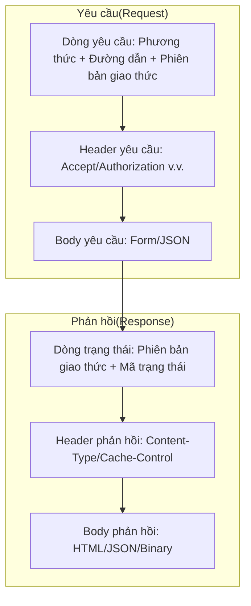
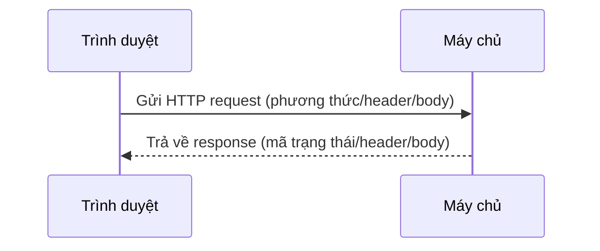

# 0.3.5.1 Trình duyệt đang nói gì—Cơ bản giao thức HTTP: Request/Response/Mã trạng thái

## Một câu tóm tắt

HTTP là định dạng thống nhất để trình duyệt và máy chủ "đối化": **client gửi request (Yêu cầu), server trả về response (Phản hồi)**, hai bên giao tiếp dựa trên cú pháp cố định.

## Giá trị cốt lõi

- Ngữ nghĩa thống nhất: Phương thức (GET/POST/PUT/DELETE/PATCH) và mã trạng thái (2xx/3xx/4xx/5xx) giúp giao tiếp có quy chuẩn.
- Loose coupling: Client và server chỉ cần thống nhất interface và định dạng trao đổi (như JSON), có thể phát triển độc lập.
- Có thể quan sát: Request và response dễ dàng ghi lại và phân tích, hỗ trợ debug và giám sát đáng tin cậy.

## Bản chất: Cấu trúc Request và Response

### Ngữ nghĩa và tính idempotent của các phương thức

- `GET`: Đọc tài nguyên. Nên không có tác dụng phụ, idempotent.
- `POST`: Tạo mới hoặc kích hoạt hành động. Thường không idempotent.
- `PUT`: Cập nhật toàn bộ tài nguyên. Idempotent.
- `PATCH`: Cập nhật một phần tài nguyên. Thường không idempotent.
- `DELETE`: Xóa tài nguyên. Idempotent (xóa lặp lại không nên thất bại).

### Mã trạng thái thường gặp

- `200` Thành công; `201` Đã tạo; `204` Không có nội dung
- `301/302` Chuyển hướng; `304` Trúng cache
- `400` Lỗi yêu cầu; `401` Chưa xác thực; `403` Không có quyền; `404` Không tìm thấy
- `500` Lỗi máy chủ; `502` Lỗi gateway; `503` Dịch vụ không khả dụng

## Trực quan hóa tương tác: Một chu trình request-response hoàn chỉnh

## Nhận thức: Review code nên chú ý điều gì

- Phương thức và ngữ nghĩa có khớp không? Thao tác ghi dữ liệu mà dùng `GET` là thiết kế sai.
- Mã trạng thái có đúng không? Đừng trả `200` cho cả lỗi nghiệp vụ.
- Thông tin header có hợp lý không? `Content-Type`/`Accept` có nhất quán với nội dung thực tế không.
- Tính idempotent có bị phá vỡ không? Ảnh hưởng của việc gọi lặp lại có rõ ràng không.

## Hướng dẫn cộng tác với AI

- Ý định cốt lõi: Để AI giúp bạn "thiết kế interface chuẩn" hoặc "chẩn đoán tại sao request nào đó thất bại".
- Công thức định nghĩa yêu cầu:
  - "Thiết kế REST interface cho `/api/users`: hỗ trợ phân trang truy vấn (GET), tạo mới (POST), cập nhật toàn bộ (PUT), xóa (DELETE), trả về JSON."
  - "Tôi truy cập `https://api.example.com/users` trả về `403`, hãy cho tôi lệnh để troubleshoot trong PowerShell."
- Thuật ngữ quan trọng: `phương thức`, `mã trạng thái`, `request header`, `response header`, `idempotent`, `cache`.
- Lệnh PowerShell thường dùng trên Windows:
  - `Invoke-WebRequest -Method GET -Uri https://api.example.com/users -UseBasicParsing`
  - `Invoke-RestMethod -Method POST -Uri https://api.example.com/users -Body '{"name":"Alice"}' -ContentType 'application/json'`
  - `Test-NetConnection -ComputerName api.example.com -Port 443`

## Hướng dẫn tránh lỗi

- Không dùng `GET` để truyền thông tin nhạy cảm; tránh đặt token vào query string.
- Body phản hồi và `Content-Type` phải khớp; JSON luôn dùng `application/json`.
- Trường hợp thất bại hãy trả về mã lỗi và thông báo lỗi rõ ràng, thuận tiện cho client xử lý.
