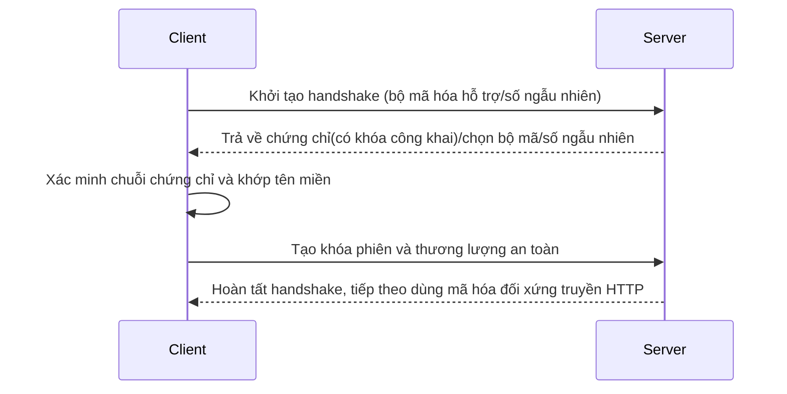

# 0.3.5.2 Tại sao URL có ổ khóa—HTTPS và Bảo mật: Cấu hình chứng chỉ SSL/TLS

## Một câu tóm tắt

HTTPS = HTTP + TLS. Nó thông qua mã hóa, xác minh và chứng chỉ, giúp dữ liệu của bạn trên internet **bảo mật**, **không bị giả mạo**, **danh tính đối phương đáng tin cậy**.

## Giá trị cốt lõi

- Tính bí mật: Ngăn nghe lén (người trung gian không thể đọc nội dung).
- Tính toàn vẹn: Ngăn giả mạo (nội dung bị thay đổi sẽ bị phát hiện).
- Xác thực danh tính: Client có thể xác nhận server thực sự là "chính nó" (chuỗi chứng chỉ và tên miền khớp).

## Bản chất: Cái nhìn đơn giản về TLS handshake

### Chứng chỉ và Tin cậy

- Chứng chỉ do CA đáng tin cậy cấp, chứa khóa công khai và thông tin tên miền.
- Trình duyệt xác minh chuỗi chứng chỉ (chứng chỉ trung gian → chứng chỉ gốc), và kiểm tra tên miền có khớp không.
- Môi trường production nên bật HSTS (`Strict-Transport-Security`) bắt buộc toàn site dùng HTTPS.

## Nhận thức: Review cấu hình nên chú ý điều gì

- Tên miền chứng chỉ có khớp hoàn toàn với site không (bao gồm subdomain và wildcard).
- Chứng chỉ có hết hạn không, chuỗi có đầy đủ không, có bật bộ mã hóa hiện đại không.
- Có tồn tại "mixed content" không (trang HTTPS tham chiếu tài nguyên HTTP).
- Cấu hình TLS termination ở reverse proxy có đúng không (Nginx/Cloudflare v.v.).

## Hướng dẫn cộng tác với AI

- Ý định cốt lõi: Để AI giúp bạn "cấu hình chứng chỉ" hoặc "chẩn đoán lỗi truy cập HTTPS".
- Công thức định nghĩa yêu cầu:
  - "Tôi bật TLS termination ở Nginx, hãy tạo cấu hình chuỗi chứng chỉ đầy đủ, và bật HSTS cùng chuyển hướng sang HTTPS."
  - "Truy cập `https://api.example.com` báo lỗi chứng chỉ, hãy kiểm tra từng bước tên miền, hạn sử dụng và chuỗi chứng chỉ."
- Lệnh PowerShell thường dùng trên Windows:
  - `Test-NetConnection -ComputerName api.example.com -Port 443`
  - `Invoke-WebRequest -Uri https://api.example.com -UseBasicParsing`

## Hướng dẫn tránh lỗi

- Chứng chỉ chỉ bao gồm tên miền đã đăng ký; `www.example.com` và `api.example.com` cần bao gồm riêng hoặc dùng wildcard.
- Đừng cung cấp endpoint `http://` ở môi trường production; bắt buộc chuyển sang HTTPS và bật HSTS.
- Tránh hard-code thông tin nhạy cảm trong code frontend; tất cả truyền dữ liệu đều đi qua HTTPS.
