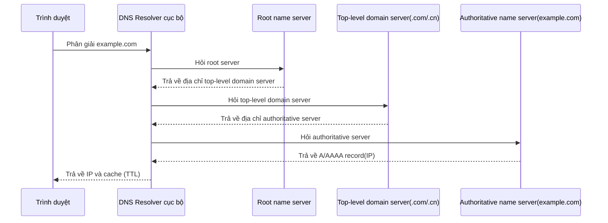

# 0.3.5.3 https://www.baidu.com/search?q=www.baidu.com là gì—Tên miền và DNS: Phân giải và cấu hình tên miền

## Một câu tóm tắt

DNS chính là "danh bạ điện thoại" của internet: dịch **tên miền** dễ nhớ thành **địa chỉ IP** khó nhớ, giúp trình duyệt biết phải tìm máy nào.

## Khái niệm cốt lõi

- Loại bản ghi: `A`(IPv4), `AAAA`(IPv6), `CNAME`(alias), `MX`(email), `TXT`(text/xác minh), `NS`(name server).
- TTL (Time To Live): Cache trong bao lâu. TTL càng thấp càng realtime, càng cao càng tiết kiệm tài nguyên nhưng cập nhật chậm.
- Phân giải đệ quy: Resolver cục bộ hỏi từng cấp root → top-level domain → authoritative server, cuối cùng nhận được IP.

## Trực quan hóa quy trình phân giải

## Nhận thức: Điểm chú ý khi cấu hình và troubleshoot

- CNAME và A không được vòng lặp lẫn nhau; CNAME không thể cùng tồn tại với record khác có cùng tên.
- Giá trị record có đúng không (IPv4/IPv6); có thiếu cấu hình riêng cho `www` và domain gốc không.
- Thay đổi DNS cần thời gian lan truyền; tốc độ có hiệu lực của các ISP khác nhau không giống nhau.

## Hướng dẫn cộng tác với AI

- Ý định cốt lõi: Để AI giúp bạn "thiết kế record set" hoặc "xác định nguyên nhân thất bại phân giải".
- Công thức định nghĩa yêu cầu:
  - "Cấu hình record `A` và `AAAA` cho `example.com`, `www` dùng CNAME trỏ về domain gốc."
  - "`api.example.com` không thể truy cập, hãy kiểm tra từng bước xem record có tồn tại không, TTL có quá thấp không, authoritative DNS có khả dụng không."
- Lệnh PowerShell thường dùng trên Windows:
  - `Resolve-DnsName example.com`
  - `nslookup example.com`
  - `ipconfig /flushdns`

## Hướng dẫn tránh lỗi

- Không dùng TTL quá ngắn trong hệ thống có lưu lượng cao thường xuyên cập nhật, dễ gây áp lực phân giải quá cao.
- Trong trường hợp CDN/proxy chú ý phân biệt IP của origin server và edge node; tránh để lộ trực tiếp origin server.
