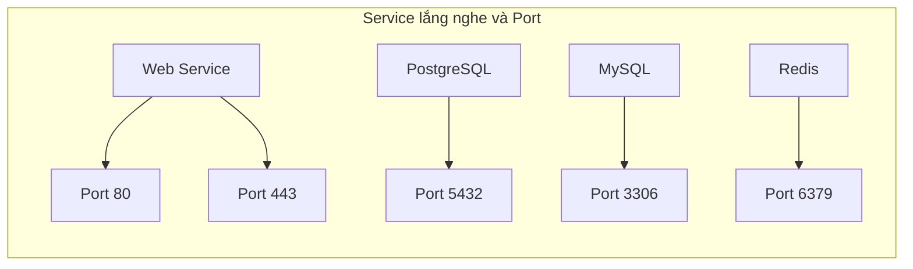

# 0.3.5.4 Số nhà trên máy tính—Port và Service: Port thường dùng và ánh xạ service

## Một câu tóm tắt

Port chính là "số nhà" trên một máy tính. Các service khác nhau lắng nghe các port khác nhau, ví dụ dịch vụ web thường dùng `80/443`, database thường dùng `5432/3306`.

## Khái niệm cốt lõi

- Dải port: `0-65535`, trong đó `0-1023` là well-known ports (cần quyền admin), `1024-49151` là registered ports, `49152-65535` là ephemeral ports (client kết nối sẽ được phân ngẫu nhiên).
- Một port một process: Cùng một thời điểm một port chỉ có thể bị một process chiếm dụng (cùng protocol).
- Ánh xạ thường gặp:
  - `80` HTTP, `443` HTTPS
  - `22` SSH
  - `53` DNS
  - `5432` PostgreSQL, `3306` MySQL, `6379` Redis

## Trực quan hóa: Mối quan hệ giữa Service và Port

## Nhận thức: Troubleshoot port bị chiếm và xung đột

- Trong Windows PowerShell:
  - Xem port bị chiếm: `Get-NetTCPConnection | Where-Object { $_.LocalPort -eq 3000 }`
  - Tra process qua PID: `Get-Process -Id <PID>`
  - Cách truyền thống: `netstat -ano | findstr ":3000"`
- Khởi động thất bại, phần lớn là do port bị chiếm hoặc không đủ quyền; đổi port hoặc giải phóng port bị chiếm.

## Hướng dẫn cộng tác với AI

- Ý định cốt lõi: Để AI giúp bạn "xác định xung đột port" hoặc "quy hoạch ánh xạ port cho service".
- Công thức định nghĩa yêu cầu:
  - "Port `3000` local bị chiếm, hãy cho tôi lệnh troubleshoot trong PowerShell, và đề xuất phương án đổi port."
  - "Quy hoạch port cho Web/API/DB, tuân thủ well-known ports và chính sách bảo mật."
- Thuật ngữ quan trọng: `dải port`, `ephemeral port`, `lắng nghe`, `PID`, `xung đột port`.

## Hướng dẫn tránh lỗi

- Không dùng random port để expose service ở môi trường production; chuẩn hóa port và mở rõ ràng trong firewall.
- Tránh nhiều service tranh giành cùng một port; đưa vào reverse proxy làm điểm vào thống nhất dễ quản lý hơn.
