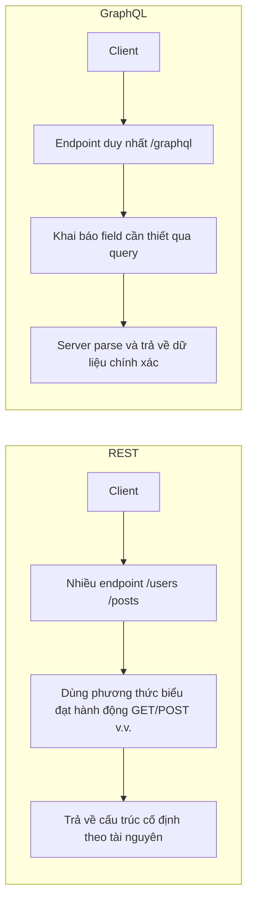

# 0.3.5.5 Ngôn ngữ chung giữa các chương trình—Cơ bản thiết kế API: Khái niệm RESTful và GraphQL

## Tái cấu trúc nhận thức: Từ "interface" đến "hợp đồng"

API không chỉ là "một địa chỉ cộng một ít dữ liệu", mà là **hợp đồng cộng tác giữa client và server**: hai bên thống nhất cấu trúc tài nguyên, cách thức tương tác và ngữ nghĩa lỗi. Có hai phong cách chính: REST và GraphQL.

## Bản chất: Sự khác biệt cốt lõi giữa REST và GraphQL



### Điểm chính của REST

- Lấy "tài nguyên" làm trung tâm: `/users`, `/posts/{id}`.
- Phương thức biểu đạt ngữ nghĩa: đọc dùng `GET`, ghi dùng `POST/PUT/PATCH/DELETE`.
- Mã trạng thái biểu đạt kết quả: `200/201/204/4xx/5xx`.
- Hỗ trợ cache: `ETag`/`Cache-Control`.
- Phân trang, lọc và sắp xếp: `?page=1&pageSize=20&sort=createdAt`.

### Điểm chính của GraphQL

- Endpoint duy nhất, trả về các field cần thiết theo câu query, tránh "quá nhiều hoặc quá ít dữ liệu".
- Schema kiểu mạnh định nghĩa cấu trúc dữ liệu và quan hệ.
- Resolver thực hiện lấy dữ liệu ở cấp field.
- Hỗ trợ tập hợp nhiều nguồn backend, frontend lấy được dữ liệu cần thiết trong một lần.

## Thực chiến: Ví dụ vòng lặp tối thiểu

### Yêu cầu (Mini-PRD)

- Lấy danh sách user và số lượng bài viết của họ.
- Frontend mong muốn một request lấy được `id/name` của user và `postCount`.

### Phương án REST

- Endpoint: `GET /users` trả về mảng user; `GET /posts?userId=<id>` lấy bài viết của user đó, sau đó tổng hợp ở client.
- Ưu điểm: Đơn giản trực quan; cache và monitoring trưởng thành.
- Nhược điểm: Có thể cần nhiều request; frontend cần logic tổng hợp.

### Phương án GraphQL

- Query:

```graphql
query {
  users {
    id
    name
    postCount
  }
}
```

- Ưu điểm: Lấy đủ trong một lần, cần gì lấy nấy.
- Nhược điểm: Server cần maintain Schema/Resolver; chiến lược monitoring và cache cần thiết kế riêng.

## Checklist nghiệm thu

- REST:
  - Phương thức và ngữ nghĩa nhất quán; mã trạng thái và error body chuẩn; tham số phân trang và giá trị mặc định rõ ràng.
  - `Content-Type` trả về nhất quán với nội dung; hỗ trợ chiến lược cache hợp lý.
- GraphQL:
  - Schema ranh giới rõ ràng (bắt buộc/tùy chọn); cấu trúc lỗi nhất quán; query phức tạp có giới hạn tốc độ.
  - Resolver không có vấn đề N+1 (khi cần thiết thêm data loader).

## Hướng dẫn cộng tác với AI

- Ý định cốt lõi: Để AI tạo interface và script xác minh theo "hợp đồng".
- Công thức định nghĩa yêu cầu:
  - "Thiết kế REST interface cho tài nguyên user, trả về dữ liệu phân trang, và cung cấp ví dụ lỗi cùng giải thích mã trạng thái."
  - "Hãy cung cấp một GraphQL Schema và Resolver phác thảo tương ứng, để query `users{id,name,postCount}`."
- Thuật ngữ quan trọng: `tài nguyên(REST)`, `mã trạng thái`, `ETag`, `Schema`, `Resolver`, `N+1`.
- Debug trong Windows PowerShell:
  - REST: `Invoke-RestMethod -Method GET -Uri https://api.example.com/users?page=1&pageSize=10`
  - GraphQL:
    ```powershell
    $body = @{ query = "query { users { id name } }" } | ConvertTo-Json
    Invoke-RestMethod -Method POST -Uri https://api.example.com/graphql -Body $body -ContentType 'application/json'
    ```

## Gợi ý quyết định

- Backend tài nguyên rõ ràng, cache thân thiện, monitoring trưởng thành thì chọn REST;
- Frontend tổ hợp dữ liệu, giảm roundtrip, field có thể cắt gọt thì chọn GraphQL;
- Phần lớn sản phẩm có thể áp dụng chiến lược kết hợp "REST làm chính, trường hợp tập hợp quan trọng đưa vào GraphQL".
