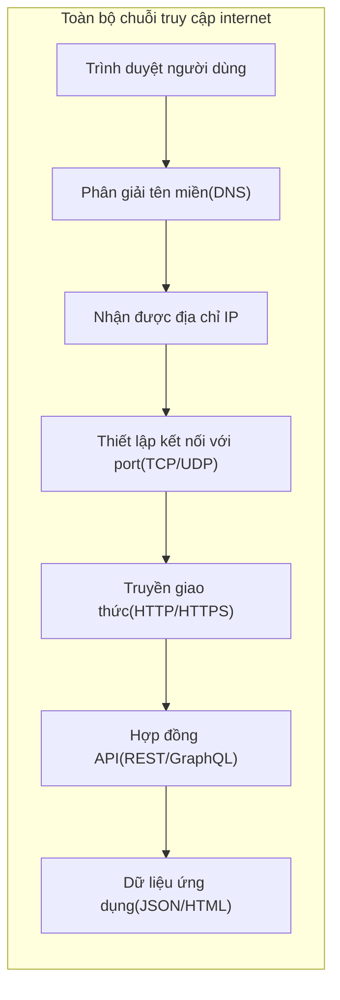

# 0.3.5 Máy tính của bạn truy cập internet như thế nào—Cơ bản về mạng: Khái niệm HTTP/HTTPS/Tên miền/Port/API

## Một câu tóm tắt

Toàn bộ chuỗi truy cập internet có thể tóm gọn là: **Phân giải tên miền ra IP → Thiết lập kết nối qua port → Trao đổi dữ liệu bằng HTTP/HTTPS → Dùng API làm hợp đồng cộng tác giữa các chương trình**.

## Chỉ dẫn chương

- **Giao thức HTTP**: "Định dạng đối thoại" giữa trình duyệt và server, bao gồm phương thức, header, body và mã trạng thái.
- **HTTPS và chứng chỉ**: Bọc thêm một lớp "mã hóa và xác thực danh tính" bên ngoài HTTP, đảm bảo quyền riêng tư và tính toàn vẹn.
- **Phân giải tên miền DNS**: Dịch tên miền con người có thể đọc thành địa chỉ IP máy có thể đọc.
- **Port và Service**: "Số nhà" trên một máy, các service khác nhau lắng nghe các port khác nhau.
- **Phong cách API**: REST và GraphQL, định nghĩa cách các chương trình cộng tác và truyền dữ liệu.

## Tổng quan trực quan

## Hướng dẫn cộng tác với AI

- Ý định cốt lõi: Để AI giúp bạn "xác định điểm lỗi mạng" hoặc "thiết kế hợp đồng interface hợp lý".
- Công thức định nghĩa yêu cầu:
  - "Hãy giúp tôi chẩn đoán nguyên nhân thất bại khi truy cập `example.com`, lần lượt kiểm tra phân giải DNS, kết nối port và chứng chỉ HTTPS."
  - "Hãy cung cấp một REST API cho danh sách user, trả về dữ liệu phân trang, bao gồm tổng số và trang hiện tại."
- Thuật ngữ quan trọng: `DNS`, `kết nối port`, `phương thức/mã trạng thái HTTP`, `chứng chỉ HTTPS`, `REST`, `GraphQL`.
- Lệnh kiểm tra thường dùng trong Windows PowerShell:
  - `Resolve-DnsName example.com`
  - `Test-NetConnection -ComputerName example.com -Port 443`
  - `Invoke-WebRequest -Uri https://example.com -UseBasicParsing`
  - `Get-NetTCPConnection | Where-Object { $_.LocalPort -eq 3000 }`

## Hướng dẫn tránh lỗi

- Trả về `200` cho tất cả lỗi nghiệp vụ là anti-pattern, nên dùng mã trạng thái phù hợp (như `400/401/403/404/500`).
- Môi trường production bắt buộc phải bật HTTPS, tránh truyền plaintext và tấn công man-in-the-middle; đồng thời chú ý vấn đề "mixed content".
- Thay đổi DNS có độ trễ lan truyền, TTL quá thấp sẽ dẫn đến query thường xuyên, quá cao sẽ dẫn đến cập nhật chậm.
- Xung đột port sẽ dẫn đến service khởi động thất bại, kiểm tra port bị chiếm trước khi khởi động: `Get-NetTCPConnection -LocalPort <port>`.
