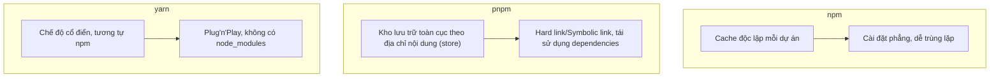

# 0.4.1 Chọn công cụ nào cho hộp công cụ - Lựa chọn trình quản lý gói: npm vs pnpm vs yarn

## Nguyên lý và bản chất: Chúng thực sự làm gì

Bản chất của trình quản lý gói là ba việc: **Phân giải cây dependencies**, **Tải xuống và cache các gói**, **Liên kết dependencies vào `node_modules` của dự án**. Sự khác biệt nằm ở "cách lưu trữ" và "cách liên kết".

## So sánh hiệu suất và dung lượng ổ đĩa (Góc nhìn kỹ thuật)

- `pnpm`: Tái sử dụng dependencies thông qua **kho lưu trữ toàn cục theo địa chỉ nội dung**, dung lượng ổ đĩa thấp hơn, cài đặt nhanh hơn, lock file ổn định hơn.
- `yarn berry`: Chế độ Plug'n'Play không tạo ra `node_modules`, tốc độ khởi động nhanh, nhưng cần chú ý thêm về khả năng tương thích hệ sinh thái.
- `npm`: Hành vi mặc định trực quan, hỗ trợ hệ sinh thái tốt nhất, nhưng dễ gây tải xuống trùng lặp và phình to ổ đĩa.

## SemVer - Phiên bản ngữ nghĩa và phạm vi phiên bản

- Phiên bản ngữ nghĩa: `Major.Minor.Patch` (`chính.phụ.bản vá`).
- Phạm vi phiên bản:
  - `^1.2.3`: Cho phép cập nhật đến `<2.0.0` (giữ nguyên phiên bản chính, nâng cấp phụ/bản vá).
  - `~1.2.3`: Cho phép cập nhật đến `<1.3.0` (giữ nguyên phiên bản chính/phụ, nâng cấp bản vá).
  - Khóa chính xác: `1.2.3`.

## Nhận biết và ứng phó với Breaking Changes

- Nhận biết: Thay đổi phiên bản `major` thường có nghĩa là không tương thích, kiểm tra Release Notes và Changelog.
- Ứng phó:
  - Dependencies quan trọng sử dụng phạm vi thận trọng (các tình huống nhạy cảm dùng `~` hoặc phiên bản cố định).
  - Trước khi nâng cấp chạy tests và build, quan sát `npm outdated`/`pnpm outdated`.
  - Thống nhất lock file và xem xét sự khác biệt, tránh lock file trôi dạt giữa các thành viên nhóm.

## Lệnh thường dùng trên Windows PowerShell

- `npm`:
  - `npm config get registry`
  - `npm config set registry https://registry.npmmirror.com`
  - `npm cache clean --force`
- `pnpm`:
  - `pnpm config set registry https://registry.npmmirror.com`
  - `pnpm store path`
  - `pnpm store prune`
- `yarn`:
  - `yarn config get registry`
  - `yarn config set registry https://registry.npmmirror.com`

## Hướng dẫn cộng tác với AI

- Ý định cốt lõi: Để AI giúp bạn "chọn và di chuyển trình quản lý gói", và xuất ra **danh sách lệnh có thể thực thi** cùng **cảnh báo rủi ro**.
- Công thức định nghĩa yêu cầu:
  - "Di chuyển dự án từ `npm` sang `pnpm`, vui lòng xuất danh sách lệnh để dọn dẹp cache, xây dựng lại lock file, xác minh tốc độ cài đặt và dung lượng ổ đĩa."
- Thuật ngữ quan trọng: `registry`, `lockfile`, `store`, `Plug'n'Play`, `outdated`.

## Đề xuất quyết định

- Dự án mới ưu tiên chọn `pnpm` (hiệu suất và dung lượng ổ đĩa xuất sắc).
- Dự án cần PnP hoặc có yêu cầu mạnh về `node_modules` cân nhắc `yarn berry`.
- Khi ưu tiên khả năng tương thích hệ sinh thái và thói quen nhóm, chọn `pnpm` và chuẩn hóa phạm vi phiên bản cùng chiến lược cache.
