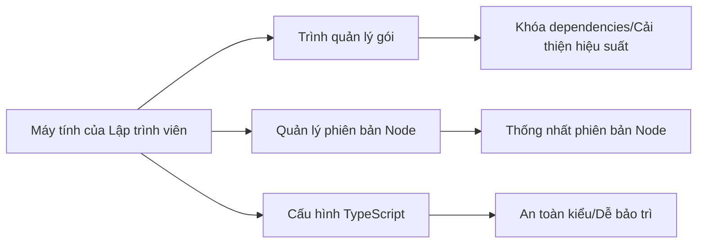

# 0.4 Xây dựng Studio lập trình của bạn - Cấu hình môi trường phát triển: Node.js, Trình quản lý gói & Chuỗi công cụ

## Tóm tắt một câu

Môi trường phát triển ổn định = Phiên bản Node phù hợp + Trình quản lý gói hiệu quả + Cấu hình TypeScript nghiêm ngặt. Trước tiên chạy thành công vòng lặp tối thiểu, sau đó tối ưu hóa hiệu suất và cộng tác nhóm.

## Dẫn nhập chương

- Lựa chọn trình quản lý gói: So sánh hiệu suất/dung lượng ổ đĩa/tính nhất quán, `npm` vs `pnpm` vs `yarn`.
- Quản lý phiên bản Node: `nvm`/`nvm-windows` đa nền tảng, khóa cấp dự án với `.nvmrc` và cấu hình biến môi trường.
- Cấu hình TypeScript: Thực hành tốt nhất với chế độ nghiêm ngặt `tsconfig.json` và path alias.

## Tổng quan trực quan

## Hướng dẫn cộng tác với AI

- Ý định cốt lõi: Để AI giúp bạn "thiết lập môi trường" và "xây dựng quy chuẩn", thay vì cài đặt dependencies rời rạc.
- Công thức định nghĩa yêu cầu:
  - "Trên Windows PowerShell, sử dụng `nvm-windows` để cài đặt và chuyển sang phiên bản Node LTS, tạo `.nvmrc` và cấu hình chế độ nghiêm ngặt `tsconfig.json`."
  - "Thực hiện di chuyển trình quản lý gói của dự án hiện tại sang `pnpm`, và cung cấp các lệnh tối ưu hóa cache và registry."
- Thuật ngữ quan trọng: `nvm-windows`, `.nvmrc`, `NODE_ENV`, `registry`, `tsconfig`, `strict`.

## Hướng dẫn tránh các vấn đề

- Node toàn cục và Node dự án không nhất quán dẫn đến build thất bại; sử dụng `.nvmrc` để khóa phiên bản và kiểm tra bắt buộc trong CI.
- Sử dụng lẫn lộn các trình quản lý gói sẽ phá hỏng lock files; nhóm thống nhất chọn một cái, và dọn dẹp cache cùng lock files trước khi di chuyển.
- TypeScript chưa bật chế độ nghiêm ngặt gây ra lỗi ẩn; nhất định phải bật `strict` và `noImplicitAny`.
