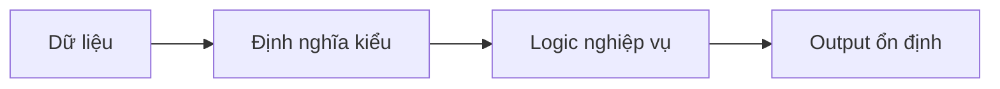

# 0.5.1 Dynamic và Static thực sự đang nói về gì—Chuyển đổi tư duy JavaScript/TypeScript: Từ kiểu động sang kiểu tĩnh

## Tái cấu trúc nhận thức: Từ "dữ liệu tùy dùng tùy đổi" đến "định nghĩa kiểu trước rồi dùng"

Kiểu động của JavaScript mang lại sự tự do cho phát triển, nhưng tự do đi kèm bất định; TypeScript dùng kiểu tĩnh để "lập ước" cho dữ liệu, đẩy rủi ro lên giai đoạn compile.



## Kiểu cơ bản

```ts
const s: string = 'hello'
const n: number = 42
const b: boolean = true
const arr: number[] = [1, 2, 3]
const obj: { id: string; name: string } = { id: 'u1', name: 'Alice' }
```

## Interface và Type Alias: interface vs type

- interface: Phù hợp hơn để mô tả **hình dạng object** và **interface có thể mở rộng**.
- type: Tổng quát hơn, hỗ trợ union và intersection, conditional type v.v. để mô hình hóa phức tạp hơn.

```ts
interface User {
  id: string
  name: string
}

type Id = string | number
type UserLite = Pick<User, 'id' | 'name'>
```

## Union Type và Intersection Type: | vs &

```ts
type Admin = { role: 'admin'; permissions: string[] }
type Member = { role: 'member'; teamId: string }

type UserRole = Admin | Member
type WithTimestamp = { createdAt: Date }
type AdminWithTimestamp = Admin & WithTimestamp
```

## Thu hẹp kiểu: Type Guard và Assertion

```ts
function formatId(id: string | number): string {
  if (typeof id === 'string') {
    return id.toUpperCase()
  }
  return id.toString()
}

function getBadge(u: Admin | Member): string {
  if ('permissions' in u) {
    return 'ADMIN'
  }
  return 'MEMBER'
}

function ensureArray(input: unknown): string {
  if (Array.isArray(input)) {
    return input.join(',')
  }
  return String(input)
}
```

Assertion chỉ dùng khi bạn chắc chắn kiểu đúng; ưu tiên thu hẹp kiểu qua guard, sau đó mới assertion.

## unknown vs any: Cân bằng giữa type safety

- `any` từ bỏ type checking, rủi ro không kiểm soát được; **cấm dùng**.
- `unknown` cần thu hẹp trước khi dùng, an toàn và linh hoạt.

```ts
function parse(data: unknown): string {
  if (typeof data === 'string') {
    return data
  }
  if (typeof data === 'number') {
    return data.toString()
  }
  return JSON.stringify(data)
}
```

## Cấu hình Strict Mode và Best Practice

```json
{
  "compilerOptions": {
    "strict": true,
    "noImplicitAny": true,
    "noImplicitReturns": true
  }
}
```

## Hướng dẫn cộng tác với AI

- Ý định cốt lõi: Để AI tạo ra **kiểu và function signature** trước, sau đó bổ sung implementation; dùng hợp đồng để dẫn dắt sinh code.
- Công thức định nghĩa yêu cầu:
  - "Định nghĩa kiểu cho user và role, viết một function nhận input `Admin | Member` trả về `string` là text badge, cấm dùng `any`."
- Thuật ngữ quan trọng: `interface`, `type`, `union`, `intersection`, `narrowing`, `unknown`.

## Hướng dẫn tránh lỗi

- Bất kỳ kiểu không chắc chắn nào cũng không dùng `any`; dùng `unknown` và thu hẹp.
- Assertion không phải phương tiện để né lỗi; ưu tiên guard.
- Giữ signature ổn định; thay đổi signature cần cập nhật đồng thời nơi gọi.
