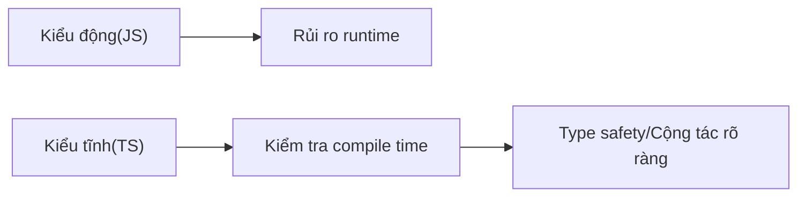

# 0.5 Từ tự do thoải mái đến quy củ—Chuyển đổi tư duy JS → TS

## Một câu tóm tắt

Giá trị của TypeScript không nằm ở "cú pháp phức tạp hơn", mà ở việc đẩy "lỗi runtime" lên "compile time". Nó khiến cộng tác rõ ràng như ký hợp đồng, giảm đoán mò và bug tiềm ẩn.

## Chỉ dẫn chương

- Sự khác biệt cốt lõi giữa dynamic và static: Dữ liệu có kiểu trước, sau đó viết logic.
- Kiểu cơ bản và kiểu phức hợp: Từ `string/number/boolean` đến `array/object`.
- Interface và Type Alias: Trường hợp áp dụng của `interface` vs `type`.
- Union và Intersection: Cách mô hình hóa bằng `|` và `&`.
- Thu hẹp kiểu: Cách dùng type guard và assertion trong kỹ thuật.
- unknown vs any: Ranh giới an toàn và phương án chiết trung.
- Strict mode và quy chuẩn team: `strict/noImplicitAny/noImplicitReturns` v.v.

## Tổng quan trực quan

## Hướng dẫn cộng tác với AI

- Ý định cốt lõi: Để AI tạo kiểu và function signature theo "hợp đồng", sau đó điền implementation.
- Công thức định nghĩa yêu cầu:
  - "Hãy cho tôi định nghĩa kiểu cho danh sách user và signature của function phân trang, yêu cầu giá trị trả về bao gồm thông tin phân trang và tổng số."
- Thuật ngữ quan trọng: `interface`, `type`, `union`, `intersection`, `narrowing`, `unknown`.

## Hướng dẫn tránh lỗi

- Cấm dùng `any`; khi không chắc kiểu thì dùng `unknown` và thu hẹp.
- Assertion không phải công cụ "loại bỏ lỗi"; làm type guard trước rồi mới assertion.
- Đừng thay đổi kiểu trả về trong implementation; function signature chính là hợp đồng.
