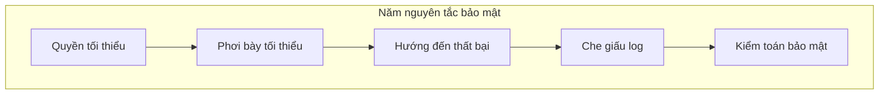

# 0.6.1 Suy nghĩ như bảo vệ—Nguyên tắc thiết kế bảo mật

## Tái cấu trúc nhận thức: Có đáy trước, nói chức năng sau

Thiết kế bảo mật không phải "vá lỗ hổng", mà là từ đầu đã định nghĩa **quyền tối thiểu**, **phơi bày tối thiểu**, **hướng đến thất bại**, và đi kèm **che giấu log** cùng **kiểm toán bảo mật**.

## Bản chất: Năm nguyên tắc lớn

- Quyền tối thiểu: User và service chỉ sở hữu quyền tối thiểu cần thiết để hoàn thành nhiệm vụ.
- Phơi bày tối thiểu: Interface chỉ trả về field cần thiết, ẩn implementation nội bộ và chi tiết lỗi.
- Hướng đến thất bại: Exception mặc định từ chối, đường dẫn thất bại rõ ràng và an toàn.
- Che giấu log: Từ thu thập log đến lưu trữ toàn bộ chuỗi không chứa khóa plaintext hoặc thông tin cá nhân nhạy cảm.
- Kiểm toán bảo mật: Định kỳ kiểm tra quyền tài khoản, lỗ hổng dependency và mặt phơi bày.

## Thực chiến

- Mô hình hóa quyền:
  - Ủy quyền dựa trên vai trò (RBAC) hoặc năng lực (ABAC), cung cấp "vai trò tối thiểu" mặc định.
  - Admin backend và API tách biệt phạm vi quyền, tránh gọi vượt quyền.
- Thiết kế interface:
  - Whitelist output (danh sách field được phép trả về) chứ không phải blacklist.
  - Thất bại trả về thống nhất `mã lỗi + thông tin ngắn gọn`, không để lộ stack trace và đường dẫn nội bộ.
- Xử lý exception:
  - Timeout/lỗi mạng/dependency không khả dụng, đi theo chiến lược degradation hoặc từ chối.
  - Tất cả đường dẫn thất bại đều ghi audit log (đã che giấu), thuận tiện truy vết.
- Che giấu log:
  - Chiến lược che: Chỉ giữ lại bốn số cuối cần thiết, như `****5678`.
  - Cấm output: Khóa, token, mật khẩu, ID card, thẻ ngân hàng toàn bộ chuỗi cấm plaintext.
- Kiểm toán bảo mật:
  - Tài khoản và quyền: Rà soát hàng tháng, nghỉ việc thu hồi, quyền tạm thời tự động hết hạn.
  - Quét lỗ hổng: Dependency và image quét hàng tuần; nguy hiểm cao lập tức nâng cấp hoặc thay thế.

## Checklist nghiệm thu

- Quyền: Vai trò tối thiểu mặc định, không có đường dẫn vượt quyền; thao tác nhạy cảm cần xác nhận lần hai.
- Phơi bày: Tất cả interface đều có whitelist field; error body không có chi tiết nội bộ.
- Thất bại: Exception mặc định từ chối; degradation và circuit breaker có thể kiểm soát.
- Log: Field quan trọng che; khóa và thông tin cá nhân không vào log.
- Kiểm toán: Quét và báo cáo định kỳ; khắc phục đóng vòng và ghi chép review.

## Hướng dẫn cộng tác với AI

- Ý định cốt lõi: Để AI tạo ra phương án và checklist nghiệm thu **dựa trên nguyên tắc** theo kịch bản nghiệp vụ.
- Công thức định nghĩa yêu cầu:
  - "Thiết kế mô hình quyền RBAC cho user center, whitelist field interface và chiến lược che giấu log, output checklist nghiệm thu và xử lý đường dẫn thất bại."
- Thuật ngữ quan trọng: `RBAC`, `ABAC`, `whitelist`, `circuit breaker`, `degradation`, `audit log`.
