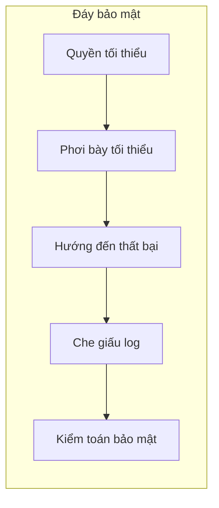

# 0.6 Đừng để website của bạn lộ hàng—Đáy bảo mật phát triển

## Một câu tóm tắt

Bảo mật không phải chồng chất tính năng, mà là thiết lập đáy: **quyền tối thiểu, phơi bày tối thiểu, hướng đến thất bại, che giấu log và kiểm toán định kỳ**. Giữ vững đáy trước, nói năng lực cao cấp sau.

## Chỉ dẫn chương

- Nguyên tắc thiết kế bảo mật: Suy nghĩ như bảo vệ, thiết lập chiến lược tối thiểu hóa và phòng thủ.
- Biến môi trường và quản lý khóa: Đặt bí mật vào đúng chỗ, và thiết lập cơ chế xoay vòng.

## Tổng quan trực quan

## Hướng dẫn cộng tác với AI

- Ý định cốt lõi: Để AI giúp bạn "thiết kế phương án theo nguyên tắc", chứ không phải vá vụn vặt.
- Công thức định nghĩa yêu cầu:
  - "Thiết kế mô hình quyền tối thiểu cho hệ thống quản lý backend, chiến lược phơi bày interface và phương án che giấu log, output checklist nghiệm thu."
- Thuật ngữ quan trọng: `quyền tối thiểu`, `phơi bày tối thiểu`, `xử lý exception`, `che giấu log`, `kiểm toán bảo mật`.

## Thao tác thường dùng Windows PowerShell

- Xem biến môi trường: `Get-ChildItem Env:`
- Thiết lập biến phiên: `$env:API_KEY = '***'`
- Biến lâu dài: `setx API_KEY '***'`

## Hướng dẫn tránh lỗi

- Hard-code khóa vào code hoặc log là hành vi nguy hiểm cao; dùng biến môi trường và dịch vụ quản lý khóa.
- Interface không trả về dữ liệu quá mức; tuân thủ "cần gì trả nấy".
- Exception mặc định từ chối chứ không phải mặc định cho phép; ghi lại nhưng không lộ chi tiết nội bộ.
