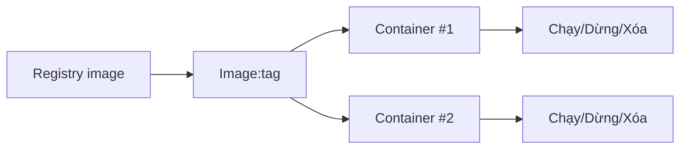

# 0.7.1 Khuôn mẫu và linh kiện chuẩn—Image và Container: Build/Run/Quản lý vòng đời

## Một câu tóm tắt

Image là "khuôn mẫu" chỉ đọc, container là "linh kiện chuẩn" đang chạy. Có image trước, có container sau; vòng đời container có thể kiểm soát: tạo, khởi động, dừng, xóa.

## Bản chất: Mối quan hệ giữa Image và Container



## Lệnh thường dùng Windows PowerShell

```powershell
Get-Command docker
docker pull node:18-alpine
docker run -d --name app -p 3000:3000 node:18-alpine
docker ps -a
docker logs -f app
docker stop app
docker rm app
docker rmi node:18-alpine
```

## Build image của bạn

`Dockerfile`

```Dockerfile
FROM node:18-alpine
WORKDIR /app
COPY package.json package-lock.json /app/
RUN npm ci
COPY . /app
EXPOSE 3000
CMD ["npm","start"]
```

Build và chạy:

```powershell
docker build -t myapp:latest .
docker run -d --name myapp -p 3000:3000 myapp:latest
```

## Nhận thức: Quản lý vòng đời hướng đến thất bại

- Container thoát bất thường, xem log trước rồi restart: `docker logs -f <tên container>`.
- Xung đột port dẫn đến khởi động thất bại, kiểm tra port bị chiếm trước: `Get-NetTCPConnection | Where-Object { $_.LocalPort -eq 3000 }`.
- Giữ "image immutable", thay đổi hoàn thành qua rebuild image và redeploy.

## Hướng dẫn cộng tác với AI

- Ý định cốt lõi: Để AI output vòng lặp hoàn chỉnh từ Dockerfile đến lệnh chạy.
- Công thức định nghĩa yêu cầu:
  - "Tạo `Dockerfile` và lệnh chạy cho ứng dụng Node lắng nghe port `3000`, dùng `node:18-alpine`, và cung cấp lệnh xem log cùng troubleshoot."
