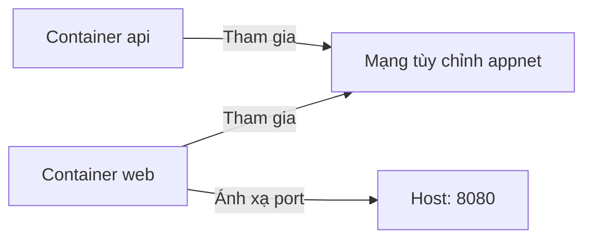

# 0.7.3 Container đối thoại với nhau như thế nào—Mạng và Port

## Một câu tóm tắt

Docker dùng "mạng" để container liên kết với nhau, dùng "ánh xạ port" để expose service ra host. Mạng `bridge` mặc định đã đủ dùng, trường hợp phức tạp dùng mạng tùy chỉnh.

## Tổng quan loại mạng

- `bridge`: Mạng container mặc định, các container có thể giao tiếp với nhau.
- `host`: Chia sẻ network stack với host (chỉ dành cho Linux).
- `none`: Không cấu hình mạng.

## Ánh xạ port và expose service

```powershell
docker run -d --name web -p 8080:80 nginx:alpine
```

Truy cập: `http://localhost:8080`

## Mạng tùy chỉnh và Service Discovery

```powershell
docker network create appnet
docker run -d --name api --network appnet myapi:latest
docker run -d --name web --network appnet -p 8080:80 myweb:latest
```

Trong cùng một mạng, container có thể truy cập lẫn nhau qua "tên container", như `http://api:3000`.

## Trực quan hóa mạng



## Lệnh thường dùng Windows PowerShell

- Liệt kê mạng: `docker network ls`
- Kiểm tra mạng: `docker network inspect appnet`
- Ngắt kết nối/Kết nối: `docker network disconnect appnet web`, `docker network connect appnet web`

## Hướng dẫn cộng tác với AI

- Ý định cốt lõi: Để AI thiết kế "topology mạng và chiến lược port".
- Công thức định nghĩa yêu cầu:
  - "Tạo mạng tùy chỉnh và ánh xạ port cho hai service web/api, web truy cập api qua tên container, và cho lệnh PowerShell để verify."
