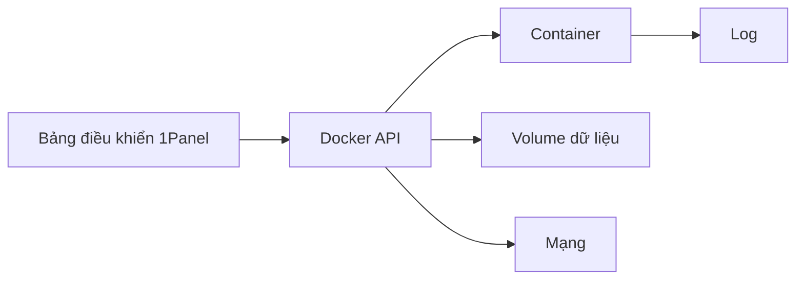

# 0.7.5 Bến cảng container trực quan — 1Panel Lý niệm cốt lõi: Môi trường chạy = Docker cấu hình trước

## Lý niệm cốt lõi

1Panel biến "ứng dụng Docker" thành quản lý và điều phối trực quan: image, container, mạng, volume, biến môi trường và log, tất cả hoàn thành tạo, cập nhật và vận hành trong một bảng điều khiển.

## Tổng quan khả năng

- Chợ ứng dụng: Tạo ứng dụng phổ biến chỉ với một cú nhấp (database, cache, môi trường Web).
- Quản lý image và container: Pull, update, start, stop, restart, delete.
- Biến môi trường và port: Cấu hình theo dạng form, tránh độ phức tạp của lệnh.
- Volume và backup: Đường dẫn mount, snapshot và backup định kỳ.
- Mạng: Mạng tùy chỉnh và chiến lược expose service.
- Log và giám sát: Xem log container và mức sử dụng tài nguyên.

## Trực quan hóa luồng công việc

## Triển khai và thực chiến: Tạo một ứng dụng

- Chọn ứng dụng → Cấu hình phiên bản image và ánh xạ port → Thiết lập biến môi trường → Mount volume dữ liệu → Tạo.
- Xác minh: Xem trạng thái container, log và khả năng truy cập port.

## Danh sách nghiệm thu

- Port: Port service expose ra bên ngoài rõ ràng và không xung đột.
- Biến môi trường: Nguồn thông tin nhạy cảm an toàn, tuân thủ nguyên tắc tối thiểu hóa.
- Volume dữ liệu: Đường dẫn bền vững rõ ràng, chiến lược backup định kỳ đầy đủ.
- Log: Chuyển log và chu kỳ lưu giữ rõ ràng, ẩn danh tuân thủ quy định.

## Hướng dẫn cộng tác AI

- Ý định cốt lõi: Để AI đưa ra "phương án cấu hình container hóa dưới 1Panel".
- Công thức định nghĩa yêu cầu:
  - "Trong 1Panel tạo một `myapp`, chỉ định phiên bản image, ánh xạ port, biến môi trường và mount volume dữ liệu, đưa ra danh sách nghiệm thu."

## Hướng dẫn tránh lỗi

- Không expose port thừa trong môi trường production; chỉ mở các port cần thiết và thêm chính sách firewall.
- Chuẩn hóa đường dẫn volume dữ liệu; tránh mount vào thư mục tạm thời dẫn đến mất dữ liệu.
- Sau khi update image cần xác minh tương thích; luyện tập trong môi trường test trước rồi mới phát hành.
