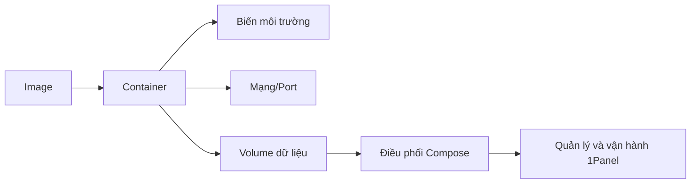

# 0.7 Đưa chương trình vào container — Khái niệm cốt lõi Docker

## Một câu giải thích

Docker dùng "image" để định nghĩa môi trường chạy, dùng "container" để thực thi chương trình của bạn; sau đó dùng "biến môi trường, mạng, volume dữ liệu và Compose" biến nó thành khả năng kỹ thuật có thể điều phối, có thể tái sử dụng.

## Tổng quan các chương

- Image và container: Xây dựng, chạy và quản lý vòng đời.
- Cấu hình biến môi trường: Tiêm cấu hình và khóa bí mật một cách an toàn.
- Mạng và port: Giao tiếp giữa các container và expose service.
- Volume dữ liệu và Compose: Bền vững hóa và điều phối nhiều service.
- 1Panel: Quản lý ứng dụng Docker bằng bảng điều khiển đồ họa.

## Sơ đồ tổng quan

## Hướng dẫn cộng tác AI

- Ý định cốt lõi: Để AI đưa ra "phương án container hóa hoàn chỉnh", không phải lệnh rời rạc.
- Công thức định nghĩa yêu cầu:
  - "Tạo Dockerfile và lệnh chạy cho ứng dụng Node.js, bao gồm ánh xạ port, biến môi trường và volume dữ liệu, đồng thời cung cấp phiên bản Compose."
- Thuật ngữ quan trọng: `image`, `container`, `ENV`, `-p`, `volume`, `docker-compose`, `1Panel`.

## Lệnh Windows PowerShell thường dùng

- Kiểm tra Docker: `Get-Command docker`
- Xem: `docker ps -a`
- Log: `docker logs -f <tên-container>`
- Vào container: `docker exec -it <tên-container> sh`
