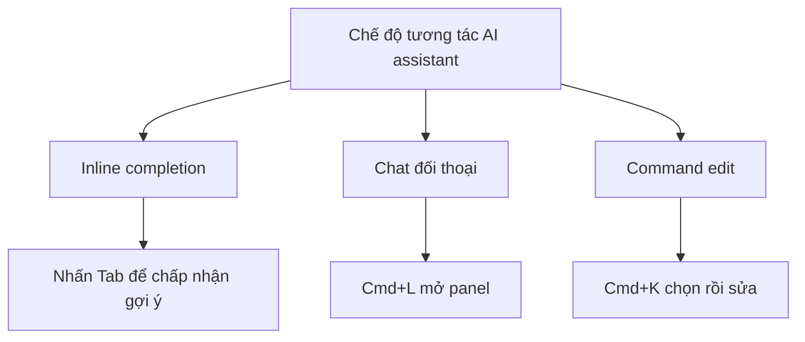

# 1.1.2 Cho IDE của bạn mọc não - Tích hợp AI assistant: Cấu hình Trae/Cursor

### Điểm chính một câu

AI assistant là đồng đội lập trình của bạn - nó có thể hiểu ý định của bạn, sinh code, giải thích lỗi, thậm chí giúp bạn refactor cả module. Cấu hình tốt nó, giống như lắp cho IDE của bạn một bộ não biết suy nghĩ.

### Giá trị cốt lõi

Trong Vibe Coding, AI assistant không phải là "công cụ hỗ trợ", mà là "năng suất cốt lõi". Điều bạn cần học không phải là "cách viết code", mà là "cách để AI giúp bạn viết ra code đúng".

### Cấu hình AI tích hợp sẵn trong Cursor

Nếu bạn chọn Cursor, AI đã được tích hợp sẵn, chỉ cần cấu hình đơn giản:

**Bước 1: Chọn model**

Mở cài đặt Cursor (Cmd/Ctrl + ,), tìm tùy chọn `Models`:

| Model | Đặc điểm | Trường hợp áp dụng |
|------|------|----------|
| **Claude 3.5 Sonnet** | Khả năng code mạnh, hiểu biết tốt | Logic phức tạp, sinh code |
| **GPT-4o** | Năng lực tổng hợp cân bằng | Lập trình hàng ngày, Q&A |
| **cursor-small** | Nhanh, chi phí thấp | Completion đơn giản |

**Cấu hình khuyên dùng**: Dùng Claude 3.5 Sonnet hàng ngày, dùng cursor-small cho completion đơn giản.

**Bước 2: Cấu hình API Key (tùy chọn)**

Phiên bản miễn phí Cursor có giới hạn lượt gọi. Nếu bạn có OpenAI hoặc Anthropic API Key riêng, có thể thêm vào cài đặt để mở khóa sử dụng không giới hạn.

### Phương án VS Code + AI plugin

Nếu bạn chọn VS Code, cần cài đặt AI plugin:

**Phương án A: GitHub Copilot**

```
1. Tìm kiếm "GitHub Copilot" trong Extension Store
2. Sau khi cài đặt, đăng nhập tài khoản GitHub
3. Cần đăng ký trả phí (miễn phí cho sinh viên)
```

**Phương án B: Trae (khả dụng trong nước)**

```
1. Truy cập trae.ai để tải Trae editor
2. Hoặc cài đặt Trae plugin trong VS Code
3. Thân thiện với môi trường mạng trong nước
```

### Ba chế độ tương tác của AI assistant

Bất kể dùng công cụ nào, AI assistant đều có ba cách tương tác cốt lõi:



1. **Inline completion**: Khi bạn gõ, AI tự động dự đoán code tiếp theo, nhấn Tab để chấp nhận
2. **Chat đối thoại**: Thảo luận vấn đề code như chat, AI sẽ trả lời kết hợp ngữ cảnh dự án
3. **Command edit**: Chọn một đoạn code, dùng ngôn ngữ tự nhiên mô tả nhu cầu sửa đổi

### Xác minh cấu hình thành công

Mở bất kỳ file code nào, thử:

1. Nhập `// Tạo một hàm tính tổng hai số`, xem AI có tự động completion không
2. Nhấn `Cmd/Ctrl + L`, nhập "Giải thích đoạn code này làm gì", xem có phản hồi không

Nếu hai bước trên đều hoạt động bình thường, chúc mừng bạn, AI assistant đã cấu hình thành công!

### Hướng dẫn tránh hố

- **Vấn đề mạng**: Hầu hết dịch vụ AI cần khoa học lên mạng, hoặc chọn phương án khả dụng trong nước (như Trae)
- **Giới hạn quota**: Phiên bản miễn phí thường có giới hạn số lần gọi, dự án quan trọng nên nâng cấp phiên bản trả phí hoặc dùng API Key riêng
- **Cân nhắc riêng tư**: Code sẽ được upload lên cloud xử lý, dự án nhạy cảm cần chú ý compliance
