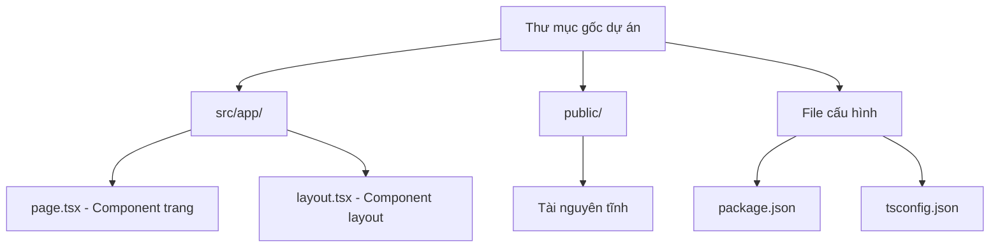

# 1.1.3 Một lệnh sinh khung dự án - Khởi tạo dự án Next.js: Chi tiết create-next-app

### Điểm chính một câu

`create-next-app` là công cụ scaffolding chính thức của Next.js, một lệnh duy nhất có thể sinh ra cấu trúc dự án fullstack sẵn sàng sử dụng.

### Giá trị cốt lõi

Tại sao không cấu hình từ đầu? Vì dự án frontend hiện đại có hàng trăm mục cấu hình: TypeScript, ESLint, Tailwind CSS, path alias, tối ưu build... Cấu hình từ đầu không chỉ tốn thời gian mà còn dễ sai sót. `create-next-app` đã giúp bạn làm hết những "công việc bẩn, việc nặng" này rồi.

### Điều kiện tiên quyết

Đảm bảo máy tính của bạn đã cài đặt:

- **Node.js**: Phiên bản 18.17 trở lên (chạy `node -v` để kiểm tra)
- **Package manager**: Khuyên dùng pnpm (chạy `pnpm -v` để kiểm tra)

Nếu chưa cài đặt, hãy hoàn thành phần cấu hình môi trường ở chương 0.4 Bootcamp trước.

### Lệnh cốt lõi

Mở terminal, chạy lệnh sau:

```bash
pnpm create next-app@latest my-first-app
```

Hệ thống sẽ hỏi một loạt tùy chọn cấu hình, **khuyên chọn**:

| Tùy chọn | Giá trị khuyên dùng | Giải thích |
|------|--------|------|
| TypeScript | **Yes** | Type safety, giảm bug |
| ESLint | **Yes** | Kiểm tra chuẩn code |
| Tailwind CSS | **Yes** | Framework CSS atomic |
| `src/` directory | **Yes** | Cấu trúc thư mục rõ ràng hơn |
| App Router | **Yes** | Phương án routing Next.js 16+ khuyên dùng |
| Import alias | **@/*** | Path alias, tránh `../../` |

### Cấu trúc dự án được sinh ra

Sau khi lệnh thực thi xong, vào thư mục dự án:

```bash
cd my-first-app
```

Bạn sẽ thấy cấu trúc thư mục như sau:

```
my-first-app/
├── src/
│   └── app/              # Thư mục cốt lõi App Router
│       ├── layout.tsx    # Layout toàn cục
│       ├── page.tsx      # Trang chủ
│       └── globals.css   # Style toàn cục
├── public/               # Tài nguyên tĩnh
├── package.json          # Cấu hình dự án
├── tsconfig.json         # Cấu hình TypeScript
├── tailwind.config.ts    # Cấu hình Tailwind
└── next.config.mjs       # Cấu hình Next.js
```



### Giải thích file quan trọng

**`src/app/page.tsx`** - Đây là trang chủ của bạn:

```tsx
export default function Home() {
  return (
    <main>
      <h1>Hello World</h1>
    </main>
  );
}
```

**`src/app/layout.tsx`** - Đây là layout toàn cục:

```tsx
export default function RootLayout({
  children,
}: {
  children: React.ReactNode;
}) {
  return (
    <html lang="zh">
      <body>{children}</body>
    </html>
  );
}
```

### Hướng dẫn cộng tác với AI

Khi bạn cần AI giúp sửa đổi cấu trúc dự án:

- **Ý định cốt lõi**: Nói rõ bạn muốn thêm trang hoặc tính năng gì
- **Thuật ngữ quan trọng**: `App Router`, `page.tsx`, `layout.tsx`, `Server Component`
- **Prompt ví dụ**: "Giúp tôi tạo một trang about trong src/app, hiển thị tiêu đề 'Về chúng tôi'"

### Hướng dẫn tránh hố

- **Phiên bản Node.js**: Next.js 16 yêu cầu Node.js 18.17+, phiên bản quá thấp sẽ báo lỗi
- **Vấn đề pnpm**: Nếu không tìm thấy lệnh pnpm, chạy trước `npm install -g pnpm`
- **Timeout mạng**: Mạng trong nước có thể tải chậm, có thể cấu hình npm mirror: `pnpm config set registry https://registry.npmmirror.com`
