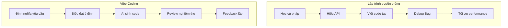

# 1.2.1 Từ Coder sang Commander - Chuyển đổi tư duy cốt lõi của lập trình hỗ trợ AI

### Tái cấu trúc nhận thức

Trong lập trình truyền thống, bạn là "công nhân thi công" - tự tay gõ từng dòng code, tự mình giải quyết từng bug. Trong Vibe Coding, bạn là "tổng kiến trúc sư dự án" - nhiệm vụ của bạn là cung cấp bản thiết kế rõ ràng, để đội thi công hiệu quả AI giúp bạn biến ý tưởng thành hiện thực.

**Khác biệt cốt lõi không nằm ở "có biết viết code không", mà ở "có thể định nghĩa rõ ràng yêu cầu không".**

### So sánh bản chất hai mô hình



| Khía cạnh | Lập trình truyền thống | Vibe Coding |
|------|----------|-------------|
| **Kỹ năng cốt lõi** | Cú pháp, thuật toán, API | Định nghĩa yêu cầu, giao tiếp, review |
| **Input chính** | Code chính xác | Prompt ngôn ngữ tự nhiên |
| **Điểm tập trung** | Chi tiết triển khai | Kết quả kỳ vọng |
| **Cách debug** | Breakpoint, log | Feedback đối thoại |
| **Đường cong học tập** | Dốc | Tương đối thoải |

### Ba trách nhiệm cốt lõi của Commander

#### 1. Quy hoạch chiến lược: Định nghĩa "làm gì"

Trước khi bắt tay làm, hãy nghĩ rõ:

- Tính năng này giải quyết vấn đề gì?
- User sẽ sử dụng nó như thế nào?
- Tiêu chí thành công là gì?

**Ví dụ**: Thay vì yêu cầu AI "viết một trang đăng nhập", hãy định nghĩa trước:

```
Yêu cầu chức năng đăng nhập:
- Hỗ trợ đăng nhập email + password
- Cần validate form (format email, độ dài password)
- Đăng nhập thất bại hiển thị thông báo lỗi
- Đăng nhập thành công chuyển đến trang chủ
```

#### 2. Chỉ huy chiến thuật: Biểu đạt "làm thế nào"

Phân tách yêu cầu thành các task AI có thể thực thi:

- Task phải đủ nhỏ, một lần chỉ làm một việc
- Cung cấp ngữ cảnh cần thiết (dùng tech stack gì, có ràng buộc gì)
- Đưa ra ví dụ tham khảo (nếu có)

#### 3. Kiểm soát chất lượng: Nghiệm thu "làm đúng hay không"

AI không phải thần, nó sẽ mắc lỗi. Bạn cần:

- Kiểm tra logic code có đúng không
- Xác minh trường hợp biên có được xử lý không
- Đảm bảo style code có tuân thủ quy chuẩn dự án không

### Nhận thức lầm tưởng thường gặp

**Lầm tưởng 1: "AI có thể tự động hiểu suy nghĩ của tôi"**

AI chỉ có thể hiểu nội dung bạn biểu đạt ra. Nếu yêu cầu của bạn mơ hồ, output của AI cũng sẽ mơ hồ.

**Lầm tưởng 2: "Code AI viết có thể dùng trực tiếp"**

Code AI sinh ra cần review. Nó có thể có lỗi logic, lỗ hổng bảo mật, hoặc không tuân theo quy chuẩn dự án của bạn.

**Lầm tưởng 3: "Vibe Coding không cần hiểu code"**

Bạn không cần biết viết code, nhưng cần hiểu được code. Nếu không bạn sẽ không thể đánh giá output của AI có đúng không.

### Nhận thức: Cách nhận diện AI "nói bậy"

Khi AI sinh code, trọng tâm kiểm tra:

1. **Dependencies có tồn tại không**: AI đôi khi sẽ "phát minh" ra thư viện hoặc API không tồn tại
2. **Logic có hoàn chỉnh không**: Kiểm tra trường hợp biên, xử lý lỗi
3. **Có phù hợp phiên bản mới nhất không**: Kiến thức của AI có thể lỗi thời
4. **Tính bảo mật**: Thông tin nhạy cảm có bị lộ không, có rủi ro injection không

### Hành động bắt đầu từ hôm nay

1. **Trước khi viết code hãy viết yêu cầu trước**: Dùng ngôn ngữ tự nhiên mô tả việc bạn muốn làm
2. **Một lần chỉ làm một việc**: Tách task lớn thành task nhỏ
3. **Mỗi lần đều review**: Đừng chấp nhận mù quáng output của AI
4. **Feedback liên tục**: Nói cho AI biết chỗ nào đúng, chỗ nào không đúng
