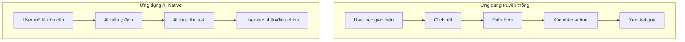

# 1.2.2 Để AI hiểu ngôn ngữ người - Đặc điểm ứng dụng AI Native: Tương tác ngôn ngữ tự nhiên và Workflow thông minh

### Hồi về bản chất

Khác biệt cốt lõi giữa ứng dụng AI Native và ứng dụng truyền thống: **Cách tương tác từ "thao tác click" chuyển thành "đối thoại ngôn ngữ tự nhiên"**.

User không còn cần học quy trình thao tác phức tạp, chỉ cần dùng ngôn ngữ hàng ngày mô tả nhu cầu, AI có thể hiểu và thực thi. Đây không chỉ là thay đổi giao diện, mà là chuyển đổi căn bản mô hình tương tác người-máy.

### Ứng dụng truyền thống vs Ứng dụng AI Native



| Khía cạnh | Ứng dụng truyền thống | Ứng dụng AI Native |
|------|----------|----------------|
| **Input chính** | Click, form | Ngôn ngữ tự nhiên |
| **Chi phí học tập** | Cần học thao tác | Biết nói là biết dùng |
| **Tính linh hoạt** | Chức năng cố định | Hiểu ý định, phản hồi linh hoạt |
| **Cá nhân hóa** | Tùy chọn preset | Thích ứng theo ngữ cảnh |

### Ba đặc trưng lớn của ứng dụng AI Native

#### 1. Ngôn ngữ tự nhiên làm giao diện chính

Ứng dụng truyền thống cần thiết kế nhiều button, menu, form để bao phủ các chức năng. Ứng dụng AI Native chỉ cần một hộp thoại:

```
Cách truyền thống: Click "File" → "Export" → Chọn format → Cài đặt tham số → Xác nhận

AI Native: Nói với AI "Export tài liệu này thành PDF, đặt margin 2cm"
```

#### 2. Nhận thức ngữ cảnh và Bộ nhớ

AI có thể nhớ lịch sử đối thoại, hiểu ngữ cảnh:

```
User: Giúp tôi viết một API đăng ký user
AI: [Sinh code]

User: Thêm validate email
AI: [Hiểu là thêm chức năng validate email trên API vừa tạo]
```

#### 3. Workflow thông minh hóa

AI không chỉ thực thi task đơn lẻ, mà còn liên kết nhiều bước:

```
User: Giúp tôi làm một hệ thống blog

AI có thể:
1. Thiết kế cấu trúc database
2. Tạo API interface
3. Sinh trang frontend
4. Cấu hình routing
5. Thêm chức năng authentication
```

### Điều này có nghĩa gì với developer?

#### 1. Thay đổi tư duy thiết kế sản phẩm

Không còn là "thiết kế menu chức năng", mà là "định nghĩa ý định mà AI có thể hiểu":

- **Truyền thống**: Trang này cần những nút gì?
- **AI Native**: User có thể đưa ra nhu cầu gì? AI hiểu và phản hồi như thế nào?

#### 2. Đơn giản hóa thiết kế tương tác

Giao diện có thể gọn gàng hơn, vì các thao tác phức tạp đều có thể hoàn thành qua đối thoại:

- **Truyền thống**: 5 tầng menu + 20 trường form
- **AI Native**: Một hộp chat + nút xác nhận/hủy

#### 3. "Xuất hiện" chức năng

AI có thể tạo ra chức năng mà người thiết kế không preset, đây vừa là cơ hội vừa là thách thức:

- **Cơ hội**: User có thể nhận được dịch vụ linh hoạt hơn
- **Thách thức**: Cần đặt ranh giới, ngăn AI làm việc không nên làm

### Yếu tố then chốt xây dựng ứng dụng AI Native

1. **Nhận diện ý định rõ ràng**: AI cần hiểu chính xác user muốn gì
2. **Ranh giới năng lực hợp lý**: Xác định rõ AI có thể làm gì, không thể làm gì
3. **Phương án degradation tao nhã**: Khi AI không hiểu được, hướng dẫn user như thế nào
4. **Quản lý ngữ cảnh liên tục**: Cách duy trì lịch sử đối thoại, khi nào xóa

### Gợi mở thực hành

Trong quá trình học khóa này, AI assistant bạn dùng (Cursor/Claude/GPT) chính là công cụ AI Native điển hình. Hãy chú ý cách bạn tương tác với chúng:

- Bạn biểu đạt nhu cầu như thế nào?
- AI hiểu ý định của bạn như thế nào?
- Khi AI hiểu sai, bạn điều chỉnh như thế nào?

Những kinh nghiệm này sẽ giúp bạn thiết kế và xây dựng ứng dụng AI Native trong tương lai.
