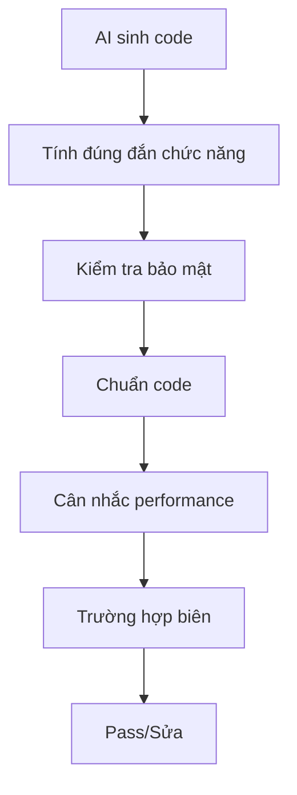

# 1.2.4 Code AI viết có tin được không - Code Review: Đảm bảo chất lượng cộng tác người-máy

### Điểm chính một câu

Code AI viết không thể dùng trực tiếp - nó cần con người review. Code review không phải là không tin AI, mà là khâu cần thiết của cộng tác người-máy.

### Tại sao phải review code của AI?

AI model có những giới hạn vốn có sau:

1. **Thời điểm cắt kiến thức**: Dữ liệu training của AI có giới hạn thời gian, có thể không biết API mới nhất hoặc best practice
2. **Thiếu ngữ cảnh dự án**: AI không hiểu quy ước cụ thể, quyết định lịch sử và logic nghiệp vụ của dự án bạn
3. **Vấn đề ảo giác**: AI đôi khi sẽ "phát minh" ra hàm, thư viện hoặc API không tồn tại
4. **Vùng mù bảo mật**: AI có thể bỏ qua vấn đề bảo mật, như lộ thông tin nhạy cảm, tấn công injection v.v.

### Checklist review code



#### 1. Tính đúng đắn chức năng

- [ ] Code có triển khai đúng chức năng kỳ vọng không?
- [ ] Luồng logic có đúng không?
- [ ] Giá trị trả về và kiểu có đúng không?

#### 2. Kiểm tra bảo mật

- [ ] Có lộ thông tin nhạy cảm (API Key, password) không?
- [ ] Có rủi ro SQL injection không?
- [ ] Có rủi ro XSS không?
- [ ] User input có được validate không?

#### 3. Chuẩn code

- [ ] Naming có tuân thủ quy ước dự án không?
- [ ] Style code có nhất quán không?
- [ ] Có comment phù hợp không?

#### 4. Cân nhắc performance

- [ ] Có tính toán lặp lại không cần thiết không?
- [ ] Có vấn đề N+1 query không?
- [ ] Có rủi ro memory leak không?

#### 5. Trường hợp biên

- [ ] Xử lý null/mảng rỗng như thế nào?
- [ ] Xử lý lượng dữ liệu cực lớn như thế nào?
- [ ] Xử lý lỗi mạng như thế nào?

### "Nói bậy" thường gặp của AI

#### Vấn đề 1: Bịa API không tồn tại

```tsx
// AI có thể viết code như này
import { useServerAction } from 'next/server'; // ❌ API này không tồn tại!
```

**Cách giải quyết**: Gặp API không quen, hãy vào tài liệu chính thức xác nhận có tồn tại không.

#### Vấn đề 2: Dùng cú pháp lỗi thời

```tsx
// AI có thể dùng cách viết Next.js phiên bản cũ
export async function getServerSideProps() { // ❌ App Router không dùng cái này nữa
  // ...
}
```

**Cách giải quyết**: Nói rõ với AI phiên bản bạn dùng, như "Tôi dùng Next.js 16 App Router".

#### Vấn đề 3: Bỏ qua xử lý lỗi

```tsx
// AI có thể bỏ qua xử lý lỗi
async function fetchUser(id: string) {
  const response = await fetch(`/api/users/${id}`);
  return response.json(); // ❌ Không xử lý trường hợp request thất bại
}
```

**Cách làm đúng**:

```tsx
async function fetchUser(id: string) {
  const response = await fetch(`/api/users/${id}`);
  if (!response.ok) {
    throw new Error(`Failed to fetch user: ${response.status}`);
  }
  return response.json();
}
```

### Best practice của review

#### 1. Chạy trước, review sau

Đừng chỉ xem code, hãy chạy lên xem hiệu quả trước. Nhiều vấn đề chỉ lộ ra khi runtime.

#### 2. Hoài nghi mỗi dependency

Dependency mới AI đưa vào, hãy xác nhận trước:
- Thư viện này thực sự tồn tại không?
- Có cần thiết đưa vào không?
- Có vấn đề bảo mật không?

#### 3. Tập trung vào đường đi quan trọng

Không cần review từng dòng tất cả code, nhưng logic cốt lõi (authentication, payment, xử lý dữ liệu) phải kiểm tra kỹ.

#### 4. Tận dụng AI để cross-review

Bạn có thể để AI review code nó tự sinh:

```
Hãy review đoạn code sau, tìm những vấn đề tiềm ẩn:
- Lỗ hổng bảo mật
- Vấn đề performance
- Lỗi logic
- Trường hợp biên chưa xử lý

[Paste code]
```

### Thiết lập thói quen review

| Giai đoạn | Trọng tâm review |
|------|----------|
| **Ngay sau sinh** | Lướt nhanh, kiểm tra lỗi rõ ràng |
| **Sau khi chạy test** | Xác minh tính đúng đắn chức năng |
| **Trước khi commit** | Checklist review code đầy đủ |
| **Trước khi merge** | Code Review của team |

### Template checklist nghiệm thu

Sau mỗi lần để AI sinh code, dùng checklist này:

```markdown
## Checklist review code

### Kiểm tra cơ bản
- [ ] Code chạy bình thường
- [ ] Triển khai đúng chức năng kỳ vọng
- [ ] Không có lỗi kiểu TypeScript

### Kiểm tra bảo mật
- [ ] Không lộ thông tin nhạy cảm
- [ ] User input có validate
- [ ] API call có kiểm soát quyền

### Kiểm tra chất lượng
- [ ] Naming rõ ràng hợp lý
- [ ] Có xử lý lỗi cần thiết
- [ ] Trường hợp biên đã bao phủ
```
