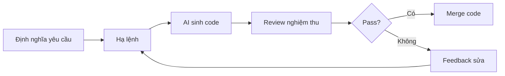

# 1.2 Bạn không chiến đấu một mình - Tâm pháp Vibe Coding: Từ "viết code" đến "chỉ huy AI viết code"

### Tái cấu trúc nhận thức

Năng lực cốt lõi của lập trình truyền thống là "viết code" - bạn cần nhớ cú pháp, hiểu API, tự tay viết từng dòng logic. Còn năng lực cốt lõi của Vibe Coding là "chỉ huy AI viết code" - bạn cần định nghĩa rõ ràng yêu cầu, truyền đạt ý định hiệu quả, nghiệm thu kết quả chính xác.

**Đây là sự chuyển đổi căn bản về vai trò: từ "công nhân thi công" thành "tổng kiến trúc sư dự án".**

### Mục tiêu bài học

Sau khi học xong bài này, bạn sẽ thiết lập được các năng lực cốt lõi sau:

1. **Chuyển đổi tư duy**: Nhận thức vai trò từ coder sang commander
2. **Prompt engineering**: Cách giao tiếp hiệu quả với AI
3. **Code review**: Cách nghiệm thu output của AI
4. **Lựa chọn công cụ**: Chọn AI model phù hợp theo từng tình huống

### Vòng lặp cốt lõi của Vibe Coding

Điểm then chốt của vòng lặp này:

- **Định nghĩa yêu cầu**: Bạn cần rất rõ mình muốn gì (khó hơn viết code)
- **Hạ lệnh**: Biểu đạt yêu cầu theo cách AI hiểu được
- **Review nghiệm thu**: Đánh giá output của AI có đáp ứng kỳ vọng không
- **Feedback sửa**: Nếu không đúng, nói cho AI biết sai chỗ nào, sửa thế nào

### Dẫn đường tiểu mục

| Tiểu mục | Chủ đề | Vấn đề cốt lõi |
|------|------|----------|
| 1.2.1 | Từ Coder sang Commander | Làm thế nào chuyển đổi tư duy? |
| 1.2.2 | Đặc điểm ứng dụng AI Native | Ứng dụng thời đại AI khác biệt như thế nào? |
| 1.2.3 | Cơ bản Prompt Engineering | Cách giao tiếp hiệu quả với AI? |
| 1.2.4 | Code Review | Cách nghiệm thu code của AI? |

### Khẩu quyết tâm pháp

> **Nghĩ rõ ràng**: Xác định rõ bạn muốn gì, rồi mới nói
> **Nói rõ ràng**: Dùng ngôn ngữ có cấu trúc để biểu đạt yêu cầu
> **Xem kỹ càng**: Code của AI không phải viết xong là dùng được
> **Sửa đúng chỗ**: Feedback phải cụ thể, đừng nói chung chung
