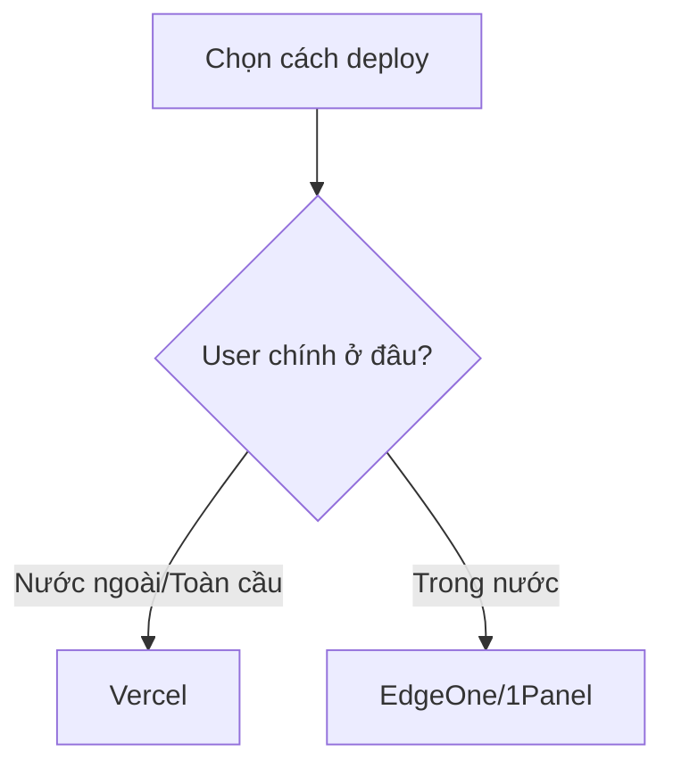
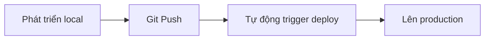

# 1.3 Để cả thế giới nhìn thấy tác phẩm của bạn - Thực chiến MVP Online và Deploy Vercel/EdgeOne

### Điểm chính một câu

Deploy là bước cuối biến code thành sản phẩm - cho tác phẩm của bạn có một URL mà cả thế giới đều có thể truy cập.

### Tại sao phải deploy sớm?

Nhận thức lầm tưởng của nhiều người mới học là "đợi chức năng làm xong mới deploy". Nhưng trong lý niệm Vibe Coding, chúng tôi ủng hộ **deploy sớm, deploy liên tục**:

1. **Xác minh môi trường**: Chạy được local không có nghĩa chạy được môi trường production, càng sớm phát hiện vấn đề càng tốt
2. **Nhận feedback**: Để user (dù chỉ là chính bạn) trải nghiệm sớm, nhận được feedback thực
3. **Xây dựng tự tin**: Nhìn thấy tác phẩm của mình chạy online, là cảm giác thành tựu lớn
4. **Hình thành vòng khép**: Vòng khép hoàn chỉnh từ yêu cầu đến online, mới thực sự là "fullstack"

### Lựa chọn cách deploy



| Cách | Trường hợp áp dụng | Ưu điểm | Nhược điểm |
|------|----------|------|------|
| **Vercel** | User nước ngoài chủ yếu | Zero config, miễn phí, tích hợp sâu Next.js | Truy cập trong nước chậm |
| **EdgeOne** | User trong nước chủ yếu | CDN gia tốc trong nước, truy cập nhanh | Cần ICP filing (khi dùng tên miền trong nước) |
| **1Panel** | Tự xây server | Hoàn toàn kiểm soát, cấu hình linh hoạt | Cần kiến thức vận hành server |

### Deploy Vercel (Khuyên người mới)

Vercel là platform deploy chính thức của Next.js, có hỗ trợ tốt nhất cho ứng dụng Next.js.

#### Các bước deploy

**Bước 1: Push code lên GitHub**

```bash
# Khởi tạo Git repo (nếu chưa có)
git init
git add .
git commit -m "Initial commit"

# Sau khi tạo repo GitHub, liên kết và push
git remote add origin https://github.com/tên-user-của-bạn/repo-của-bạn.git
git push -u origin main
```

**Bước 2: Kết nối Vercel**

1. Truy cập [vercel.com](https://vercel.com) và đăng nhập (có thể dùng tài khoản GitHub)
2. Click "Add New..." → "Project"
3. Chọn GitHub repo bạn vừa push
4. Vercel sẽ tự động phát hiện dự án Next.js, click trực tiếp "Deploy"

**Bước 3: Đợi deploy hoàn thành**

Thông thường sau 1-2 phút, bạn sẽ nhận được một tên miền `.vercel.app`, có thể truy cập trực tiếp ứng dụng của bạn!

#### Cấu hình biến môi trường

Nếu ứng dụng của bạn cần biến môi trường (như chuỗi kết nối database):

1. Trong cài đặt dự án Vercel tìm "Environment Variables"
2. Thêm biến môi trường bạn cần
3. Deploy lại

### Deploy EdgeOne (User trong nước)

Tencent Cloud EdgeOne cung cấp khả năng edge computing và CDN acceleration, đặc biệt phù hợp ứng dụng hướng đến user trong nước.

#### Ưu thế cốt lõi

- **Truy cập trong nước nhanh**: Tận dụng CDN node của Tencent Cloud
- **Edge Function**: Hỗ trợ chạy code ở edge node
- **Bảo vệ bảo mật**: Tích hợp sẵn DDoS protection và WAF

#### Cách deploy

EdgeOne hỗ trợ nhiều cách tiếp cận, với ứng dụng Next.js, khuyên dùng:

1. **Static export + CDN**: Phù hợp trang web tĩnh thuần túy
2. **Edge Function**: Phù hợp ứng dụng cần SSR

Cấu hình cụ thể xem hướng dẫn chi tiết ở tiểu mục 1.5.6.

### Deploy liên tục

Bất kể dùng platform nào, đều hỗ trợ **continuous deployment**:



Mỗi lần bạn `git push` lên nhánh main, platform deploy sẽ tự động kéo code mới nhất và deploy lại. Điều này có nghĩa:

- Không cần deploy thủ công
- Commit code tức lên production
- Có thể iterate nhanh

### Xác minh deploy thành công

Sau khi deploy xong, kiểm tra:

1. **Truy cập trang chủ**: Xác nhận trang hiển thị bình thường
2. **Test chức năng**: Click các link và button
3. **Kiểm tra console**: Mở developer tools của trình duyệt, xác nhận không có lỗi

### Vấn đề thường gặp

**Q: Sau deploy trang trắng?**

1. Xem deployment log của Vercel/EdgeOne
2. Kiểm tra có lỗi build không
3. Xác nhận biến môi trường cấu hình đúng

**Q: Trong nước truy cập Vercel rất chậm?**

Cân nhắc dùng EdgeOne hoặc cấu hình custom domain + CDN.

**Q: Làm thế nào bind tên miền riêng?**

Trong cài đặt tên miền của platform deploy thêm custom domain, sau đó ở nhà cung cấp tên miền thêm DNS resolve record.

### Đạt được mốc quan trọng

Sau khi hoàn thành bài này, ứng dụng của bạn đã:

- [x] Có một URL công khai có thể truy cập
- [x] Thực hiện được commit code tức deploy
- [x] Có thể chia sẻ cho bất kỳ ai

**Bước tiếp theo**: Học cách xây dựng quy trình làm việc cộng tác AI hiệu quả, giúp quá trình phát triển mượt mà hơn.
