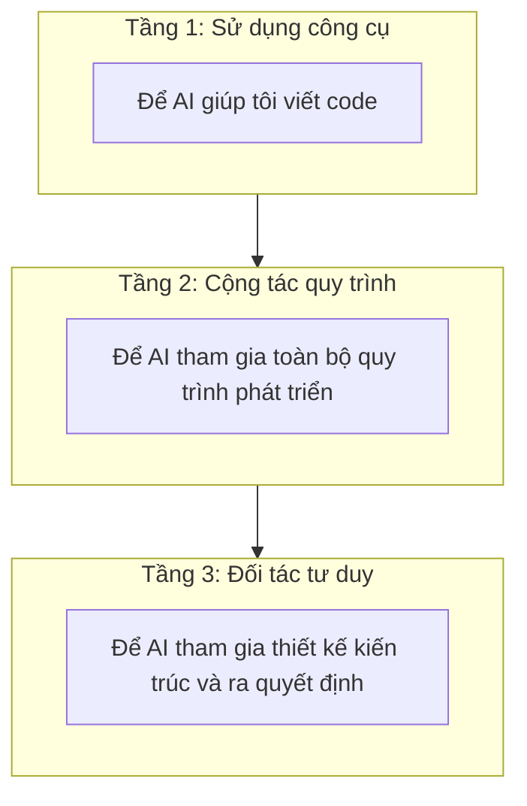
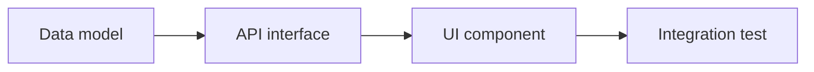

# 1.4 Làm thế nào để AI trở thành đồng đội thực sự — Thực chiến luồng công việc cộng tác AI và Best Practices

### Tái cấu trúc nhận thức

AI không phải là "công cụ thay bạn viết code", mà là "đồng đội cộng tác với bạn". Cộng tác người-máy hiệu quả cần xây dựng một luồng công việc có thể tái sử dụng.

### Ba tầng cộng tác AI



| Tầng | Đặc điểm | Kịch bản điển hình |
|------|------|----------|
| **Sử dụng công cụ** | Gọi đơn lẻ, dùng xong bỏ | "Giúp tôi viết một hàm" |
| **Cộng tác quy trình** | Đối thoại liên tục, ngữ cảnh liền mạch | "Chúng ta cùng nhau thực hiện tính năng này" |
| **Đối tác tư duy** | Tham gia ra quyết định, đưa ra đề xuất | "Bạn nghĩ thế nào về phương án kiến trúc này?" |

### Template luồng công việc hiệu quả

#### Giai đoạn 1: Định nghĩa yêu cầu

Trước khi bắt đầu coding, hãy cùng AI sắp xếp yêu cầu:

```
Tôi cần thực hiện [tên tính năng].

Bối cảnh:
[Mô tả ngắn gọn tại sao cần tính năng này]

User story:
Với tư cách là [vai trò người dùng], tôi muốn [làm việc gì đó], để [đạt được giá trị nào đó]

Tiêu chí nghiệm thu:
1. [Tiêu chí 1]
2. [Tiêu chí 2]
3. [Tiêu chí 3]

Hãy giúp tôi phân tích yêu cầu này, xem có điểm nào thiếu sót không.
```

#### Giai đoạn 2: Thiết kế phương án

Để AI tham gia thiết kế phương án kỹ thuật:

```
Dựa trên yêu cầu trên, hãy giúp tôi thiết kế phương án kỹ thuật.

Tech stack: Next.js 16 + TypeScript + Tailwind CSS + Prisma

Hãy xem xét:
1. Thiết kế cấu trúc dữ liệu
2. Thiết kế interface API
3. Phân tách component
4. Xử lý trường hợp biên
```

#### Giai đoạn 3: Thực hiện từng bước

Theo phương án, để AI sinh code từng bước:



**Nguyên tắc quan trọng**: Mỗi bước xác nhận OK rồi mới chuyển sang bước tiếp theo.

#### Giai đoạn 4: Review tối ưu

Hoàn thành thực hiện, để AI giúp bạn review:

```
Hãy review đoạn code sau, kiểm tra:
1. Logic có đúng không
2. Có vấn đề bảo mật không
3. Có vấn đề hiệu năng không
4. Code có tuân thủ best practices không

[Dán code]
```

### Chiến lược quản lý ngữ cảnh

Bộ nhớ của AI có hạn, cần chủ động quản lý ngữ cảnh:

#### 1. File quy tắc dự án

Tạo `.cursorrules` hoặc `CLAUDE.md` trong thư mục gốc dự án:

```markdown
# Quy tắc dự án

## Tech stack
- Next.js 16 (App Router)
- TypeScript (strict mode)
- Tailwind CSS
- Prisma + PostgreSQL

## Quy ước code
- Dùng function component, không dùng class component
- Ưu tiên dùng Server Components
- Tên file dùng kebab-case
- Tên component dùng PascalCase

## Cấu trúc thư mục
- src/app - Trang và routing
- src/components - Component tái sử dụng
- src/lib - Hàm tiện ích
- src/types - Định nghĩa kiểu
```

#### 2. Đồng bộ ngữ cảnh khi bắt đầu task

Mỗi lần bắt đầu task mới, cung cấp background cần thiết trước:

```
Tôi đang phát triển dự án [loại dự án].

Task hiện tại: [Mô tả task]

File liên quan:
- [Đường dẫn file 1 và chức năng]
- [Đường dẫn file 2 và chức năng]

Bây giờ tôi cần...
```

#### 3. Định kỳ tổng kết tiến độ

Sau khi đối thoại dài, yêu cầu AI tổng kết:

```
Hãy tổng kết xem cuộc đối thoại này chúng ta đã hoàn thành gì:
1. Đã thực hiện tính năng nào
2. Còn công việc gì cần làm
3. Vấn đề cần lưu ý
```

### Checklist luồng công việc cộng tác

Trong mỗi task phát triển, thực hiện theo quy trình sau:

```markdown
## Task: [Tên task]

### 1. Định nghĩa yêu cầu
- [ ] Mục tiêu tính năng rõ ràng
- [ ] Định nghĩa tiêu chí nghiệm thu
- [ ] Nhận diện trường hợp biên

### 2. Thiết kế phương án
- [ ] Xác định cấu trúc dữ liệu
- [ ] Thiết kế interface API
- [ ] Lập kế hoạch cấu trúc component

### 3. Thực hiện từng bước
- [ ] Thực hiện tầng dữ liệu
- [ ] Thực hiện tầng interface
- [ ] Thực hiện tầng UI
- [ ] Xử lý trường hợp lỗi

### 4. Review nghiệm thu
- [ ] Code review thông qua
- [ ] Test tính năng thông qua
- [ ] Trường hợp biên được cover
```

### Các mẫu cộng tác thường gặp

#### Mẫu 1: Pair Programming

Giống như pair programming với người thật, thảo luận real-time:

```
Bây giờ tôi sẽ thực hiện [tính năng], trước tiên viết phiên bản cơ bản...

[Dán code bạn viết]

Bạn xem viết thế này có đúng không? Có cách viết nào tốt hơn không?
```

#### Mẫu 2: Code Review

Để AI đóng vai Code Reviewer:

```
Hãy với vai trò Code Reviewer nghiêm khắc review đoạn code sau:

[Dán code]

Hãy chỉ ra:
- Bug tiềm ẩn
- Chỗ có thể tối ưu
- Cách viết không tuân thủ best practices
```

#### Mẫu 3: Rubber Duck Debugging

Khi bạn bị kẹt, giải thích vấn đề cho AI:

```
Tôi gặp một vấn đề, để tôi giải thích...

Hiện tượng: [Mô tả hiện tượng vấn đề]
Hiểu biết của tôi: [Bạn nghĩ nên là gì]
Đã thử: [Phương pháp bạn đã thử]

Bạn có thể giúp tôi phân tích nguyên nhân có thể không?
```

### Hướng dẫn tránh lỗi

1. **Đừng hoàn toàn phụ thuộc vào AI**: AI là trợ lý, không phải thay thế. Quyền quyết định cuối cùng ở bạn
2. **Đừng yêu cầu quá nhiều một lúc**: Task lớn chia thành task nhỏ, hoàn thành từng bước
3. **Kịp thời sửa lỗi**: Phát hiện AI đi sai hướng, chỉ ra ngay lập tức
4. **Lưu đối thoại có giá trị**: Giải pháp hay và prompt tốt đáng để lưu lại tái sử dụng

### Tổng kết chương này

Cộng tác AI hiệu quả cần:

1. **Xây dựng quy trình**: Yêu cầu → Thiết kế → Thực hiện → Review
2. **Quản lý ngữ cảnh**: Quy tắc dự án + Background task + Định kỳ tổng kết
3. **Linh hoạt chuyển đổi mẫu**: Pair programming / Code review / Thảo luận vấn đề
4. **Giữ quyền chủ động**: AI là đồng đội, nhưng bạn là người chịu trách nhiệm dự án
