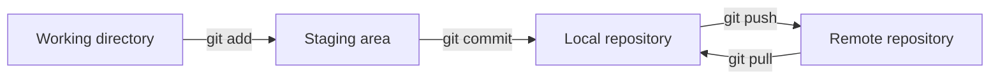
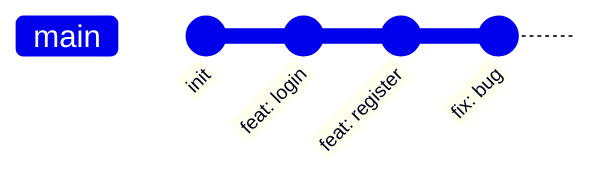
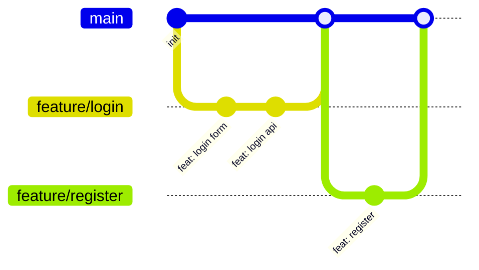

# 1.5.2 Cộng tác nhóm không đánh nhau — Luồng công việc Git: Chiến lược nhánh và Quy ước cộng tác

### Một câu giải thích

Git là "cỗ máy thời gian" của code — nó ghi lại mọi thay đổi, cho phép bạn quay về bất kỳ phiên bản lịch sử nào, hơn nữa còn cho phép nhiều người cùng cộng tác mà không can thiệp lẫn nhau.

### Khái niệm cốt lõi



| Khái niệm | Giải thích |
|------|------|
| **Working directory** | File bạn đang chỉnh sửa |
| **Staging area** | Thay đổi chuẩn bị commit |
| **Local repository** | Lịch sử đã commit |
| **Remote repository** | Code repository trên GitHub |

### Tra cứu nhanh lệnh cơ bản

```bash
# Xem trạng thái
git status

# Thêm file vào staging area
git add .                    # Thêm tất cả file
git add src/components/      # Thêm thư mục chỉ định

# Commit
git commit -m "feat: thêm chức năng đăng nhập người dùng"

# Push lên remote
git push origin main

# Pull cập nhật remote
git pull origin main

# Xem lịch sử
git log --oneline

# Rollback phiên bản
git reset --soft HEAD~1      # Rollback một phiên bản, giữ lại thay đổi
git reset --hard HEAD~1      # Rollback một phiên bản, bỏ thay đổi
```

### Chiến lược nhánh

#### Phát triển một người

Với dự án cá nhân, chiến lược đơn giản là đủ:



Phát triển trực tiếp trên nhánh `main` là được.

#### Phát triển nhóm

Dự án nhóm đề xuất **GitHub Flow**:



**Quy tắc cốt lõi**:

1. Nhánh `main` luôn giữ trạng thái có thể deploy
2. Tính năng mới tạo nhánh feature từ `main`
3. Hoàn thành thì merge về `main` thông qua Pull Request
4. Trước khi merge cần Code Review

### Quy ước commit

Dùng quy ước **Conventional Commits**:

```
<type>(<scope>): <description>

[Nội dung tùy chọn]

[Chú thích tùy chọn]
```

**Loại thường dùng**:

| Loại | Giải thích | Ví dụ |
|------|------|------|
| `feat` | Tính năng mới | `feat: thêm đăng nhập người dùng` |
| `fix` | Sửa bug | `fix: sửa nút đăng nhập không phản hồi` |
| `docs` | Cập nhật tài liệu | `docs: cập nhật README` |
| `style` | Format code | `style: format code` |
| `refactor` | Refactor | `refactor: tối ưu logic đăng nhập` |
| `test` | Liên quan test | `test: thêm test đăng nhập` |
| `chore` | Build/Công cụ | `chore: cập nhật dependencies` |

### Kịch bản thao tác thường gặp

#### Kịch bản 1: Phát triển tính năng mới

```bash
# 1. Đảm bảo main là mới nhất
git checkout main
git pull origin main

# 2. Tạo nhánh tính năng
git checkout -b feature/user-profile

# 3. Phát triển và commit
git add .
git commit -m "feat: thêm trang hồ sơ người dùng"

# 4. Push nhánh
git push -u origin feature/user-profile

# 5. Tạo Pull Request trên GitHub
```

#### Kịch bản 2: Sửa bug khẩn cấp

```bash
# 1. Từ main tạo nhánh sửa lỗi
git checkout main
git pull origin main
git checkout -b fix/login-error

# 2. Sửa và commit
git add .
git commit -m "fix: sửa lỗi null pointer khi đăng nhập"

# 3. Push và tạo PR
git push -u origin fix/login-error
```

#### Kịch bản 3: Xử lý conflict merge

```bash
# 1. Pull main mới nhất
git checkout main
git pull origin main

# 2. Quay về nhánh tính năng và merge main
git checkout feature/user-profile
git merge main

# 3. Giải quyết conflict thủ công (editor sẽ đánh dấu vị trí conflict)
# 4. Đánh dấu conflict đã giải quyết
git add .
git commit -m "merge: resolve conflicts with main"
```

### Cấu hình .gitignore

Đảm bảo file nhạy cảm không bị commit:

```gitignore
# Dependencies
node_modules/

# Build output
.next/
out/
dist/

# Biến môi trường
.env
.env.local
.env.*.local

# IDE
.vscode/
.idea/

# System files
.DS_Store
Thumbs.db

# Logs
*.log
```

### Hướng dẫn tránh lỗi

- **Kiểm tra trước khi commit**: `git status` và `git diff` xác nhận thay đổi
- **Commit từng bước nhỏ**: Mỗi commit chỉ làm một việc, tiện rollback
- **Viết tốt message commit**: Bạn trong tương lai sẽ cảm ơn bạn hiện tại
- **Không commit thông tin nhạy cảm**: API Key, mật khẩu phải loại trừ trong .gitignore
- **Conflict đừng hoảng**: Hiểu nguyên nhân conflict trước, rồi giải quyết thủ công
