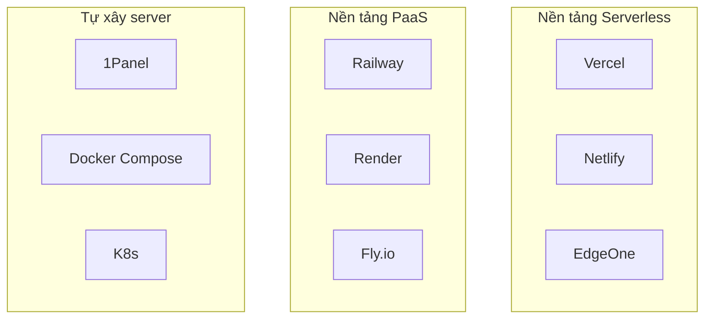
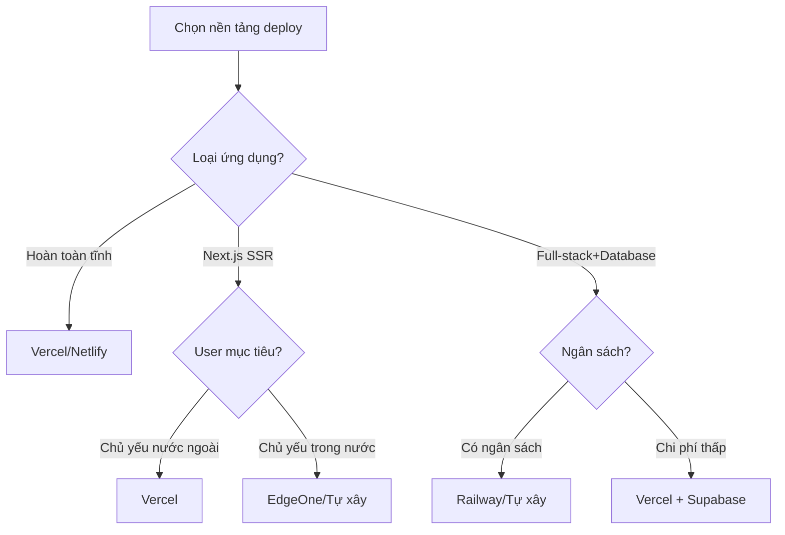

# 1.5.4 Dự án cuối cùng đặt ở đâu — Nền tảng deploy: Container hóa và Lựa chọn dịch vụ cloud

### Một câu giải thích

Nền tảng deploy quyết định ứng dụng của bạn chạy trên internet như thế nào — chọn nền tảng phù hợp có thể làm vận hành trở nên nhẹ nhàng, chi phí kiểm soát được.

### Toàn cảnh phương án deploy



### So sánh nền tảng

| Nền tảng | Loại | Kịch bản phù hợp | Miễn phí | Truy cập trong nước |
|------|------|----------|----------|----------|
| **Vercel** | Serverless | Frontend/SSR | Hào phóng | Khá chậm |
| **Netlify** | Serverless | Trang tĩnh | Hào phóng | Khá chậm |
| **EdgeOne** | CDN + Edge | User trong nước | Có | Nhanh |
| **Railway** | PaaS | Ứng dụng full-stack | $5/tháng | Chậm |
| **1Panel** | Tự xây | Kiểm soát hoàn toàn | Phí server | Tùy server |

### Cây quyết định lựa chọn



### Cơ bản về container hóa

Dù chọn nền tảng nào, hiểu Docker đều rất quan trọng:

```dockerfile
# Dockerfile điển hình cho Next.js
FROM node:20-alpine AS base

# Giai đoạn dependencies
FROM base AS deps
WORKDIR /app
COPY package.json pnpm-lock.yaml ./
RUN corepack enable pnpm && pnpm install --frozen-lockfile

# Giai đoạn build
FROM base AS builder
WORKDIR /app
COPY --from=deps /app/node_modules ./node_modules
COPY . .
RUN corepack enable pnpm && pnpm build

# Giai đoạn chạy
FROM base AS runner
WORKDIR /app
ENV NODE_ENV=production

COPY --from=builder /app/public ./public
COPY --from=builder /app/.next/standalone ./
COPY --from=builder /app/.next/static ./.next/static

EXPOSE 3000
CMD ["node", "server.js"]
```

### Chiến lược đề xuất của khóa học

| Giai đoạn | Phương án đề xuất | Lý do |
|------|----------|------|
| **Giai đoạn học** | Vercel | Zero config, bắt đầu nhanh |
| **Dự án cá nhân** | Vercel + Supabase | Miễn phí đủ dùng |
| **User trong nước** | EdgeOne hoặc 1Panel | Tốc độ truy cập nhanh |
| **Dự án production** | Tự xây server + 1Panel | Kiểm soát hoàn toàn, chi phí dự đoán được |

### Cân nhắc chi phí

| Phương án | Chi phí ban đầu | Chi phí mở rộng | Quy mô phù hợp |
|------|----------|----------|----------|
| **Vercel bản miễn phí** | 0 | Tính theo lượng | Dự án nhỏ |
| **Vercel Pro** | $20/tháng | Tính theo lượng | Dự án trung |
| **Tự xây server** | Phí server | Cố định | Bất kỳ quy mô |

### Hướng dẫn tránh lỗi

- **Hạn chế Vercel bản miễn phí**: Serverless function thời gian thực thi giới hạn 10 giây
- **Vấn đề cold start**: Serverless function lần gọi đầu tiên có thể khá chậm
- **Địa phương hóa dữ liệu**: Một số ngành yêu cầu lưu trữ dữ liệu trong nước
- **Yêu cầu filing**: Dùng server và domain trong nước cần ICP filing
