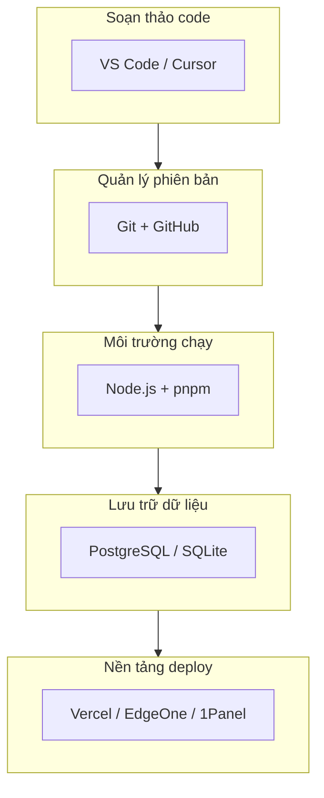

# 1.5 Trang bị đầy đủ môi trường phát triển — Toolchain và Môi trường: IDE/Git/Node.js/Database/Nền tảng deploy

### Một câu giải thích

Môi trường phát triển là "bàn làm việc" của bạn — chọn đúng công cụ, cấu hình tốt, hiệu quả phát triển có thể tăng gấp nhiều lần.

### Toàn cảnh toolchain



### Nội dung phần này bao gồm

| Chương | Chủ đề | Nội dung cốt lõi |
|------|------|----------|
| 1.5.1 | Cấu hình IDE | Gợi ý và cấu hình plugin VS Code |
| 1.5.2 | Luồng công việc Git | Chiến lược nhánh và quy ước cộng tác |
| 1.5.3 | Lựa chọn database | PostgreSQL vs MySQL vs SQLite |
| 1.5.4 | Nền tảng deploy | Container hóa và lựa chọn dịch vụ cloud |
| 1.5.5 | Vercel | Nền tảng deploy tốt nhất cho Next.js |
| 1.5.6 | Tencent Cloud EO | Phương án tối ưu truy cập trong nước |

### Tech stack đề xuất

Khóa học này sử dụng thống nhất tech stack sau để đảm bảo tính nhất quán trong quá trình học:

| Danh mục | Công cụ đề xuất | Phương án thay thế |
|------|----------|----------|
| **Editor** | Cursor | VS Code |
| **Quản lý phiên bản** | Git + GitHub | GitLab |
| **Runtime** | Node.js 20 LTS | Node.js 18 LTS |
| **Quản lý gói** | pnpm | npm / yarn |
| **Database** | PostgreSQL | SQLite (môi trường dev) |
| **ORM** | Prisma | - |
| **Deploy** | Vercel | EdgeOne / 1Panel |

### Tại sao chọn những công cụ này?

1. **Cursor**: IDE nguyên bản AI, khớp cao với lý niệm Vibe Coding của khóa học
2. **pnpm**: Tốc độ cài đặt nhanh hơn, tiết kiệm không gian đĩa hơn
3. **PostgreSQL**: Chức năng mạnh mẽ, kết hợp tốt với Prisma
4. **Vercel**: Tích hợp sâu với Next.js, deploy zero config

### Checklist kiểm tra môi trường

Trước khi bắt đầu học các phần tiếp theo, xác nhận môi trường của bạn đáp ứng:

```bash
# Kiểm tra phiên bản Node.js
node -v  # Nên >= 18.17

# Kiểm tra pnpm
pnpm -v  # Nên đã cài đặt

# Kiểm tra Git
git --version  # Nên đã cài đặt

# Kiểm tra editor
# Cursor hoặc VS Code đã cài đặt và cấu hình trợ lý AI
```

### Lộ trình học tập tiếp theo

Nếu bạn là người hoàn toàn mới, đề xuất học theo thứ tự từng chương con. Nếu bạn đã có kinh nghiệm phát triển, có thể bỏ qua phần đã quen, tập trung chú ý:

- **1.5.2 Luồng công việc Git**: Nền tảng cộng tác nhóm
- **1.5.5 Vercel**: Deploy nhanh ứng dụng Next.js của bạn
