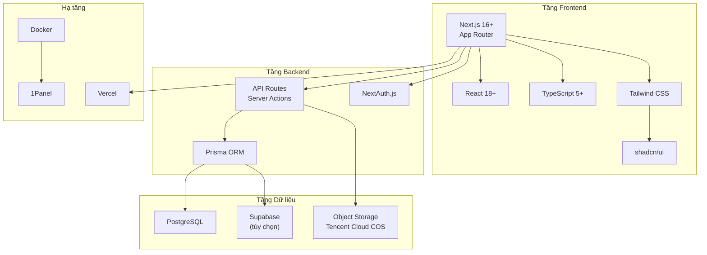

# 2.0 Chọn đúng công cụ, công việc nhẹ nhàng gấp đôi—Tổng quan công nghệ

## Tại sao lựa chọn công nghệ lại quan trọng đến vậy?

Trong thời đại Vibe Coding, tiêu chuẩn cốt lõi của việc lựa chọn công nghệ đã có sự chuyển đổi căn bản:

**Phát triển truyền thống**: Chọn công nghệ bạn quen thuộc nhất.

**Vibe Coding**: Chọn công nghệ mà AI thành thạo nhất.

Dữ liệu huấn luyện của các mô hình AI quyết định việc nó hiểu sâu hơn về một số công nghệ nhất định, chất lượng tạo code cao hơn. Chọn một công nghệ thân thiện với AI có nghĩa là:

- Code được AI tạo ra phù hợp hơn với best practices
- Khi gặp vấn đề, AI có thể đưa ra giải pháp chính xác hơn
- Tài nguyên cộng đồng phong phú, "kho tri thức" của AI hoàn thiện hơn

## Tổng quan công nghệ trong khóa học này



## Chiến lược khóa phiên bản

### Tại sao phải khóa phiên bản?

Trong phối hợp nhóm và phát triển hỗ trợ AI, sự không nhất quán về phiên bản là nguồn gốc phổ biến nhất của "vấn đề huyền bí". Khóa phiên bản rõ ràng có thể:

1. **Đảm bảo tái tạo được**: Code chạy được hôm nay, ngày mai chắc chắn vẫn chạy được
2. **Giảm sự nhầm lẫn của AI**: AI biết bạn đang dùng API phiên bản nào
3. **Giảm chi phí phối hợp**: Môi trường các thành viên trong nhóm nhất quán

### Phiên bản phụ thuộc cốt lõi

```json
{
  "dependencies": {
    "next": "^14.2.0",
    "react": "^18.3.0",
    "react-dom": "^18.3.0",
    "typescript": "^5.4.0",
    "@prisma/client": "^5.14.0",
    "next-auth": "^4.24.0",
    "tailwindcss": "^3.4.0"
  },
  "devDependencies": {
    "prisma": "^5.14.0",
    "@types/node": "^20.0.0",
    "@types/react": "^18.3.0"
  }
}
```

### Ngữ nghĩa số phiên bản: SemVer

Hiểu về phiên bản ngữ nghĩa (Semantic Versioning) là nền tảng của việc quản lý phụ thuộc:

```
Major.Minor.Patch
  ^     ^     ^
  |     |     +-- Sửa Bug, tương thích ngược
  |     +-------- Tính năng mới, tương thích ngược
  +-------------- Cập nhật phá vỡ, có thể không tương thích
```

**Phạm vi phiên bản trong package.json**:

| Ký hiệu | Ý nghĩa | Ví dụ |
|------|------|------|
| `^1.2.3` | Cho phép cập nhật minor và patch | Khớp `1.x.x` |
| `~1.2.3` | Chỉ cho phép cập nhật patch | Khớp `1.2.x` |
| `1.2.3` | Khóa chính xác | Chỉ khớp `1.2.3` |

::: tip Thực hành tốt nhất
Đối với các framework cốt lõi (Next.js, React), nên sử dụng `^` để khóa major version; đối với các thư viện có thể có vấn đề tương thích, sử dụng `~` hoặc phiên bản chính xác.
:::

## Tại sao chọn bộ công nghệ này?

### Next.js: Giải pháp tối ưu cho fullstack framework

| Tính năng | Giá trị |
|------|------|
| App Router | Routing dựa trên file system, trực quan dễ hiểu |
| RSC | Server Components, giảm kích thước JS phía client |
| Server Actions | Gọi trực tiếp logic server trong component |
| Tối ưu tích hợp | Tự động tối ưu hóa hình ảnh, font, script |

### TypeScript: Đối tác tốt nhất của AI

TypeScript không chỉ là bảo đảm type-safe, mà còn là cầu nối hợp tác với AI:

- **Type chính là tài liệu**: AI hiểu ý định của bạn qua định nghĩa type
- **Tự động hoàn thành**: Hệ thống type giúp AI tạo code chính xác hơn
- **Refactor an toàn**: Type checking giúp những sửa đổi quy mô lớn của AI đáng tin cậy hơn

### Prisma: Thao tác database type-safe

```typescript
// Type tự động tạo bởi Prisma, giúp AI biết cấu trúc dữ liệu của bạn
const user = await prisma.user.findUnique({
  where: { id: userId },
  include: { posts: true }  // AI biết điều này sẽ trả về User có posts
})
```

## Hướng dẫn phối hợp với AI

Khi bạn cần AI giúp đưa ra quyết định lựa chọn công nghệ, bạn có thể hỏi như sau:

> **Ý định cốt lõi**: Giúp AI hiểu ràng buộc dự án của bạn, đưa ra gợi ý công nghệ

**Thuật ngữ chính**: `Next.js App Router`, `TypeScript`, `Prisma`, `Server Components`, `Server Actions`

**Chiến lược tương tác**:
1. Trước tiên mô tả nhu cầu cốt lõi và quy mô của dự án
2. Nêu rõ giới hạn môi trường triển khai của bạn
3. Yêu cầu AI đưa ra gợi ý cấu hình cụ thể dựa trên công nghệ của khóa học này

::: warning Lời khuyên tránh sai lầm
Đừng để AI tự ý gợi ý công nghệ. Hãy nói rõ với nó: "Dựa trên công nghệ Next.js 16 App Router + TypeScript + Prisma", tránh AI gợi ý các phương án lỗi thời hoặc không tương thích.
:::
