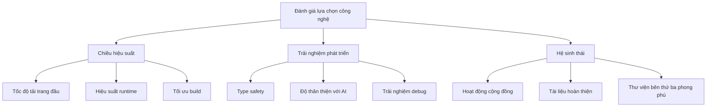
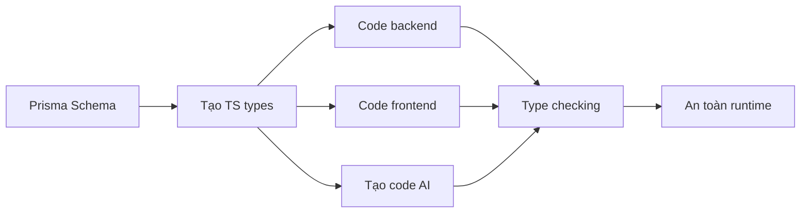

# 2.1.1 Chọn chúng vì lý do gì—Lý do chọn công nghệ

## Tái cấu trúc nhận thức: Ba chiều của lựa chọn công nghệ

Lựa chọn công nghệ truyền thống thường chỉ quan tâm "công nghệ này có thể thực hiện yêu cầu của tôi không". Trong thời đại Vibe Coding, chúng ta cần đánh giá từ ba chiều:



## Chiều hiệu suất: Tại sao chọn Next.js

### So sánh hiệu suất trang đầu

| Phương án | Thời gian trang đầu | SEO | Áp lực server |
|------|----------|-----|------------|
| React SPA thuần | Chậm | Kém | Thấp |
| Next.js SSR | Nhanh | Tốt | Trung bình |
| Next.js SSG | Cực nhanh | Tốt | Cực thấp |
| Next.js RSC | Nhanh | Tốt | Thấp |

### Ưu điểm hiệu suất của Next.js

1. **Code splitting tự động**: Mỗi trang chỉ tải JS cần thiết
2. **Tối ưu hình ảnh**: `next/image` tự động nén, lazy load, responsive
3. **Tối ưu font**: `next/font` không có layout shift
4. **Cơ chế prefetch**: `<Link>` tự động prefetch các link hiển thị

```typescript
// Tối ưu hình ảnh của Next.js sẵn dùng ngay
import Image from 'next/image'

export function Avatar({ src, alt }: { src: string; alt: string }) {
  return (
    <Image
      src={src}
      alt={alt}
      width={100}
      height={100}
      // Tự động: định dạng WebP, responsive srcset, lazy loading
    />
  )
}
```

## Trải nghiệm phát triển: Tại sao chọn TypeScript

### Chuỗi giá trị của type safety



### TypeScript giúp AI hiểu bạn hơn

```typescript
// Với định nghĩa type, AI biết bạn cần gì
interface CreatePostInput {
  title: string
  content: string
  authorId: string
  tags?: string[]
}

// Code được AI tạo sẽ tự động khớp type này
async function createPost(input: CreatePostInput) {
  // AI biết input có những field gì, sẽ sử dụng đúng
}
```

**Không có type** thì AI có thể tạo:
```javascript
// AI không biết data có field gì, dễ sai
function createPost(data) {
  // data.titel ← Lỗi chính tả, chỉ phát hiện khi runtime
}
```

## Hệ sinh thái: Tại sao chọn bộ kết hợp này

### So sánh độ trưởng thành hệ sinh thái

| Công nghệ | Lượt tải npm/tuần | GitHub Stars | Tuổi |
|------|-------------|--------------|------|
| Next.js | 6 triệu+ | 120k+ | 7 năm+ |
| Prisma | 2 triệu+ | 35k+ | 5 năm+ |
| Tailwind | 8 triệu+ | 80k+ | 6 năm+ |

### Tại sao những con số này quan trọng?

- **Lượt tải/tuần cao** → Vấn đề dễ được phát hiện và sửa hơn
- **Stars nhiều** → Hỗ trợ cộng đồng tốt, tài nguyên tutorial phong phú
- **Tuổi lâu** → Đã được kiểm chứng production, API ổn định

### Tiêu chuẩn chọn phụ thuộc quan trọng

::: tip Quy tắc vàng khi chọn thư viện bên thứ ba
1. **Lượt tải npm/tuần > 100k**: Cho thấy đủ nhiều người dùng
2. **Cập nhật gần nhất < 3 tháng**: Cho thấy vẫn được duy trì tích cực
3. **Có định nghĩa TypeScript types**: Bắt buộc cho hợp tác AI
4. **Issues được phản hồi kịp thời**: Có vấn đề sẽ tìm được người giúp
:::

## Giác ngộ: Điểm kiểm tra khi review code AI

Khi AI giúp bạn viết code, cần kiểm tra kỹ những điểm sau:

### 1. Phiên bản phụ thuộc

```json
// AI có thể tạo phiên bản lỗi thời
{
  "dependencies": {
    "next": "^13.0.0"  // ❌ Nên dùng 14.x
  }
}
```

### 2. Đường dẫn import

```typescript
// AI có thể nhầm lẫn App Router và Pages Router
import { useRouter } from 'next/router'     // ❌ Pages Router
import { useRouter } from 'next/navigation'  // ✅ App Router
```

### 3. Loại component

```typescript
// AI có thể dùng Hook client trong Server Component
export default function Page() {
  const [state, setState] = useState()  // ❌ Server component không dùng được useState
}
```

## Tóm tắt phần này

Lý do cốt lõi chọn Next.js + TypeScript + Prisma:

| Chiều | Giá trị cốt lõi |
|------|----------|
| **Hiệu suất** | Tối ưu sẵn dùng, không cần cấu hình thủ công |
| **Trải nghiệm phát triển** | Type safety xuyên suốt fullstack, hợp tác AI hiệu quả |
| **Hệ sinh thái** | Cộng đồng hoạt động, có giải pháp cho vấn đề, tài nguyên phong phú |
