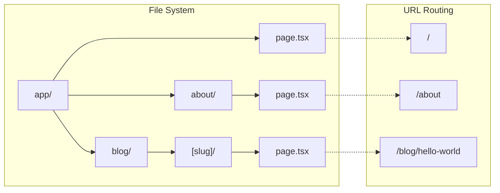
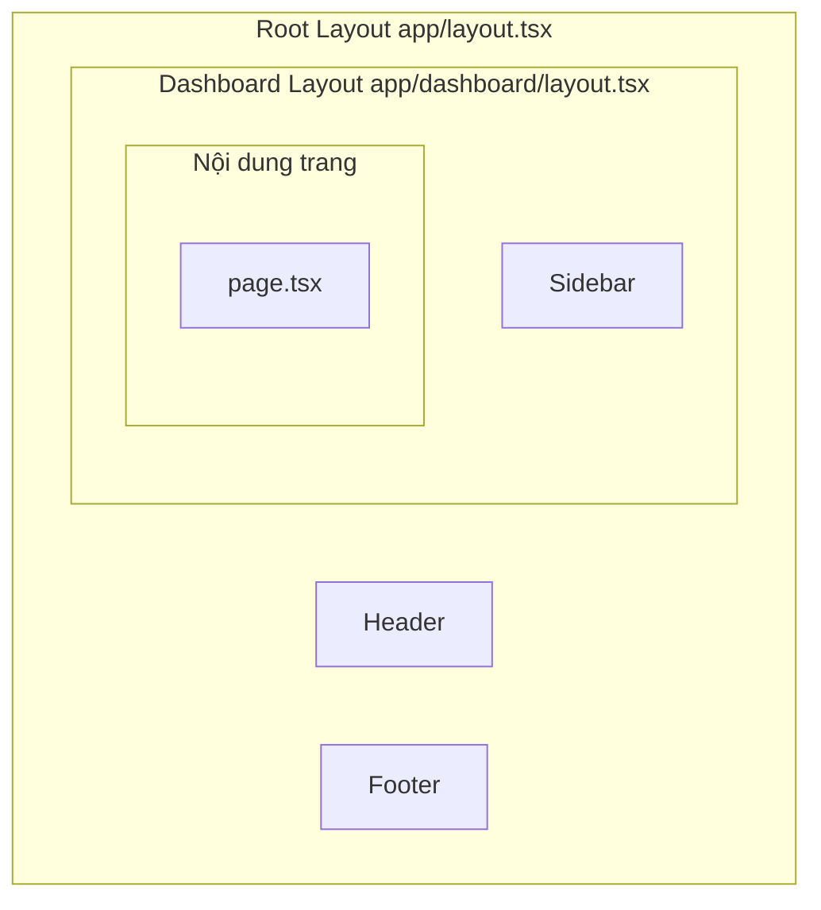

# 2.1.2 Thư mục file chính là routing trang web—Kiến trúc App Router

## Bản chất khôi phục

Bản chất của App Router là **ánh xạ từ file system đến URL**. Tạo một thư mục, tức là tạo một route segment; đặt `page.tsx` trong thư mục, route này có thể được truy cập.

```
Routing truyền thống: Cấu hình ánh xạ URL → Component trong code
App Router: Cấu trúc thư mục = Cấu trúc URL
```

## Trực quan hóa giải cấu: Cấu trúc thư mục và URL



## File quy ước cốt lõi

Mỗi thư mục trong App Router có thể chứa các file quy ước sau:

| Tên file | Vai trò | Có bắt buộc không |
|--------|------|----------|
| `page.tsx` | Nội dung UI của route | Bắt buộc nếu route có thể truy cập |
| `layout.tsx` | Layout chia sẻ, các route con tái sử dụng | Tùy chọn |
| `loading.tsx` | UI trạng thái loading | Tùy chọn |
| `error.tsx` | UI xử lý lỗi | Tùy chọn |
| `not-found.tsx` | Trang 404 | Tùy chọn |
| `route.ts` | API endpoint | Loại trừ lẫn nhau với page.tsx |

### Cấu trúc thư mục tối thiểu

```
app/
├── layout.tsx      # Root layout (bắt buộc)
├── page.tsx        # Trang chủ
├── globals.css     # Global styles
└── about/
    └── page.tsx    # Trang /about
```

## Nested Layout: Tính năng mạnh mẽ nhất

Layout là một trong những tính năng mạnh mẽ nhất của App Router. Nó cho phép bạn chia sẻ UI ở các cấp độ khác nhau, và **khi chuyển route, layout sẽ không re-render**.



### Ví dụ code layout

```typescript
// app/layout.tsx - Root layout
export default function RootLayout({
  children,
}: {
  children: React.ReactNode
}) {
  return (
    <html lang="vi">
      <body>
        <Header />
        {children}  {/* Nội dung route con chèn vào đây */}
        <Footer />
      </body>
    </html>
  )
}

// app/dashboard/layout.tsx - Dashboard layout
export default function DashboardLayout({
  children,
}: {
  children: React.ReactNode
}) {
  return (
    <div className="flex">
      <Sidebar />
      <main className="flex-1">{children}</main>
    </div>
  )
}
```

## Dynamic Routes

Sử dụng dấu ngoặc vuông `[]` để tạo dynamic route segment:

| Cú pháp | File ví dụ | Khớp URL |
|------|----------|----------|
| `[slug]` | `blog/[slug]/page.tsx` | `/blog/hello` |
| `[...slug]` | `docs/[...slug]/page.tsx` | `/docs/a/b/c` |
| `[[...slug]]` | `shop/[[...slug]]/page.tsx` | `/shop` hoặc `/shop/a/b` |

```typescript
// app/blog/[slug]/page.tsx
export default function BlogPost({
  params,
}: {
  params: { slug: string }
}) {
  return <h1>Bài viết: {params.slug}</h1>
}
```

## Route Groups: Tổ chức mà không ảnh hưởng URL

Sử dụng dấu ngoặc tròn `()` để tạo route group, dùng để tổ chức code nhưng không ảnh hưởng URL:

```
app/
├── (marketing)/        # Không xuất hiện trong URL
│   ├── layout.tsx      # Layout chia sẻ cho trang marketing
│   ├── about/
│   │   └── page.tsx    # URL: /about
│   └── contact/
│       └── page.tsx    # URL: /contact
└── (shop)/             # Không xuất hiện trong URL
    ├── layout.tsx      # Layout chia sẻ cho trang shop
    └── products/
        └── page.tsx    # URL: /products
```

## Giác ngộ: Điểm kiểm tra khi review code AI

### 1. Vị trí page.tsx có đúng không?

```
app/
├── dashboard/
│   └── settings/
│       └── page.tsx    # ✅ /dashboard/settings
│
├── dashboard/
│   └── settings.tsx    # ❌ Đây không phải page, là component thường
```

### 2. layout.tsx có dùng đúng không?

```typescript
// ❌ Sai: layout không nên có state
export default function Layout({ children }) {
  const [user, setUser] = useState()  // Đừng làm thế này
  return <div>{children}</div>
}

// ✅ Đúng: state nên ở trong Client Component
export default function Layout({ children }) {
  return (
    <div>
      <UserProvider>  {/* Dùng Context Provider */}
        {children}
      </UserProvider>
    </div>
  )
}
```

### 3. Type của tham số dynamic route có đúng không?

```typescript
// AI có thể quên thêm type cho params
export default function Page({ params }) {  // ❌ Thiếu type
  // ...
}

export default function Page({
  params
}: {
  params: { slug: string }  // ✅ Type rõ ràng
}) {
  // ...
}
```

## Tóm tắt phần này

Ý tưởng cốt lõi của App Router: **Quy ước hơn cấu hình** (Convention over Configuration).

| Khái niệm | Vai trò |
|------|------|
| **File System Routing** | Cấu trúc thư mục = Cấu trúc URL |
| **Nested Layout** | Tái sử dụng UI, chuyển route không re-render |
| **File quy ước** | page/layout/loading/error |
| **Dynamic Routes** | Cú pháp `[param]` |
| **Route Groups** | `(group)` tổ chức code |
