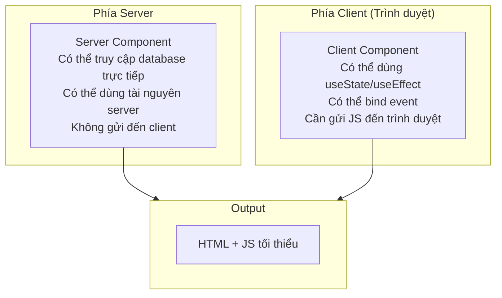
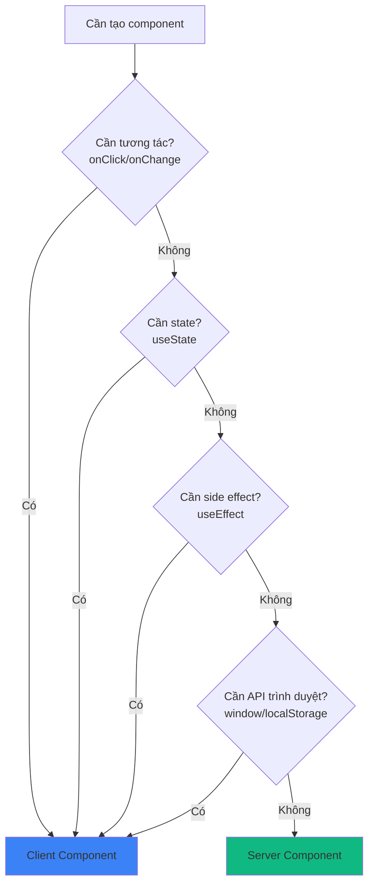
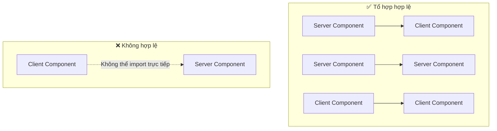

# 2.1.3 Code frontend-backend viết chung?—Chiến lược render RSC

## Tái cấu trúc nhận thức

Trong ứng dụng React truyền thống, tất cả component đều chạy trong trình duyệt. React Server Components (RSC) phá vỡ ranh giới này:

```
React truyền thống: Tất cả component → Bundle → Gửi đến trình duyệt → Trình duyệt thực thi
RSC: Server Component thực thi trên server → Chỉ gửi kết quả render → Client Component thực thi trong trình duyệt
```

## Bản chất khôi phục



## Server Component vs Client Component

| Tính năng | Server Component | Client Component |
|------|------------------|------------------|
| **Môi trường chạy** | Server | Trình duyệt |
| **Truy cập database** | ✅ Được | ❌ Không |
| **Sử dụng Hooks** | ❌ Không dùng được useState/useEffect | ✅ Được |
| **Xử lý event** | ❌ Không onClick | ✅ Được |
| **Kích thước bundle** | Không tính | Tính vào JS Bundle |
| **Hành vi mặc định** | Mặc định trong App Router | Cần `'use client'` |

## Khi nào dùng loại component nào?



### Công thức đơn giản

- **Cần click, nhập liệu, animation** → Client Component
- **Chỉ hiển thị dữ liệu** → Server Component
- **Không chắc chắn** → Viết Server Component trước, cần tương tác mới sửa

## Ví dụ code

### Server Component (mặc định)

```typescript
// app/posts/page.tsx
// Mặc định là Server Component, không cần khai báo gì

import { prisma } from '@/lib/prisma'

export default async function PostsPage() {
  // ✅ Có thể truy cập database trực tiếp
  const posts = await prisma.post.findMany()

  return (
    <ul>
      {posts.map(post => (
        <li key={post.id}>{post.title}</li>
      ))}
    </ul>
  )
}
```

### Client Component

```typescript
// components/like-button.tsx
'use client'  // ← Bắt buộc khai báo ở đầu file

import { useState } from 'react'

export function LikeButton({ postId }: { postId: string }) {
  // ✅ Có thể dùng useState
  const [liked, setLiked] = useState(false)

  // ✅ Có thể bind event
  return (
    <button onClick={() => setLiked(!liked)}>
      {liked ? '❤️' : '🤍'}
    </button>
  )
}
```

### Sử dụng kết hợp

```typescript
// app/posts/[id]/page.tsx - Server Component
import { prisma } from '@/lib/prisma'
import { LikeButton } from '@/components/like-button'

export default async function PostPage({
  params
}: {
  params: { id: string }
}) {
  // Lấy dữ liệu phía server
  const post = await prisma.post.findUnique({
    where: { id: params.id }
  })

  return (
    <article>
      <h1>{post.title}</h1>
      <p>{post.content}</p>
      {/* Client Component nhúng trong Server Component */}
      <LikeButton postId={post.id} />
    </article>
  )
}
```

## Quy tắc ranh giới component



### Quy tắc then chốt

1. **Server → Client**: ✅ Server Component có thể import Client Component
2. **Server → Server**: ✅ Server Component có thể import Server Component
3. **Client → Client**: ✅ Client Component có thể import Client Component
4. **Client → Server**: ❌ Client Component không thể import trực tiếp Server Component

### Nếu Client Component cần chứa Server Component?

Sử dụng pattern `children`:

```typescript
// ✅ Cách làm đúng
// client-wrapper.tsx
'use client'
export function ClientWrapper({ children }: { children: React.ReactNode }) {
  return <div onClick={() => {}}>{children}</div>
}

// page.tsx (Server Component)
import { ClientWrapper } from './client-wrapper'
import { ServerComponent } from './server-component'

export default function Page() {
  return (
    <ClientWrapper>
      <ServerComponent />  {/* Truyền qua children */}
    </ClientWrapper>
  )
}
```

## Giác ngộ: Điểm kiểm tra khi review code AI

### 1. Vị trí `'use client'`

```typescript
// ❌ Sai: không ở đầu file
import { useState } from 'react'
'use client'  // Thế này không hiệu quả

// ✅ Đúng: phải ở trên cùng
'use client'
import { useState } from 'react'
```

### 2. Dùng API client trong Server Component

```typescript
// ❌ AI có thể tạo code như này
export default function Page() {
  const [data, setData] = useState()  // Server Component không dùng được useState

  useEffect(() => {  // Server Component không dùng được useEffect
    // ...
  }, [])
}
```

### 3. Vị trí lấy dữ liệu

```typescript
// ❌ Lấy trong Client Component (không cần thiết)
'use client'
export function PostList() {
  const [posts, setPosts] = useState([])
  useEffect(() => {
    fetch('/api/posts').then(...)  // Thêm một request mạng
  }, [])
}

// ✅ Lấy trực tiếp trong Server Component
export default async function PostList() {
  const posts = await prisma.post.findMany()  // Truy cập database trực tiếp
  return <ul>...</ul>
}
```

## Tóm tắt phần này

Giá trị cốt lõi của RSC: **Chạy đúng code ở đúng nơi**.

| Trường hợp | Chọn | Lý do |
|------|------|------|
| Hiển thị dữ liệu | Server Component | Giảm JS Bundle, truy cập dữ liệu trực tiếp |
| Tương tác form | Client Component | Cần state và event |
| UI tĩnh | Server Component | Zero client-side JS |
| Hiệu ứng animation | Client Component | Cần API trình duyệt |
