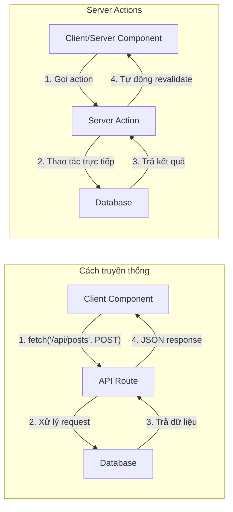
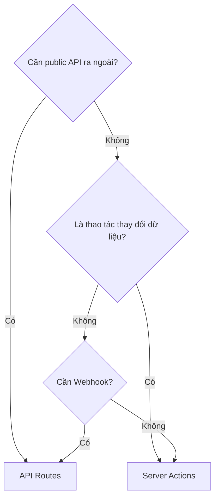

# 2.1.4 Ở frontend gọi trực tiếp backend—Server Actions

## Tái cấu trúc nhận thức

Quy trình thay đổi dữ liệu truyền thống:
```
Người dùng click → Frontend gửi fetch request → Backend API xử lý → Trả kết quả → Frontend cập nhật UI
```

Quy trình Server Actions:
```
Người dùng click → Gọi trực tiếp hàm server → Server xử lý → Tự động cập nhật UI
```

**Bản chất**: Server Actions là các hàm phía server được gọi trực tiếp trong component, không cần tạo API endpoint thủ công.

## Trực quan hóa giải cấu



## Định nghĩa Server Action

### Cách 1: Định nghĩa inline (trong Server Component)

```typescript
// app/posts/page.tsx - Server Component
export default function PostsPage() {
  async function createPost(formData: FormData) {
    'use server'  // ← Đánh dấu là Server Action

    const title = formData.get('title') as string
    await prisma.post.create({ data: { title } })
    revalidatePath('/posts')  // Làm mới dữ liệu trang
  }

  return (
    <form action={createPost}>
      <input name="title" />
      <button type="submit">Tạo</button>
    </form>
  )
}
```

### Cách 2: File riêng (khuyến nghị)

```typescript
// app/actions/posts.ts
'use server'  // ← Khai báo đầu file, toàn bộ file là Server Actions

import { prisma } from '@/lib/prisma'
import { revalidatePath } from 'next/cache'

export async function createPost(formData: FormData) {
  const title = formData.get('title') as string

  await prisma.post.create({
    data: { title }
  })

  revalidatePath('/posts')
}

export async function deletePost(id: string) {
  await prisma.post.delete({ where: { id } })
  revalidatePath('/posts')
}
```

## Sử dụng trong component

### Trong Server Component (form action)

```typescript
// app/posts/new/page.tsx
import { createPost } from '@/app/actions/posts'

export default function NewPostPage() {
  return (
    <form action={createPost}>
      <input name="title" placeholder="Tiêu đề" />
      <textarea name="content" placeholder="Nội dung" />
      <button type="submit">Đăng</button>
    </form>
  )
}
```

### Trong Client Component

```typescript
// components/delete-button.tsx
'use client'

import { deletePost } from '@/app/actions/posts'
import { useTransition } from 'react'

export function DeleteButton({ postId }: { postId: string }) {
  const [isPending, startTransition] = useTransition()

  return (
    <button
      disabled={isPending}
      onClick={() => {
        startTransition(() => {
          deletePost(postId)
        })
      }}
    >
      {isPending ? 'Đang xóa...' : 'Xóa'}
    </button>
  )
}
```

## Server Actions vs API Routes

| Tính năng | Server Actions | API Routes |
|------|----------------|------------|
| **Trường hợp áp dụng** | Thay đổi dữ liệu (CRUD) | API công khai, Webhook |
| **Cách gọi** | Gọi hàm trực tiếp | HTTP request |
| **Type safety** | ✅ Tự động suy luận | Cần định nghĩa thủ công |
| **Tái sử dụng** | Nội bộ ứng dụng | Có thể public ra ngoài |
| **Progressive enhancement** | ✅ Hoạt động cả khi không có JS | Cần JS |

### Khi nào dùng Server Actions?



## Xử lý lỗi

```typescript
// app/actions/posts.ts
'use server'

import { z } from 'zod'

const PostSchema = z.object({
  title: z.string().min(1, 'Tiêu đề không được để trống'),
  content: z.string().min(10, 'Nội dung ít nhất 10 ký tự')
})

export async function createPost(formData: FormData) {
  // 1. Validate input
  const validatedFields = PostSchema.safeParse({
    title: formData.get('title'),
    content: formData.get('content')
  })

  if (!validatedFields.success) {
    return {
      errors: validatedFields.error.flatten().fieldErrors
    }
  }

  // 2. Thực thi thao tác
  try {
    await prisma.post.create({
      data: validatedFields.data
    })
  } catch (error) {
    return { errors: { _form: ['Tạo thất bại, vui lòng thử lại'] } }
  }

  // 3. Làm mới cache và redirect
  revalidatePath('/posts')
  redirect('/posts')
}
```

## Giác ngộ: Điểm kiểm tra khi review code AI

### 1. Vị trí `'use server'`

```typescript
// ❌ Sai: đặt ngoài hàm nhưng không ở đầu file
export async function myAction() {
  'use server'  // Nếu không ở đầu file, phải trong thân hàm
}

// ✅ Đúng: đầu file
'use server'
export async function myAction() {}

// ✅ Đúng: trong thân hàm
export async function myAction() {
  'use server'
  // ...
}
```

### 2. Vấn đề serialize tham số

```typescript
// ❌ Tham số của Server Actions phải serialize được
async function badAction(callback: () => void) {
  'use server'
  callback()  // Hàm không thể truyền làm tham số
}

// ✅ Chỉ truyền dữ liệu serialize được
async function goodAction(id: string, data: { name: string }) {
  'use server'
  // ...
}
```

### 3. Quên revalidate

```typescript
// ❌ Sau khi thay đổi dữ liệu không làm mới cache
async function createPost(formData: FormData) {
  'use server'
  await prisma.post.create({ ... })
  // Quên revalidatePath, dữ liệu trang không cập nhật
}

// ✅ Nhớ làm mới cache của đường dẫn liên quan
async function createPost(formData: FormData) {
  'use server'
  await prisma.post.create({ ... })
  revalidatePath('/posts')
}
```

## Tóm tắt phần này

Giá trị cốt lõi của Server Actions: **Xóa bỏ ranh giới frontend-backend, làm thay đổi dữ liệu đơn giản như gọi hàm**.

| Trường hợp | Phương án khuyến nghị |
|------|----------|
| Submit form | Server Actions + form action |
| Thao tác button | Server Actions + useTransition |
| API công khai | API Routes |
| Tích hợp bên thứ ba | API Routes |
