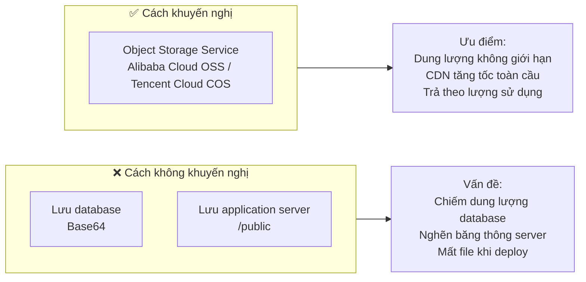
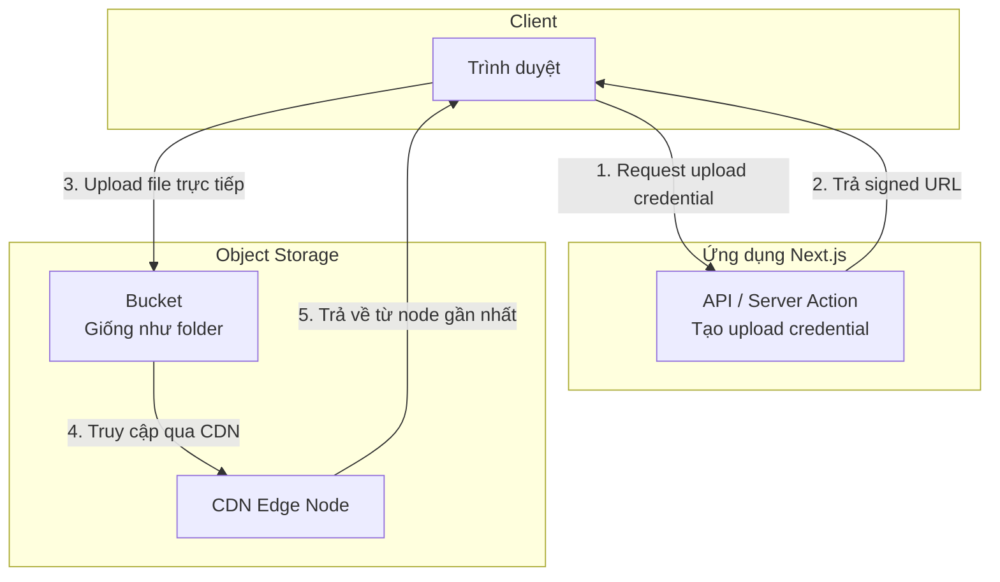
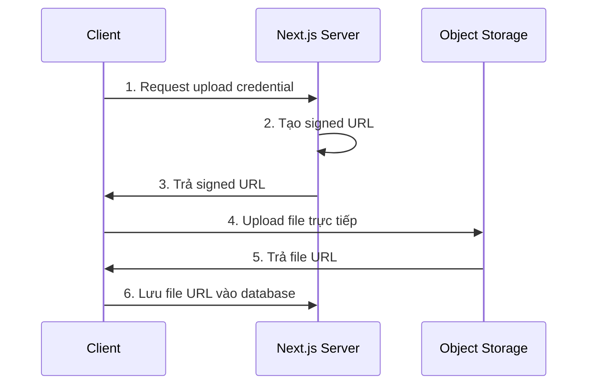

# 2.1.5 Hình ảnh và file đặt ở đâu nhanh nhất—OSS Object Storage

## Phá đề bằng một câu

Hình ảnh, video và các file tĩnh không nên lưu trong database, cũng không nên lưu trên application server. Dịch vụ object storage được thiết kế riêng cho việc này—rẻ, nhanh, có thể mở rộng.

## Tại sao cần object storage?



| Cách lưu trữ | Chi phí | Hiệu suất | Khả năng mở rộng | Khuyến nghị |
|----------|------|------|----------|--------|
| Database | Cực cao | Kém | Kém | ❌ |
| Application Server | Trung bình | Trung bình | Kém | ❌ |
| Object Storage | Thấp | Cực tốt | Không giới hạn | ✅ |

## Khái niệm cốt lõi

### Kiến trúc cơ bản của object storage



### Thuật ngữ then chốt

| Thuật ngữ | Giải thích |
|------|------|
| **Bucket** | Storage bucket, tương đương thư mục top-level |
| **Object** | Đối tượng, tức file được lưu |
| **Key** | Định danh duy nhất của object, tương đương đường dẫn file |
| **Signed URL** | Link truy cập an toàn có thời hạn |
| **CDN** | Content Delivery Network, truy cập từ node gần nhất |

## Quy trình upload file

### Direct upload từ frontend (khuyến nghị)



**Ưu điểm**:
- File không đi qua application server, tiết kiệm băng thông
- Tốc độ upload nhanh hơn
- Áp lực server thấp

### Ví dụ code

```typescript
// app/api/upload/route.ts
import { NextResponse } from 'next/server'
import COS from 'cos-nodejs-sdk-v5'

const cos = new COS({
  SecretId: process.env.COS_SECRET_ID!,
  SecretKey: process.env.COS_SECRET_KEY!,
})

export async function POST(request: Request) {
  const { filename, contentType } = await request.json()

  // Tạo đường dẫn file duy nhất
  const key = `uploads/${Date.now()}-${filename}`

  // Tạo pre-signed URL
  const signedUrl = cos.getObjectUrl({
    Bucket: process.env.COS_BUCKET!,
    Region: process.env.COS_REGION!,
    Key: key,
    Method: 'PUT',
    Sign: true,
    Expires: 3600,  // Hiệu lực 1 giờ
  })

  return NextResponse.json({
    uploadUrl: signedUrl,
    fileUrl: `https://${process.env.COS_BUCKET}.cos.${process.env.COS_REGION}.myqcloud.com/${key}`
  })
}
```

```typescript
// components/file-upload.tsx
'use client'

export function FileUpload() {
  async function handleUpload(file: File) {
    // 1. Lấy upload credential
    const res = await fetch('/api/upload', {
      method: 'POST',
      body: JSON.stringify({
        filename: file.name,
        contentType: file.type
      })
    })
    const { uploadUrl, fileUrl } = await res.json()

    // 2. Upload trực tiếp lên OSS
    await fetch(uploadUrl, {
      method: 'PUT',
      body: file,
      headers: { 'Content-Type': file.type }
    })

    // 3. Trả về file URL
    return fileUrl
  }

  return (
    <input
      type="file"
      onChange={(e) => {
        const file = e.target.files?.[0]
        if (file) handleUpload(file)
      }}
    />
  )
}
```

## Chiến lược tối ưu hình ảnh

### Kết hợp với Next.js Image component

```typescript
// next.config.js
module.exports = {
  images: {
    remotePatterns: [
      {
        protocol: 'https',
        hostname: '*.cos.ap-shanghai.myqcloud.com',
      },
    ],
  },
}

// Sử dụng
import Image from 'next/image'

export function Avatar({ url }: { url: string }) {
  return (
    <Image
      src={url}  // OSS URL
      alt="Avatar"
      width={100}
      height={100}
      // Next.js tự động tối ưu: định dạng WebP, responsive, lazy load
    />
  )
}
```

### Xử lý hình ảnh OSS

Hầu hết dịch vụ OSS đều hỗ trợ xử lý hình ảnh qua URL parameters:

```typescript
// Ảnh gốc
const url = 'https://bucket.cos.region.myqcloud.com/image.jpg'

// Thumbnail (chiều rộng 200px)
const thumbnail = `${url}?imageMogr2/thumbnail/200x`

// Cắt thành hình vuông
const square = `${url}?imageMogr2/crop/200x200/gravity/center`

// Chuyển đổi format
const webp = `${url}?imageMogr2/format/webp`
```

## Cân nhắc về bảo mật

### 1. Không để lộ secret key

```typescript
// ❌ Nguy hiểm: Frontend dùng trực tiếp secret key
const cos = new COS({
  SecretId: 'AKID...',  // Tuyệt đối không làm thế này
  SecretKey: 'xxx...',
})

// ✅ An toàn: Server tạo temporary credential
// Frontend chỉ nhận signed URL có thời hạn
```

### 2. Giới hạn loại và kích thước upload

```typescript
// app/api/upload/route.ts
export async function POST(request: Request) {
  const { filename, contentType, size } = await request.json()

  // Validate file type
  const allowedTypes = ['image/jpeg', 'image/png', 'image/webp']
  if (!allowedTypes.includes(contentType)) {
    return NextResponse.json(
      { error: 'Loại file không được hỗ trợ' },
      { status: 400 }
    )
  }

  // Validate file size (10MB)
  if (size > 10 * 1024 * 1024) {
    return NextResponse.json(
      { error: 'File quá lớn' },
      { status: 400 }
    )
  }

  // ... tạo signed URL
}
```

### 3. Sử dụng private read/write

```
Cài đặt quyền Bucket:
- Public read: Ai cũng truy cập được, phù hợp cho tài nguyên công khai
- Private read/write: Cần signature mới truy cập được, phù hợp cho file nhạy cảm
```

## Các nhà cung cấp OSS phổ biến

| Nhà cung cấp | Tên sản phẩm | Đặc điểm |
|--------|--------|------|
| Tencent Cloud | COS | Truy cập nhanh trong nước, tích hợp tốt với hệ sinh thái WeChat |
| Alibaba Cloud | OSS | Tính năng đầy đủ nhất, hệ sinh thái hoàn thiện nhất |
| AWS | S3 | Tiêu chuẩn quốc tế, truy cập tốt ở nước ngoài |
| Cloudflare | R2 | Miễn phí egress bandwidth, tỷ lệ giá/hiệu suất cao |

## Tóm tắt phần này

Giá trị cốt lõi của object storage: **Việc chuyên nghiệp giao cho dịch vụ chuyên nghiệp**.

| Trường hợp | Phương án |
|------|------|
| User upload hình ảnh | Direct upload lên OSS từ frontend |
| Static resources | OSS + CDN |
| File nhạy cảm | Private Bucket + Signed URL |
| Xử lý hình ảnh | OSS built-in processing / Next.js Image |
