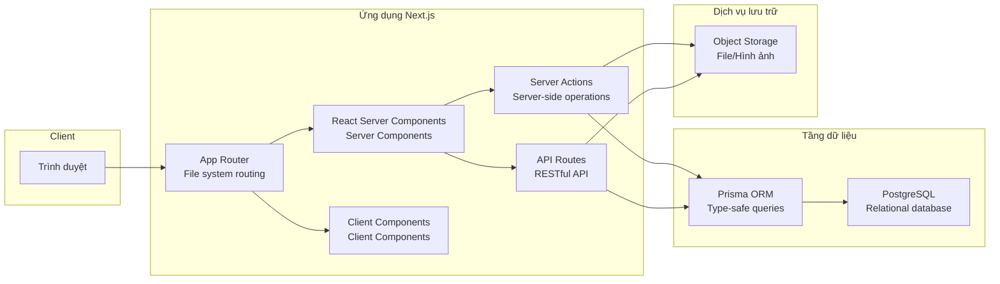

# 2.1 Tại sao chúng ta chọn bộ trang bị này—Tổng quan kiến trúc

## Phá đề bằng một câu

Next.js + TypeScript + Prisma + OSS là "bộ kết hợp vàng" cho phát triển fullstack năm 2024-2025—chúng không phải là xu hướng mới nhất, nhưng lại là công nghệ mà AI thành thạo nhất, hệ sinh thái hoàn thiện nhất, được kiểm chứng production đầy đủ nhất.

## Sơ đồ tổng quan kiến trúc

## Tóm tắt trách nhiệm từng tầng

| Tầng | Công nghệ | Trách nhiệm cốt lõi |
|------|------|----------|
| **Tầng routing** | App Router | Ánh xạ URL, nested layout, loading states |
| **Tầng view** | RSC + Client Components | Render UI, xử lý tương tác |
| **Tầng operations** | Server Actions | Xử lý form, thay đổi dữ liệu |
| **Tầng interface** | API Routes | API công khai, tích hợp bên thứ ba |
| **Tầng data** | Prisma + PostgreSQL | Lưu trữ dữ liệu, xử lý transaction |
| **Tầng storage** | OSS | Lưu trữ file, phân phối CDN |

## Tại sao là bộ kết hợp này?

### 1. Độ thân thiện với AI cao nhất

Bộ công nghệ này chiếm tỷ trọng cực lớn trong dữ liệu huấn luyện AI, có nghĩa là:

- Code được AI tạo ra phù hợp hơn với best practices
- Khi gặp vấn đề có thể nhận được giải pháp chính xác hơn
- Khi review code, AI có thể phát hiện nhiều vấn đề tiềm ẩn hơn

### 2. Trải nghiệm phát triển thống nhất

Phát triển fullstack truyền thống cần chuyển đổi context thường xuyên giữa frontend-backend. Còn bộ công nghệ này:

- **Một ngôn ngữ**: TypeScript fullstack
- **Một project**: Code frontend-backend cùng tồn tại
- **Một bộ type**: Type được Prisma tạo ra, frontend-backend chia sẻ

### 3. Kiểm chứng production đầy đủ

| Công nghệ | Người dùng |
|------|--------|
| Next.js | Vercel, Netflix, TikTok, Notion |
| Prisma | Hashicorp, Miro, Mercedes-Benz |
| PostgreSQL | Instagram, Spotify, Reddit |

## Tóm tắt phần này

Nguyên tắc cốt lõi khi chọn công nghệ: **Không chọn mới nhất, chọn ổn định nhất; không chọn ngầu nhất, chọn AI hiểu rõ nhất.**

Tiếp theo chúng ta sẽ đi sâu vào từng thành phần cốt lõi của kiến trúc này:

- 2.1.1 Lý do chọn công nghệ
- 2.1.2 Kiến trúc App Router
- 2.1.3 Chiến lược render RSC
- 2.1.4 Server Actions
- 2.1.5 OSS Object Storage
