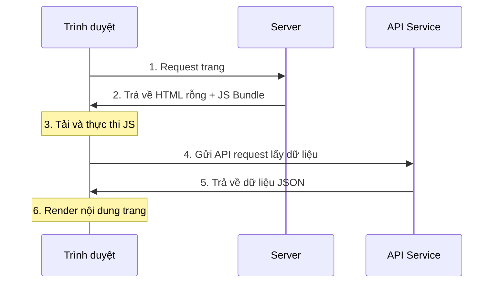

# 2.2.1 Trình duyệt user tự render — CSR Client-side Rendering

## Một câu giải thích

CSR là giao công việc render cho trình duyệt người dùng hoàn thành — server chỉ trả về HTML vỏ rỗng và một đống JavaScript, nội dung trang thực sự do JS sinh động trong trình duyệt.

## Nguyên lý hoạt động



### HTML server trả về

```html
<!DOCTYPE html>
<html>
<head>
  <title>My App</title>
</head>
<body>
  <div id="root"></div>  <!-- Container rỗng -->
  <script src="/bundle.js"></script>  <!-- JS chịu trách nhiệm điền nội dung -->
</body>
</html>
```

## Ưu nhược điểm của CSR

| Ưu điểm | Nhược điểm |
|------|------|
| Áp lực server nhỏ | Tải màn hình đầu chậm |
| Chuyển trang mượt (SPA) | SEO cực kém |
| Frontend-backend tách biệt hoàn toàn | Phụ thuộc JavaScript |
| Trải nghiệm tương tác tốt | First contentful paint trễ |

## Kịch bản áp dụng

### ✅ Phù hợp với CSR

- **Hệ thống quản trị backend**: Không cần SEO, user sẽ ở lại lâu
- **Dashboard**: Yêu cầu dữ liệu real-time cao, cần cập nhật thường xuyên
- **Ứng dụng SaaS**: Khu vực chức năng sau đăng nhập, SEO vô nghĩa
- **Công cụ nội bộ**: Ứng dụng mạng nội bộ công ty

### ❌ Không phù hợp với CSR

- **Landing page marketing**: Tốc độ màn hình đầu ảnh hưởng trực tiếp tỷ lệ chuyển đổi
- **Blog/Tài liệu**: SEO là yêu cầu cốt lõi
- **Trang sản phẩm thương mại điện tử**: Cần được công cụ tìm kiếm thu thập

## Thực hiện CSR trong Next.js

### Cách 1: Dùng `'use client'` + useEffect

```typescript
// components/user-dashboard.tsx
'use client'

import { useState, useEffect } from 'react'

export function UserDashboard() {
  const [data, setData] = useState(null)
  const [loading, setLoading] = useState(true)

  useEffect(() => {
    fetch('/api/dashboard')
      .then(res => res.json())
      .then(data => {
        setData(data)
        setLoading(false)
      })
  }, [])

  if (loading) return <div>Đang tải...</div>

  return (
    <div>
      <h1>Chào mừng, {data.userName}</h1>
      {/* Nội dung khác */}
    </div>
  )
}
```

### Cách 2: Dùng SWR / React Query

```typescript
// components/user-dashboard.tsx
'use client'

import useSWR from 'swr'

const fetcher = (url: string) => fetch(url).then(res => res.json())

export function UserDashboard() {
  const { data, error, isLoading } = useSWR('/api/dashboard', fetcher)

  if (isLoading) return <div>Đang tải...</div>
  if (error) return <div>Tải thất bại</div>

  return (
    <div>
      <h1>Chào mừng, {data.userName}</h1>
    </div>
  )
}
```

## Chiến lược tối ưu hiệu năng

### 1. Code splitting

```typescript
// Import động, tải theo yêu cầu
import dynamic from 'next/dynamic'

const HeavyComponent = dynamic(() => import('./heavy-component'), {
  loading: () => <p>Đang tải...</p>,
  ssr: false  // Tắt server-side rendering
})
```

### 2. Skeleton screen

```typescript
function DashboardSkeleton() {
  return (
    <div className="animate-pulse">
      <div className="h-8 bg-gray-200 rounded w-1/4 mb-4" />
      <div className="h-4 bg-gray-200 rounded w-full mb-2" />
      <div className="h-4 bg-gray-200 rounded w-3/4" />
    </div>
  )
}
```

### 3. Prefetch dữ liệu

```typescript
// Lấy trước dữ liệu trước khi user có thể truy cập
function Navigation() {
  const prefetchDashboard = () => {
    // Prefetch khi hover chuột
    fetch('/api/dashboard')
  }

  return (
    <Link
      href="/dashboard"
      onMouseEnter={prefetchDashboard}
    >
      Dashboard
    </Link>
  )
}
```

## Nhận thức: Bẫy thường gặp của CSR

### 1. Vấn đề nhấp nháy

```typescript
// ❌ Gây nhấp nháy: Server render nội dung rỗng, client mới điền
export default function Page() {
  const [data, setData] = useState(null)
  // ...
  return data ? <Content /> : null
}

// ✅ Cung cấp trạng thái loading
export default function Page() {
  const [data, setData] = useState(null)
  const [loading, setLoading] = useState(true)
  // ...
  return loading ? <Skeleton /> : <Content />
}
```

### 2. Lỗi Hydration

```typescript
// ❌ Kết quả render server và client không nhất quán
export default function Page() {
  return <div>{new Date().toLocaleString()}</div>  // Thời gian sẽ khác
}

// ✅ Chỉ render thời gian ở client
'use client'
export default function Page() {
  const [time, setTime] = useState<string>()
  useEffect(() => {
    setTime(new Date().toLocaleString())
  }, [])
  return <div>{time}</div>
}
```

## Tổng kết phần này

Đặc điểm cốt lõi của CSR: **Hy sinh tốc độ màn hình đầu và SEO, đổi lấy trải nghiệm tương tác và giảm áp server**.

| Kịch bản | Có phù hợp CSR không |
|------|-------------|
| Quản trị backend | ✅ Lựa chọn tốt nhất |
| Ứng dụng SaaS | ✅ Phù hợp |
| Trang marketing | ❌ Không phù hợp |
| Nội dung blog | ❌ Không phù hợp |
