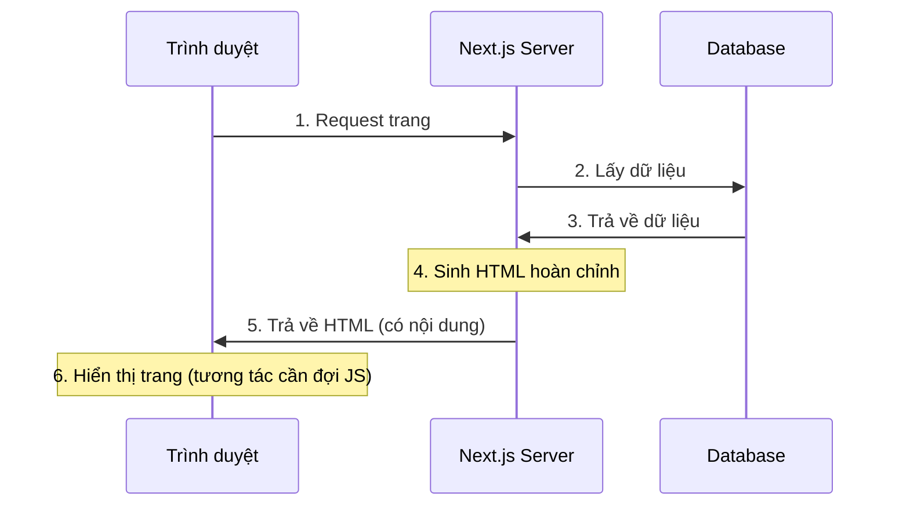

# 2.2.2 Server render xong rồi mới gửi — SSR Server-side Rendering

## Một câu giải thích

SSR là mỗi lần user request, server real-time lấy dữ liệu, sinh HTML hoàn chỉnh, rồi mới gửi cho trình duyệt — user nhìn thấy ngay lập tức là nội dung hoàn chỉnh.

## Nguyên lý hoạt động



## Ưu nhược điểm của SSR

| Ưu điểm | Nhược điểm |
|------|------|
| SEO thân thiện | Áp lực server lớn |
| Nội dung màn hình đầu nhanh | Mỗi request đều phải render |
| Dữ liệu real-time | TTFB khá chậm |
| Chia sẻ mạng xã hội thân thiện | Không thể dùng CDN cache |

## Thực hiện SSR trong Next.js

### Cách 1: Dùng dynamic function (tự động SSR)

```typescript
// app/search/page.tsx
// Dùng searchParams, tự động biến thành SSR
export default async function SearchPage({
  searchParams,
}: {
  searchParams: { q?: string }
}) {
  const results = await searchProducts(searchParams.q)

  return (
    <div>
      <h1>Tìm kiếm: {searchParams.q}</h1>
      <ProductList products={results} />
    </div>
  )
}
```

### Cách 2: Khai báo tường minh dynamic rendering

```typescript
// app/dashboard/page.tsx
export const dynamic = 'force-dynamic'  // Bắt buộc SSR

export default async function DashboardPage() {
  const stats = await getRealtimeStats()

  return <Dashboard stats={stats} />
}
```

### Điều kiện kích hoạt SSR

Next.js sẽ tự động dùng SSR trong các tình huống sau:

| API được dùng | Giải thích |
|------------|------|
| `cookies()` | Đọc Cookie |
| `headers()` | Đọc request header |
| `searchParams` | Tham số query URL |
| `fetch` không cache | `cache: 'no-store'` |

```typescript
import { cookies, headers } from 'next/headers'

export default async function Page() {
  const cookieStore = cookies()  // Kích hoạt SSR
  const headersList = headers()  // Kích hoạt SSR

  // Hoặc
  const data = await fetch('...', {
    cache: 'no-store'  // Kích hoạt SSR
  })
}
```

## Kịch bản áp dụng

### ✅ Phù hợp với SSR

- **Trang kết quả tìm kiếm**: Nội dung do user input quyết định
- **Trang cá nhân user**: Cần SEO, dữ liệu khác nhau theo user
- **Trang dữ liệu real-time**: Cổ phiếu, thời tiết cần dữ liệu mới nhất
- **Trang cần xác thực**: Hiển thị nội dung khác theo identity user

### ❌ Không phù hợp với SSR

- **Nội dung tĩnh**: Dùng SSG hiệu quả hơn
- **Concurrent cực cao**: Server không chịu nổi
- **Nội dung thay đổi không thường xuyên**: Dùng ISR tốt hơn

## Tối ưu hiệu năng

### 1. Streaming rendering

```typescript
// app/posts/page.tsx
import { Suspense } from 'react'

export default function PostsPage() {
  return (
    <div>
      <h1>Danh sách bài viết</h1>
      <Suspense fallback={<PostsSkeleton />}>
        <PostsList />  {/* Async component, streaming */}
      </Suspense>
    </div>
  )
}

async function PostsList() {
  const posts = await getPosts()  // Slow query
  return <ul>{posts.map(...)}</ul>
}
```

### 2. Lấy dữ liệu song song

```typescript
// ❌ Lấy tuần tự (chậm)
const user = await getUser()
const posts = await getPosts()

// ✅ Lấy song song (nhanh)
const [user, posts] = await Promise.all([
  getUser(),
  getPosts()
])
```

## Nhận thức: Vấn đề thường gặp của SSR

### 1. Render lại vô hạn

```typescript
// ❌ Mỗi lần render đều khác, gây cache thất bại
export default async function Page() {
  const data = await fetch('...', {
    headers: { 'x-timestamp': Date.now().toString() }  // Mỗi lần khác
  })
}

// ✅ Dùng tham số request ổn định
export default async function Page() {
  const data = await fetch('...', {
    next: { revalidate: 60 }  // Cache 60 giây
  })
}
```

### 2. Quên xử lý lỗi

```typescript
// ✅ Thêm error boundary
// app/search/error.tsx
'use client'

export default function Error({
  error,
  reset,
}: {
  error: Error
  reset: () => void
}) {
  return (
    <div>
      <h2>Tìm kiếm lỗi rồi</h2>
      <button onClick={reset}>Thử lại</button>
    </div>
  )
}
```

## Tổng kết phần này

Giá trị cốt lõi của SSR: **Dữ liệu real-time + SEO thân thiện**.

| Kịch bản | Có phù hợp SSR không |
|------|-------------|
| Trang tìm kiếm | ✅ Lựa chọn tốt nhất |
| Trang cá nhân user | ✅ Phù hợp |
| Trang tài liệu | ❌ Dùng SSG |
| Dashboard | ⚠️ Tùy tình huống |
