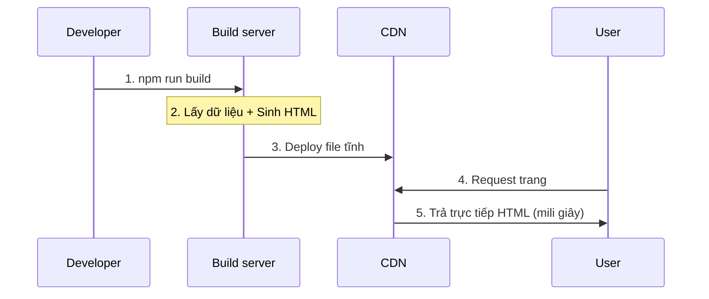

# 2.2.3 Render trước tất cả trang — SSG Static Site Generation

## Một câu giải thích

SSG là ở giai đoạn build (`npm run build`) đã render tất cả trang thành file HTML tĩnh, sau khi deploy trả trực tiếp từ CDN — tốc độ cực nhanh, server zero áp lực.

## Nguyên lý hoạt động



## Ưu nhược điểm của SSG

| Ưu điểm | Nhược điểm |
|------|------|
| Cực nhanh (CDN trả trực tiếp) | Thời gian build dài |
| Server zero áp lực | Cập nhật nội dung cần deploy lại |
| SEO thân thiện | Không phù hợp nội dung động |
| Tính khả dụng cao | Nhiều trang thì build chậm |

## Thực hiện SSG trong Next.js

### Cách dùng cơ bản (hành vi mặc định)

```typescript
// app/about/page.tsx
// Không có dữ liệu động, mặc định là SSG
export default function AboutPage() {
  return <h1>Về chúng tôi</h1>
}
```

### SSG có dữ liệu

```typescript
// app/posts/page.tsx
async function getPosts() {
  const res = await fetch('https://api.example.com/posts', {
    next: { revalidate: false }  // Lấy lúc build, không cập nhật nữa
  })
  return res.json()
}

export default async function PostsPage() {
  const posts = await getPosts()

  return (
    <ul>
      {posts.map(post => (
        <li key={post.id}>{post.title}</li>
      ))}
    </ul>
  )
}
```

### SSG cho dynamic route

```typescript
// app/blog/[slug]/page.tsx

// Cho Next.js biết cần pre-render những trang nào
export async function generateStaticParams() {
  const posts = await getPosts()

  return posts.map(post => ({
    slug: post.slug
  }))
}

export default async function BlogPost({
  params
}: {
  params: { slug: string }
}) {
  const post = await getPost(params.slug)

  return (
    <article>
      <h1>{post.title}</h1>
      <div>{post.content}</div>
    </article>
  )
}
```

## Kịch bản áp dụng

### ✅ Phù hợp với SSG

- **Bài viết blog**: Nội dung sau khi tạo ít thay đổi
- **Trang tài liệu**: Như tutorial này
- **Landing page marketing**: Tốc độ màn hình đầu quyết định tỷ lệ chuyển đổi
- **Trang giới thiệu sản phẩm**: Nội dung tương đối cố định

### ❌ Không phù hợp với SSG

- **Dữ liệu user**: Mỗi người khác nhau
- **Nội dung real-time**: Cổ phiếu, thời tiết
- **Hàng triệu trang**: Trang sản phẩm cấp triệu

## Dữ liệu so sánh hiệu năng

```
Thời gian tải trang SSG: ~50ms (CDN trả trực tiếp)
Thời gian tải trang SSR: ~200-500ms (Server render)
Thời gian tải trang CSR: ~500-1500ms (Tải JS + render)
```

## Nhận thức: Vấn đề thường gặp của SSG

### 1. Lấy dữ liệu lúc build thất bại

```typescript
// ✅ Thêm xử lý lỗi
export async function generateStaticParams() {
  try {
    const posts = await getPosts()
    return posts.map(post => ({ slug: post.slug }))
  } catch (error) {
    console.error('Lấy danh sách bài viết thất bại:', error)
    return []  // Trả mảng rỗng, không gián đoạn build
  }
}
```

### 2. Quên generateStaticParams

```typescript
// ❌ Dynamic route không có generateStaticParams, sẽ biến thành SSR
// app/blog/[slug]/page.tsx
export default async function Page({ params }) {
  // ...
}

// ✅ Thêm generateStaticParams thực hiện SSG
export async function generateStaticParams() {
  // ...
}
```

## Tổng kết phần này

Giá trị cốt lõi của SSG: **Hiệu năng tối ưu + Chi phí server bằng 0**.

| Kịch bản | Có phù hợp SSG không |
|------|-------------|
| Blog | ✅ Lựa chọn tốt nhất |
| Tài liệu | ✅ Lựa chọn tốt nhất |
| Trang chủ thương mại điện tử | ✅ Phù hợp |
| Trung tâm user | ❌ Không phù hợp |
